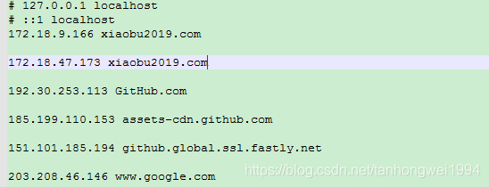

# 基于nginx实现web服务器的双机热备

> 原创 最新推荐文章于 2025-05-18 21:45:37 发布 · 公开 · 1.1k 阅读 · 0 · 0 · 本内容遵循CC 4.0 BY-SA版权协议 版权声明：本文为博主原创文章，遵循 CC 4.0 BY-SA 版权协议，转载请附上原文出处链接和本声明。 · 编辑
> 文章链接：https://blog.csdn.net/tanhongwei1994/article/details/85251425

一、nginx.conf配置：

```java

#user  nobody;
worker_processes  4;

#error_log  logs/error.log;
#error_log  logs/error.log  notice;
#error_log  logs/error.log  info;

#pid        logs/nginx.pid;


events {
    worker_connections  1024;
}


http {
    include       mime.types;
    default_type  application/octet-stream;

    #log_format  main  '$remote_addr - $remote_user [$time_local] "$request" '
    #                  '$status $body_bytes_sent "$http_referer" '
    #                  '"$http_user_agent" "$http_x_forwarded_for"';

    #access_log  logs/access.log  main;

    sendfile        on;
    #tcp_nopush     on;

    #keepalive_timeout  0;
    keepalive_timeout  65;#连接超时时间，默认为75s，可以在http，server，location块。

    #gzip  on;
	
	#服务器的集群  
	    upstream  netitcast.com {  #服务器集群名字   
	        server    172.18.9.166:9001  weight=2 max_fails=3 fail_timeout=600s;#服务器配置   #weight是权重的意思，权重越大，分配的概率越大。  
	        server    172.18.47.173:9001  weight=1;
			#server    172.18.47.173:9001  backup;#备用
	    }     


    server {
        listen       8888;
        server_name  xiaobu2019.com;
		#域名可以有多个，用空格隔开和使用通配符 eg:*.xiaobu.com
        server_name www.ha97.com ha97.com;

        #charset koi8-r;

        #access_log  logs/host.access.log  main;

      location / {
            proxy_pass http://netitcast.com;
            proxy_redirect default;
			proxy_connect_timeout 1;
        }
		

        #error_page  404              /404.html;

        # redirect server error pages to the static page /50x.html
        #
        error_page   500 502 503 504  /50x.html;
        location = /50x.html {
            root   html;
        }

        # proxy the PHP scripts to Apache listening on 127.0.0.1:80
        #
        #location ~ \.php$ {
        #    proxy_pass   http://127.0.0.1; #请求转向mysvr 定义的服务器列表
        #}

        # pass the PHP scripts to FastCGI server listening on 127.0.0.1:9000
        #
        #location ~ \.php$ {
        #    root           html;#根目录
        #    fastcgi_pass   127.0.0.1:9000;
        #    fastcgi_index  index.php;
        #    fastcgi_param  SCRIPT_FILENAME  /scripts$fastcgi_script_name;
        #    include        fastcgi_params;
        #}

        # deny access to .htaccess files, if Apache's document root
        # concurs with nginx's one
        #
        #location ~ /\.ht {
        #    deny  all;#拒绝的ip
		#allow 172.18.5.54; #允许的ip   
        #}
    }


    # another virtual host using mix of IP-, name-, and port-based configuration
    #
    #server {
    #    listen       8000;
    #    listen       somename:8080;
    #    server_name  somename  alias  another.alias;

    #    location / {
    #        root   html;
    #        index  index.html index.htm;
    #    }
    #}


    # HTTPS server
    #
    #server {
    #    listen       443 ssl;
    #    server_name  localhost;

    #    ssl_certificate      cert.pem;
    #    ssl_certificate_key  cert.key;

    #    ssl_session_cache    shared:SSL:1m;
    #    ssl_session_timeout  5m;

    #    ssl_ciphers  HIGH:!aNULL:!MD5;
    #    ssl_prefer_server_ciphers  on;

    #    location / {
    #        root   html;
    #        index  index.html index.htm;
    #    }
    #}

}
```


二、两个server程序代码：

```java
    @GetMapping("demo")
    public String demo(){
        Emp emp = new Emp();
        emp.setId(UUIDUtils.getUUID());
        emp.setName("admin2018-12-25");
        emp.setCreateTime(LocalDateTime.now());
        empMapper.insertSelective(emp);
        System.out.println("emp = " + emp);
        return "server 1 成功插入数据";
    }
```


```java
    @GetMapping("demo")
    public String demo(){
        Emp emp = new Emp();
        emp.setId(UUIDUtils.getUUID());
        emp.setName("admin2018-12-25");
        emp.setCreateTime(LocalDateTime.now());
        empMapper.insertSelective(emp);
        System.out.println("emp = " + emp);
        return "server 2 成功插入数据";
    }
```

三、结果

强行断掉第一个服务，执行结果只会出现备用服务执行。

 

主机ip域名映射 C:\Windows\System32\drivers\etc\HOST文件

 

---

#连接到后台（tomcat X）的连接如果超过1秒，则视为连接失败
proxy_connect_timeout 1;


#服务器配置 当分配三次失败之后，600s内不会分配请求给这个server
server    172.18.9.166:8080 max_fails=3 fail_timeout=600s ;

参考: [https://www.cnblogs.com/knowledgesea/p/5175711.html](https://www.cnblogs.com/knowledgesea/p/5175711.html) 