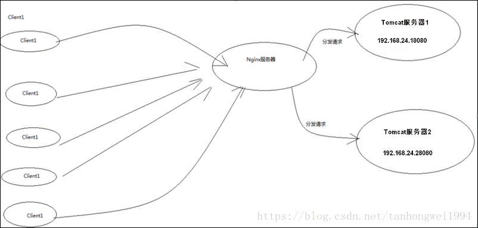
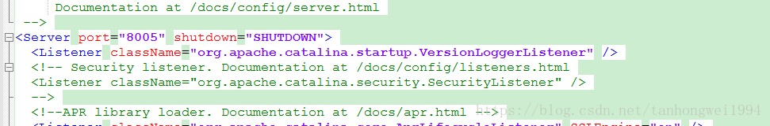
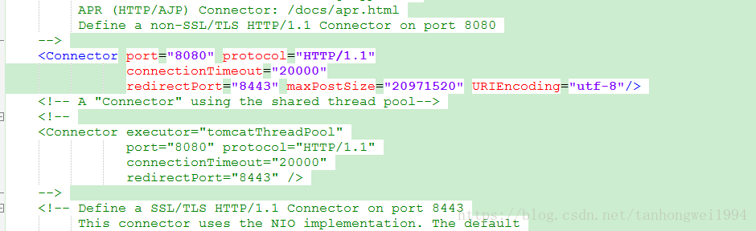
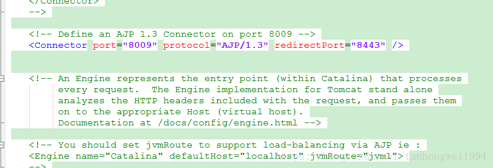
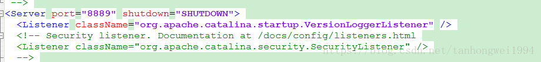
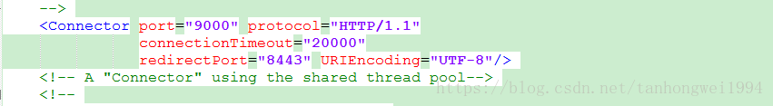
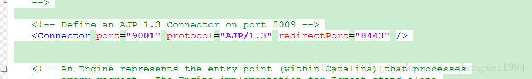
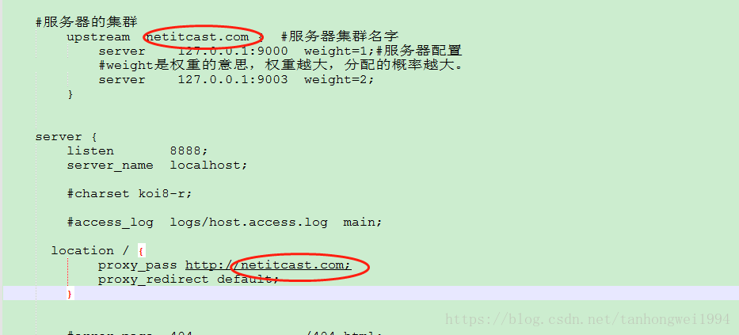
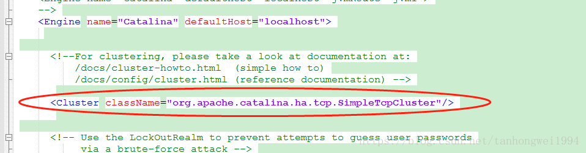
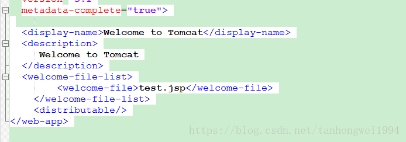

# Ngnix+tomcat 集群以及session共享

> 原创 最新推荐文章于 2024-12-03 14:35:13 发布 · 公开 · 555 阅读 · 0 · 4 · 本内容遵循CC 4.0 BY-SA版权协议 版权声明：本文为博主原创文章，遵循 CC 4.0 BY-SA 版权协议，转载请附上原文出处链接和本声明。 · 编辑
> 文章链接：https://blog.csdn.net/tanhongwei1994/article/details/83345846

一、工具
Nginx
tomcat

二、目标 

三、步骤
3.1 下载稳定版Nginx和tomcat
3.2修改tomcat下conf中的server.xml
初始值： 

 

 

修改值：
第一个tomcat中conf下server.xml
 

 

 

后续的tomcat下的server.xml端口保证不一样即可

3.3 配置Ngnix下的conf文件（conf/nginx.conf）
两个名词必须保持一致

 

四 配置session共享
4.1 取消 下一行的注释
 

4.2并在WEB-INF下的web.xml添加 

一切OK！ 收工…