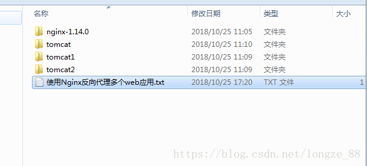
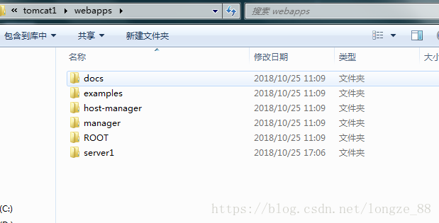
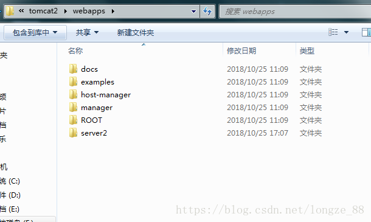
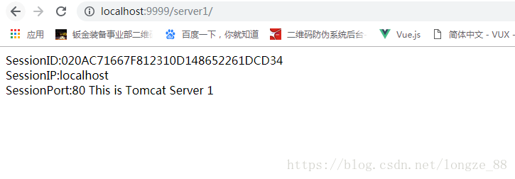
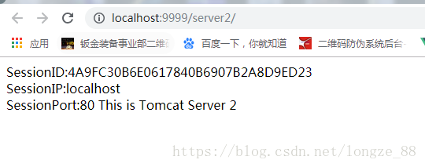

# Nginx配置多个项目放在不同的tomcat中，共享同一个端口

> 原创 最新推荐文章于 2024-01-14 09:51:19 发布 · 公开 · 7.4k 阅读 · 1 · 12 · 本内容遵循CC 4.0 BY-SA版权协议 版权声明：本文为博主原创文章，遵循 CC 4.0 BY-SA 版权协议，转载请附上原文出处链接和本声明。 · 编辑
> 文章链接：https://blog.csdn.net/tanhongwei1994/article/details/83383416

一、准备两个tomcat以及Nginx安装包
1.1分别命名为tomcat1，tomcat2。
 

1.2在两个tomcat的webapps下面分别新建个项目 server1，server2.
 

 

二、配置Ngnix的配置文件

```
http {
    include       mime.types;
    default_type  application/octet-stream;

    #log_format  main  '$remote_addr - $remote_user [$time_local] "$request" '
    #                  '$status $body_bytes_sent "$http_referer" '
    #                  '"$http_user_agent" "$http_x_forwarded_for"';

    #access_log  logs/access.log  main;

    sendfile        on;
    #tcp_nopush     on;

    #keepalive_timeout  0;
    keepalive_timeout  65;

    #gzip  on;
	 upstream netitcast.com {
         server localhost:10001;
    }

		 upstream netitcast2.com {
         server localhost:10004;
    }
       server {
        listen       9999;
        server_name  localhost;
        location / {
        proxy_pass http://netitcast.com;
        }
		
		  #加下面的配置
	location /server1{
	    proxy_pass http://127.0.0.1:10001/server1;#主要是这里，这是tomcat1的端口和项目
	    proxy_set_header           Host $host;
            proxy_set_header  X-Real-IP  $remote_addr;
	    proxy_set_header           X-Forwarded-For $proxy_add_x_forwarded_for;
            client_max_body_size  100m;
            root   html;
            index  index.html index.htm;
        }
 
	location /server2{
	    proxy_pass http://127.0.0.1:10004/server2;#主要是这里，这是tomcat2的端口和项目 #必须加项目名</span>
 
	    proxy_set_header           Host $host;
            proxy_set_header  X-Real-IP  $remote_addr;
	    proxy_set_header           X-Forwarded-For $proxy_add_x_forwarded_for;
            client_max_body_size  100m;
            root   html;
            index  index.html index.htm;
        }

        location ~ \.(gif|jpg|png)$ {
            root   data;
        }
        error_page   500 502 503 504  /50x.html;
        location = /50x.html {
            root   html;
        }
    }
}
```

三、重启Nginx并测试
 

 

附录 Nginx的cmd命令
直接点击Nginx目录下的nginx.exe    或者    cmd运行start nginx

关闭

nginx -s stop    或者

nginx -s quit

stop表示立即停止nginx,不保存相关信息

quit表示正常退出nginx,并保存相关信息

重启(因为改变了配置,需要重启)

nginx -s reload

windows任务管理器下Nginx的进程命令
tasklist /fi “imagename eq nginx.exe”

杀掉进程
taskkill /pid 1984  -t  -f