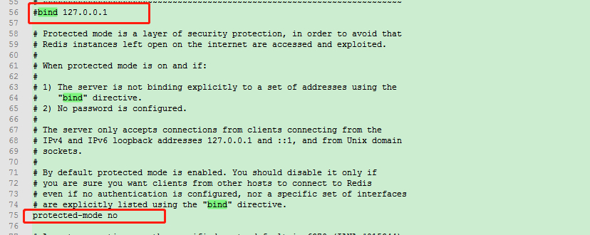
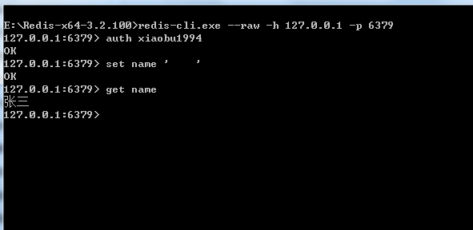
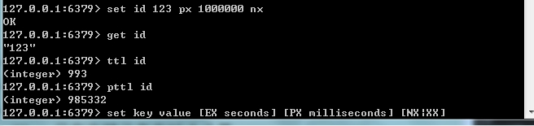

# Redis常用命令

> 原创 于 2019-07-29 16:49:32 发布 · 公开 · 265 阅读 · 0 · 0 · 本内容遵循CC 4.0 BY-SA版权协议 版权声明：本文为博主原创文章，遵循 CC 4.0 BY-SA 版权协议，转载请附上原文出处链接和本声明。 · 编辑
> 文章链接：https://blog.csdn.net/tanhongwei1994/article/details/97653501

> 启动

```java
redis-server redis.windows.conf
```

> 注册服务

```java
redis-server --service-install redis.windows-service.conf --loglevel verbose
```

> 卸载服务

```java
redis-server --service-uninstall
```

> 打开客户端连接

```java
redis-cli.exe -h 127.0.0.1 -p 6379 
```

> 查看有无密码

```java
config get requirepass
```

> 设置密码

```java
config set requirepasee 'xiaobu1994'
```

> 登录认证

```java
AUTH xiaobu@1994
```

> 开启远程

将bind注释掉protected-mode改为no

 

> 远程连接

```java
redis-cli.exe -h 172.18.9.166 -p 6379
```

> 解决redis中文乱码问题

```java
redis-cli.exe --raw -h 127.0.0.1 -p 6379
```

 

> 设置过期时间和取消时间限制

```java

127.0.0.1:6379> set id 10
OK
127.0.0.1:6379> expire id 10000
1
127.0.0.1:6379> get id
10
127.0.0.1:6379> ttl id
9970
127.0.0.1:6379> persist id
1
```

> 不存在key就赋值，否则就不赋值

```java
setnx id 123
```

> 获取值并设置新值 如果没有则会返回nil 但是仍然会把值赋给key

```java
getset id 2345
```

 

1. EX seconds − 设置指定的到期时间(以秒为单位)。

2. PX milliseconds - 设置指定的到期时间(以毫秒为单位)。

3. NX - 仅在键不存在时设置键。

4. XX - 只有在键已存在时才设置。

 

