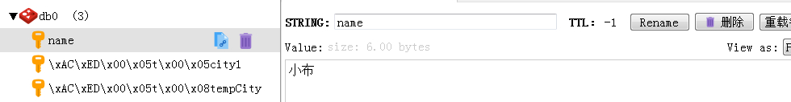
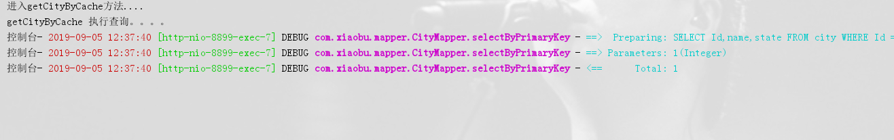
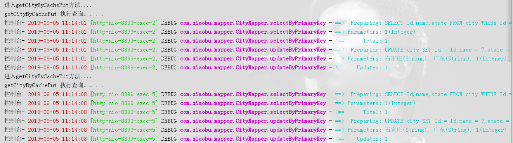
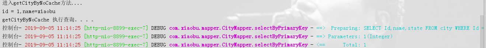

# SpringBoot | 使用Jackson序列化整合Cache实现Redis缓存

> 原创 已于 2022-05-09 20:32:50 修改 · 公开 · 4.3k 阅读 · 1 · 5 · 本内容遵循CC 4.0 BY-SA版权协议 版权声明：本文为博主原创文章，遵循 CC 4.0 BY-SA 版权协议，转载请附上原文出处链接和本声明。 · 编辑
> 文章链接：https://blog.csdn.net/tanhongwei1994/article/details/100554758

POM依赖

```xml
    <dependency>
               <groupId>org.springframework.boot</groupId>
               <artifactId>spring-boot-starter-web</artifactId>
           </dependency>
   
           <dependency>
               <groupId>org.springframework.boot</groupId>
               <artifactId>spring-boot-starter-data-redis</artifactId>
           </dependency>
   
           <dependency>
               <groupId>org.apache.commons</groupId>
               <artifactId>commons-pool2</artifactId>
               <version>2.4.3</version>
           </dependency>
```

配置文件

```properties
spring.redis.host=localhost
spring.redis.port=6379
spring.redis.password=xiaobu1994
# 连接超时时间（毫秒）
spring.redis.timeout=10000
# Redis默认情况下有16个分片，这里配置具体使用的分片，默认是0
spring.redis.database=0
# 连接池最大连接数（使用负值表示没有限制） 默认 8
spring.redis.lettuce.pool.max-active=8
# 连接池最大阻塞等待时间（使用负值表示没有限制） 默认 -1
spring.redis.lettuce.pool.max-wait=-1
# 连接池中的最大空闲连接 默认 8
spring.redis.lettuce.pool.max-idle=8
# 连接池中的最小空闲连接 默认 0
spring.redis.lettuce.pool.min-idle=0
#缓存配置
# 一般来说是不用配置的，Spring Cache 会根据依赖的包自行装配 先后顺序 JCache -> EhCache -> Redis -> Guava
spring.cache.type=redis
```

启动类

```java
package com.xiaobu;

import lombok.extern.slf4j.Slf4j;
import org.springframework.boot.CommandLineRunner;
import org.springframework.boot.SpringApplication;
import org.springframework.boot.autoconfigure.SpringBootApplication;
import org.springframework.cache.annotation.EnableCaching;
import org.springframework.scheduling.annotation.EnableAsync;
import org.springframework.scheduling.annotation.EnableScheduling;
import org.springframework.web.servlet.config.annotation.WebMvcConfigurer;
import tk.mybatis.spring.annotation.MapperScan;


/**
 * @author xiaobu
 * @EnableCaching 开启缓存
 */
@EnableCaching
@SpringBootApplication
@Slf4j
public class SsmApplication implements WebMvcConfigurer, CommandLineRunner {

    public static void main(String[] args) {
        SpringApplication.run(SsmApplication.class, args);
    }

    @Override
    public void run(String... args) throws Exception {
        log.info("服务启动成功。。。。");
    }

}

```

- opsForValue： 对应 String（字符串）

- opsForZSet： 对应 ZSet（有序集合）

- opsForHash： 对应 Hash（哈希）

- opsForList： 对应 List（列表）

- opsForSet： 对应 Set（集合）

- opsForGeo： 对应 GEO（地理位置）

RedisConfig

```java
package com.xiaobu.config;

import com.fasterxml.jackson.annotation.JsonAutoDetect;
import com.fasterxml.jackson.annotation.PropertyAccessor;
import com.fasterxml.jackson.databind.ObjectMapper;
import com.fasterxml.jackson.databind.SerializationFeature;
import com.fasterxml.jackson.datatype.jsr310.JavaTimeModule;
import com.fasterxml.jackson.datatype.jsr310.deser.LocalDateDeserializer;
import com.fasterxml.jackson.datatype.jsr310.deser.LocalDateTimeDeserializer;
import com.fasterxml.jackson.datatype.jsr310.ser.LocalDateSerializer;
import com.fasterxml.jackson.datatype.jsr310.ser.LocalDateTimeSerializer;
import org.springframework.boot.autoconfigure.condition.ConditionalOnMissingBean;
import org.springframework.cache.CacheManager;
import org.springframework.cache.annotation.CachingConfigurerSupport;
import org.springframework.cache.annotation.EnableCaching;
import org.springframework.context.annotation.Bean;
import org.springframework.context.annotation.Configuration;
import org.springframework.context.annotation.Primary;
import org.springframework.data.redis.cache.RedisCacheConfiguration;
import org.springframework.data.redis.cache.RedisCacheManager;
import org.springframework.data.redis.cache.RedisCacheWriter;
import org.springframework.data.redis.connection.RedisConnectionFactory;
import org.springframework.data.redis.core.RedisTemplate;
import org.springframework.data.redis.serializer.Jackson2JsonRedisSerializer;
import org.springframework.data.redis.serializer.RedisSerializationContext;
import org.springframework.data.redis.serializer.StringRedisSerializer;

import java.time.Duration;
import java.time.LocalDate;
import java.time.LocalDateTime;
import java.time.format.DateTimeFormatter;

/**
 * @author 小布
 * @version 1.0.0
 * @className RedisConfig.java
 * @createTime 2021年10月15日 16:25:00
 */
@Configuration
@EnableCaching
public class RedisConfig extends CachingConfigurerSupport {
    @Bean
    @Primary//当有多个管理器的时候，必须使用该注解在一个管理器上注释：表示该管理器为默认的管理器
    public CacheManager cacheManager(RedisConnectionFactory connectionFactory) {
        //初始化一个RedisCacheWriter
        RedisCacheWriter redisCacheWriter = RedisCacheWriter.nonLockingRedisCacheWriter(connectionFactory);
        //序列化方式
        Jackson2JsonRedisSerializer<Object> serializer = new Jackson2JsonRedisSerializer<>(Object.class);
        RedisSerializationContext.SerializationPair<Object> pair = RedisSerializationContext.SerializationPair.fromSerializer(serializer);
        RedisCacheConfiguration defaultCacheConfig = RedisCacheConfiguration.defaultCacheConfig().serializeValuesWith(pair);
        //设置过期时间 30天
        defaultCacheConfig = defaultCacheConfig.entryTtl(Duration.ofDays(30));
        //初始化RedisCacheManager
        return new RedisCacheManager(redisCacheWriter, defaultCacheConfig);
    }


    @Bean(name = "redisTemplate")
    @SuppressWarnings("unchecked")
    @ConditionalOnMissingBean(name = "redisTemplate")
    public RedisTemplate<Object, Object> redisTemplate(RedisConnectionFactory redisConnectionFactory) {
        RedisTemplate<Object, Object> template = new RedisTemplate<>();
        template.setConnectionFactory(redisConnectionFactory);
        // Jackson2JsonRedisSerializer序列化
        Jackson2JsonRedisSerializer<Object> jackson2JsonRedisSerializer = new Jackson2JsonRedisSerializer<>(Object.class);
        ObjectMapper objectMapper = new ObjectMapper();
        // 指定要序列化的域，field,get和set,以及修饰符范围，ANY是都有包括private和public
        objectMapper.setVisibility(PropertyAccessor.ALL, JsonAutoDetect.Visibility.ANY);
        //LocalDatetime序列化
        JavaTimeModule timeModule = new JavaTimeModule();
        timeModule.addDeserializer(LocalDate.class,
                new LocalDateDeserializer(DateTimeFormatter.ofPattern("yyyy-MM-dd")));
        timeModule.addDeserializer(LocalDateTime.class,
                new LocalDateTimeDeserializer(DateTimeFormatter.ofPattern("yyyy-MM-dd HH:mm:ss")));
        timeModule.addSerializer(LocalDate.class,
                new LocalDateSerializer(DateTimeFormatter.ofPattern("yyyy-MM-dd")));
        timeModule.addSerializer(LocalDateTime.class,
                new LocalDateTimeSerializer(DateTimeFormatter.ofPattern("yyyy-MM-dd HH:mm:ss")));
        objectMapper.disable(SerializationFeature.WRITE_DATES_AS_TIMESTAMPS);
        objectMapper.registerModule(timeModule);
        // 指定序列化输入的类型，类必须是非final修饰的，final修饰的类，比如String,Integer等会跑出异常 https://blog.csdn.net/lixinkuan328/article/details/109654974
        // objectMapper.activateDefaultTyping(LaissezFaireSubTypeValidator.instance, ObjectMapper.DefaultTyping.NON_FINAL);
        jackson2JsonRedisSerializer.setObjectMapper(objectMapper);
        // key的序列化采用StringRedisSerializer
        template.setKeySerializer(new StringRedisSerializer());
        template.setHashKeySerializer(new StringRedisSerializer());
        // value值的序列化采用Jackson2JsonRedisSerializer
        template.setValueSerializer(jackson2JsonRedisSerializer);
        template.setHashValueSerializer(jackson2JsonRedisSerializer);
        return template;
    }
}

```

RedisUtils工具类

```java
package com.xiaobu.util;

import com.fasterxml.jackson.databind.ObjectMapper;
import org.springframework.data.redis.core.RedisTemplate;
import org.springframework.stereotype.Component;
import org.springframework.util.CollectionUtils;

import javax.annotation.Resource;
import java.util.List;
import java.util.Map;
import java.util.Set;
import java.util.concurrent.TimeUnit;

/**
 * @author 小布
 * @version 1.0.0
 * @className RedisUtils.java
 * @createTime 2021年10月16日 07:42:00
 */
@Component
public class RedisUtils {
    //若当前class不在spring boot框架内（不在web项目中）所以无法使用autowired，使用此种方法进行注入
    @Resource(name = "redisTemplate")
    private RedisTemplate<Object, Object> redisTemplate;
    /*
        ###  线上Redis禁止使用Keys正则匹配操作  ###
        1、redis是单线程的，其所有操作都是原子的，不会因并发产生数据异常
        2、使用高耗时的Redis命令是很危险的，会占用唯一的一个线程的大量处理时间，导致所有的请求都被拖慢。（例如时间复杂度为O(N)的KEYS命令，严格禁止在生产环境中使用）
        (1)运维/开发人员进行keys *操作，该操作比较耗时，又因为redis是单线程的，所以redis被锁住。
        (2)此时QPS比较高，又来了几万个对redis的读写请求，因为redis被锁住，所以全部Hang在那。
        (3)因为太多线程Hang在那，CPU严重飙升，造成redis所在的服务器宕机
        (4)所有的线程在redis那取不到数据，一瞬间全去数据库取数据，数据库就宕机了。
        需要注意的是，同样危险的命令不仅有keys *，还有以下几组：
            Flushdb 命令用于清空当前数据库中的所有 key
            Flushall 命令用于清空整个 Redis 服务器的数据(删除所有数据库的所有 key )
            CONFIG 客户端连接后可配置服务器
       参考简书：https://www.jianshu.com/p/2d0e11c551fc
    */

    // =============================common============================

    /**
     * 指定缓存失效时间
     *
     * @param key  键
     * @param time 时间(秒)
     */
    public boolean expire(Object key, long time) {
        try {
            if (time > 0) {
                redisTemplate.expire(key, time, TimeUnit.SECONDS);
            }
            return true;
        } catch (Exception e) {
            e.printStackTrace();
            return false;
        }
    }

    /**
     * 根据key 获取过期时间
     *
     * @param key 键 不能为null
     * @return 时间(秒) 返回0代表为永久有效
     */
    public long getExpire(Object key) {
        return redisTemplate.getExpire(key, TimeUnit.SECONDS);
    }

    /**
     * 判断key是否存在
     *
     * @param key 键
     * @return true 存在 false不存在
     */
    public boolean hasKey(Object key) {
        try {
            return redisTemplate.hasKey(key);
        } catch (Exception e) {
            e.printStackTrace();
            return false;
        }
    }

    /**
     * 删除缓存
     *
     * @param key 可以传一个值 或多个
     */
    public void remove(Object... key) {
        if (key != null && key.length > 0) {
            if (key.length == 1) {
                redisTemplate.delete(key[0]);
            } else {
                redisTemplate.delete(CollectionUtils.arrayToList(key));
            }
        }
    }
    // ============================String=============================

    /**
     * 普通缓存获取
     * 如果是list需要用jackson转换一下
     * List<User> users = objectMapper.convertValue(o, new TypeReference<List<User>>() {
     * });
     *
     * @param key 键
     * @return 值
     */
    public Object get(Object key) {
        return key == null ? null : redisTemplate.opsForValue().get(key);
    }

    /**
     * 普通缓存获取,泛型
     *
     * @param key   键
     * @param clazz 类型
     * @return 值
     */
    public <T> T get(Object key, Class<T> clazz) {
        ObjectMapper mapper = new ObjectMapper();
        Object v = get(key);
        if (v == null) {
            return null;
        }
        return mapper.convertValue(v, clazz);
    }


    /**
     * 普通缓存放入
     *
     * @param key   键
     * @param value 值
     * @return true成功 false失败
     */
    public boolean set(Object key, Object value) {
        try {
            redisTemplate.opsForValue().set(key, value);
            return true;
        } catch (Exception e) {
            e.printStackTrace();
            return false;
        }
    }

    /**
     * 普通缓存放入并设置时间
     *
     * @param key   键
     * @param value 值
     * @param time  时间(秒) time要大于0 如果time小于等于0 将设置无限期
     * @return true成功 false 失败
     */
    public boolean set(Object key, Object value, long time) {
        try {
            if (time > 0) {
                redisTemplate.opsForValue().set(key, value, time, TimeUnit.SECONDS);
            } else {
                set(key, value);
            }
            return true;
        } catch (Exception e) {
            e.printStackTrace();
            return false;
        }
    }

    /**
     * 递增
     *
     * @param key   键
     * @param delta 要增加几(大于0)
     */
    public long incr(Object key, long delta) {
        if (delta < 0) {
            throw new RuntimeException("递增因子必须大于0");
        }
        return redisTemplate.opsForValue().increment(key, delta);
    }

    /**
     * 递减
     *
     * @param key   键
     * @param delta 要减少几(小于0)
     */
    public long decr(Object key, long delta) {
        if (delta < 0) {
            throw new RuntimeException("递减因子必须大于0");
        }
        return redisTemplate.opsForValue().increment(key, -delta);
    }
    // ================================Map=================================

    /**
     * HashGet
     *
     * @param key  键 不能为null
     * @param item 项 不能为null
     * @return 值
     */
    public Object hget(Object key, String item) {
        return redisTemplate.opsForHash().get(key, item);
    }

    /**
     * 获取hashKey对应的所有键值
     *
     * @param key 键
     * @return 对应的多个键值
     */
    public Map<Object, Object> hmget(Object key) {
        return redisTemplate.opsForHash().entries(key);
    }

    /**
     * HashSet
     *
     * @param key 键
     * @param map 对应多个键值
     * @return true 成功 false 失败
     */
    public boolean hmset(Object key, Map<Object, Object> map) {
        try {
            redisTemplate.opsForHash().putAll(key, map);
            return true;
        } catch (Exception e) {
            e.printStackTrace();
            return false;
        }
    }

    /**
     * HashSet 并设置时间
     *
     * @param key  键
     * @param map  对应多个键值
     * @param time 时间(秒)
     * @return true成功 false失败
     */
    public boolean hmset(Object key, Map<Object, Object> map, long time) {
        try {
            redisTemplate.opsForHash().putAll(key, map);
            if (time > 0) {
                expire(key, time);
            }
            return true;
        } catch (Exception e) {
            e.printStackTrace();
            return false;
        }
    }

    /**
     * 向一张hash表中放入数据,如果不存在将创建
     *
     * @param key   键
     * @param item  项
     * @param value 值
     * @return true 成功 false失败
     */
    public boolean hset(Object key, String item, Object value) {
        try {
            redisTemplate.opsForHash().put(key, item, value);
            return true;
        } catch (Exception e) {
            e.printStackTrace();
            return false;
        }
    }

    /**
     * 向一张hash表中放入数据,如果不存在将创建
     *
     * @param key   键
     * @param item  项
     * @param value 值
     * @param time  时间(秒) 注意:如果已存在的hash表有时间,这里将会替换原有的时间
     * @return true 成功 false失败
     */
    public boolean hset(Object key, String item, Object value, long time) {
        try {
            redisTemplate.opsForHash().put(key, item, value);
            if (time > 0) {
                expire(key, time);
            }
            return true;
        } catch (Exception e) {
            e.printStackTrace();
            return false;
        }
    }

    /**
     * 删除hash表中的值
     *
     * @param key  键 不能为null
     * @param item 项 可以使多个 不能为null
     */
    public void hdel(Object key, Object... item) {
        redisTemplate.opsForHash().delete(key, item);
    }

    /**
     * 判断hash表中是否有该项的值
     *
     * @param key  键 不能为null
     * @param item 项 不能为null
     * @return true 存在 false不存在
     */
    public boolean hHasKey(Object key, String item) {
        return redisTemplate.opsForHash().hasKey(key, item);
    }

    /**
     * hash递增 如果不存在,就会创建一个 并把新增后的值返回
     *
     * @param key  键
     * @param item 项
     * @param by   要增加几(大于0)
     */
    public double hincr(Object key, String item, double by) {
        return redisTemplate.opsForHash().increment(key, item, by);
    }

    /**
     * hash递减
     *
     * @param key  键
     * @param item 项
     * @param by   要减少记(小于0)
     */
    public double hdecr(Object key, String item, double by) {
        return redisTemplate.opsForHash().increment(key, item, -by);
    }
    // ============================set=============================

    /**
     * 根据key获取Set中的所有值
     *
     * @param key 键
     */
    public Set<Object> sGet(Object key) {
        try {
            return redisTemplate.opsForSet().members(key);
        } catch (Exception e) {
            e.printStackTrace();
            return null;
        }
    }

    /**
     * 根据value从一个set中查询,是否存在
     *
     * @param key   键
     * @param value 值
     * @return true 存在 false不存在
     */

    public boolean sHasKey(Object key, Object value) {
        try {
            return redisTemplate.opsForSet().isMember(key, value);
        } catch (Exception e) {
            e.printStackTrace();
            return false;
        }
    }

    /**
     * 将数据放入set缓存
     *
     * @param key    键
     * @param values 值 可以是多个
     * @return 成功个数
     */
    public long sSet(Object key, Object... values) {
        try {
            return redisTemplate.opsForSet().add(key, values);
        } catch (Exception e) {
            e.printStackTrace();
            return 0;
        }
    }

    /**
     * 将set数据放入缓存
     *
     * @param key    键
     * @param time   时间(秒)
     * @param values 值 可以是多个
     * @return 成功个数
     */

    public long sSetAndTime(Object key, long time, Object... values) {
        try {
            Long count = redisTemplate.opsForSet().add(key, values);
            if (time > 0) {
                expire(key, time);
            }
            return count;
        } catch (Exception e) {
            e.printStackTrace();
            return 0;
        }
    }

    /**
     * 获取set缓存的长度
     *
     * @param key 键
     */
    public long sGetSetSize(Object key) {
        try {
            return redisTemplate.opsForSet().size(key);
        } catch (Exception e) {
            e.printStackTrace();
            return 0;
        }
    }

    /**
     * 移除值为value的
     *
     * @param key    键
     * @param values 值 可以是多个
     * @return 移除的个数
     */
    public long setRemove(Object key, Object... values) {
        try {
            Long count = redisTemplate.opsForSet().remove(key, values);
            return count;
        } catch (Exception e) {
            e.printStackTrace();
            return 0;
        }
    }
    // ===============================list=================================

    /**
     * 获取list缓存的内容
     *
     * @param key   键
     * @param start 开始
     * @param end   结束 0 到 -1代表所有值
     */
    public List<Object> lGetObj(Object key, long start, long end) {
        try {
            return redisTemplate.opsForList().range(key, start, end);
        } catch (Exception e) {
            e.printStackTrace();
            return null;
        }
    }


    /**
     * 获取list缓存的长度
     *
     * @param key 键
     */
    public long lGetListSize(Object key) {
        try {
            return redisTemplate.opsForList().size(key);
        } catch (Exception e) {
            e.printStackTrace();
            return 0;
        }
    }

    /**
     * 通过索引 获取list中的值
     *
     * @param key   键
     * @param index 索引 index>=0时， 0 表头，1 第二个元素，依次类推；index<0时，-1，表尾，-2倒数第二个元素，依次类推
     */
    public Object lGetIndex(Object key, long index) {
        try {
            return redisTemplate.opsForList().index(key, index);
        } catch (Exception e) {
            e.printStackTrace();
            return null;
        }
    }

    /**
     * 将list放入缓存
     *
     * @param key   键
     * @param value 值
     */
    public boolean lSet(Object key, Object value) {
        try {
            redisTemplate.opsForList().rightPush(key, value);
            return true;
        } catch (Exception e) {
            e.printStackTrace();
            return false;
        }
    }

    /**
     * 将list放入缓存
     *
     * @param key   键
     * @param value 值
     * @param time  时间(秒)
     */
    public boolean lSet(Object key, Object value, long time) {
        try {
            redisTemplate.opsForList().rightPush(key, value);
            if (time > 0) {
                expire(key, time);
            }
            return true;
        } catch (Exception e) {
            e.printStackTrace();
            return false;
        }
    }

    /**
     * 将list放入缓存
     *
     * @param key   键
     * @param value 值
     */
    public boolean lSet(Object key, List<Object> value) {
        try {
            redisTemplate.opsForList().rightPushAll(key, value);
            return true;
        } catch (Exception e) {
            e.printStackTrace();
            return false;
        }
    }

    /**
     * 将list放入缓存
     *
     * @param key   键
     * @param value 值
     * @param time  时间(秒)
     */
    public boolean lSet(Object key, List<Object> value, long time) {
        try {
            redisTemplate.opsForList().rightPushAll(key, value);
            if (time > 0) {
                expire(key, time);
            }
            return true;
        } catch (Exception e) {
            e.printStackTrace();
            return false;
        }
    }

    /**
     * 根据索引修改list中的某条数据
     *
     * @param key   键
     * @param index 索引
     * @param value 值
     */
    public boolean lUpdateIndex(Object key, long index, Object value) {
        try {
            redisTemplate.opsForList().set(key, index, value);
            return true;
        } catch (Exception e) {
            e.printStackTrace();
            return false;
        }
    }

    /**
     * 移除N个值为value
     *
     * @param key   键
     * @param count 移除多少个
     * @param value 值
     * @return 移除的个数
     */

    public long lRemove(Object key, long count, Object value) {
        try {
            return redisTemplate.opsForList().remove(key, count, value);
        } catch (Exception e) {
            e.printStackTrace();
            return 0;
        }
    }
}

```

RedisTest

```java
package com.xiaobu;

import com.xiaobu.entity.City;
import com.xiaobu.mapper.CountryMapper;
import com.xiaobu.service.CountryService;
import lombok.extern.slf4j.Slf4j;
import org.junit.Test;
import org.junit.runner.RunWith;
import org.springframework.beans.factory.annotation.Autowired;
import org.springframework.boot.test.context.SpringBootTest;
import org.springframework.data.redis.core.RedisTemplate;
import org.springframework.data.redis.core.StringRedisTemplate;
import org.springframework.data.redis.core.ValueOperations;
import org.springframework.test.context.junit4.SpringRunner;

import java.util.concurrent.TimeUnit;

/**
 * @author xiaobu
 * @version JDK1.8.0_171
 * @date on  2019/9/4 10:40
 * @description V1.0  手动使用redis
 */
@RunWith(SpringRunner.class)
@SpringBootTest
@Slf4j
public class RedisTest {

    @Autowired
    private CountryMapper countryMapper;
    @Autowired
    CountryService countryService;

    @Autowired
    private RedisTemplate redisTemplate;

    @Autowired
    private StringRedisTemplate stringRedisTemplate;

    @Autowired
    private RedisUtils redisUtils;

    @Test
    public void test() {
        //字符串
        stringRedisTemplate.opsForValue().set("name", "小布");
        log.info(stringRedisTemplate.opsForValue().get("name"));
        City city = new City();
        city.setName("深圳");
        city.setState("广东");
        ValueOperations<String, City> ops = redisTemplate.opsForValue();
        ops.set("city1", city);
        City city1 = (City) redisTemplate.opsForValue().get("city1");
        log.info("city1 ==> [{}]", city1);
        //设置过期
        ops.set("tempCity", city, 1, TimeUnit.HOURS);
        City tempCity = (City) redisTemplate.opsForValue().get("tempCity");
        log.info("tempCity ==> [{}]", tempCity);
    }


    @Test
    public void test() {
        ColumnDefinition c = new ColumnDefinition();
        c.setLabel("label");
        c.setValue("value");
        c.setDefine("define");
        redisUtils.set("ColumnDefinition", c);
        ColumnDefinition columnDefinition1 = redisUtils.get("ColumnDefinition", ColumnDefinition.class);
        log.info("columnDefinition1 ==> [{}]", columnDefinition1);
    }

}
```

RedisLocalDateTime 序列化

```java
/**
     * 需要格式化的字段
     */
    @TableField(value = "CREATE_TIME")
    @JsonDeserialize(using = LocalDateTimeDeserializer.class)
    @JsonSerialize(using = LocalDateTimeSerializer.class)
    @JsonFormat(pattern = "yyyy-MM-dd HH:mm:ss", timezone = "GMT+8")
    private LocalDateTime createTime;
```

Jackson把实体转JSON字符串

```java
        ObjectMapper MAPPER = new ObjectMapper();
        try {
            String ujosn = MAPPER.writeValueAsString(city);
            System.out.println("ujosn = " + ujosn);
        } catch (JsonProcessingException e) {
            e.printStackTrace();
        }
```

```java
package com.xiaobu.junit;

import com.fasterxml.jackson.core.type.TypeReference;
import com.fasterxml.jackson.databind.ObjectMapper;
import com.xiaobu.entity.Persons;
import com.xiaobu.entity.RedisTestBean;
import com.xiaobu.util.RedisUtils;
import org.junit.jupiter.api.Test;
import org.springframework.boot.test.context.SpringBootTest;
import org.springframework.data.redis.core.RedisTemplate;
import org.springframework.data.redis.serializer.Jackson2JsonRedisSerializer;

import javax.annotation.Resource;
import java.util.ArrayList;
import java.util.List;

/**
 * @author 小布
 * @className RedisTest.java
 * @createTime 2022年05月08日 20:37:00
 */
@SpringBootTest
public class RedisTest {

    @Resource
    private RedisTemplate<Object, Object> redisTemplate;
    @Resource
    private RedisUtils redisUtils;
    @Resource
    private ObjectMapper objectMapper;


    @Test
    public void testPersonList() {
        Persons persons = new Persons();
        persons.setFirstName("123");
        List<Persons> list2 = new ArrayList<>();
        list2.add(persons);
        redisUtils.set("list2", list2);
        String key = "list2";
        List<Persons> list = (List<Persons>) redisUtils.get(key);
        System.out.println("list = " + list);
    }

    /**
     * 添加persons对象
     */
    @Test
    public void testSetPersons() {
        Persons persons = new Persons();
        persons.setFirstName("20");
        //重新设置序列化器
        // this.redisTemplate.setValueSerializer(new JdkSerializationRedisSerializer());
        this.redisTemplate.setValueSerializer(new Jackson2JsonRedisSerializer<>(Persons.class));
        this.redisTemplate.opsForValue().set("persons", persons);
    }

    /**
     * 取persons对象
     */
    @Test
    public void testGetUsers() {
        //重新设置序列化器
        // this.redisTemplate.setValueSerializer(new JdkSerializationRedisSerializer());
        this.redisTemplate.setValueSerializer(new Jackson2JsonRedisSerializer<>(Persons.class));
        Persons p = (Persons) this.redisTemplate.opsForValue().get("persons");
        System.out.println(p);
    }

    @Test
    public void testRedisBean() {
        RedisTestBean redisTestBean = new RedisTestBean();
        Persons persons = new Persons();
        persons.setFirstName("20");
        redisTestBean.setName("123");
        redisTestBean.setPersons(persons);
        redisUtils.set("bean", redisTestBean);
        RedisTestBean bean = redisUtils.get("bean", RedisTestBean.class);
        System.out.println("bean = " + bean);
    }

    @Test
    public void testGetRedisBean() {
        this.redisTemplate.setValueSerializer(new Jackson2JsonRedisSerializer<>(RedisTestBean.class));
        RedisTestBean redisTestBean = (RedisTestBean) this.redisTemplate.opsForValue().get("bean");
        System.out.println("redisTestBean = " + redisTestBean);
    }


    @Test
    void testRedisList() {
        Persons persons = new Persons();
        persons.setFirstName("123");
        List<Persons> personsList = new ArrayList<>();
        personsList.add(persons);
        String key = "personsList";
        redisUtils.set(key, personsList);
        Object o = redisUtils.get(key);
        List<Persons> list = (List<Persons>) o;
        System.out.println("list = " + list);
        //使用jackson将对象转换为List<Persons>
        List<Persons> data = objectMapper.convertValue(o, new TypeReference<List<Persons>>() {
        });
        System.out.println("data = " + data);
    }


}
```

```java
package com.xiaobu.junit;

import com.fasterxml.jackson.core.type.TypeReference;
import com.fasterxml.jackson.databind.ObjectMapper;
import com.xiaobu.entity.User;
import org.junit.jupiter.api.Test;
import org.springframework.beans.factory.annotation.Autowired;
import org.springframework.boot.test.context.SpringBootTest;
import org.springframework.data.redis.core.ListOperations;
import org.springframework.data.redis.core.RedisTemplate;

import java.util.ArrayList;
import java.util.Date;
import java.util.List;

/**
 * @author xiaobu
 * @className RedisTest.java
 * @createTime 2022年05月08日 20:37:00
 * 将list存入redis list类型
 */
@SpringBootTest
public class RedisTest2 {

    @Autowired
    ObjectMapper objectMapper;
    @Autowired
    private RedisTemplate<Object, ?> redisTemplate;

    @Test
    void testRedisTemplate() {
        ListOperations<Object, User> listOps = (ListOperations<Object, User>) redisTemplate.opsForList();
        User user = new User("李四", 18, new Date());
        ArrayList<User> userList = new ArrayList<>();
        userList.add(user);
        userList.add(user);
        listOps.leftPushAll("users", userList);
        //此时拿到的是jackson序列化后的json字符串
        List<User> lists = listOps.range("users", 0, -1);
        System.out.println("lists = " + lists);
        //jackson解析出具体的bean
        List<User> users = objectMapper.convertValue(lists, new TypeReference<List<User>>() {
        });
        users.forEach(x -> System.out.println(x.getName() + "==" + x.getBirthDay()));
    }

  
}

```

查看redis，可以看出已经设置成功.

 

使用SpringCache自动根据方法生成缓存

- key： 缓存的 key，可以为空，如果指定要按照 SpEL 表达式编写，如果不指定，则缺省按照方法的所有参数进行组合。例如：@Cacheable(value=”testcache”,key=”#id”)

- value： 缓存的名称，必须指定至少一个。例如：@Cacheable(value=”mycache”) 或者@Cacheable(value={”cache1”,”cache2”}

- condition： 缓存的条件，可以为空，使用 SpEL 编写，返回 true 或者 false，只有为 true 才进行缓存(如：condition =“#id<2”，只缓存id<
  2的;condition=”#userName.length()>2”只缓存名字长度大于2的)

> @Cacheable注解会先查询是否已经有缓存，有会使用缓存，没有则会执行方法并缓存。

> @CachePut注解的作用 主要针对方法配置，能够根据方法的请求参数对其结果进行缓存，和 @Cacheable 不同的是，它每次都会触发真实方法的调用 。简单来说就是用户更新缓存数据。但需要注意的是该注解的value 和 key 必须与要更新的缓存相同，也就是与@Cacheable 相同。

> @CachEvict 的作用 主要针对方法配置，能够根据一定的条件对缓存进行清空 。

> @CacheConfig 一个类中可能会有多个缓存操作，而这些缓存操作可能是重复的。这个时候可以使用@CacheConfig @CacheConfig是一个类级别的注解，允许共享缓存的名称、KeyGenerator、CacheManager 和CacheResolver。 该操作会被覆盖。

- allEntries: 是否清空所有缓存内容，缺省为 false，如果指定为 true，则方法调用后将立即清空所有缓存。

- beforeInvocation: 是否在方法执行前就清空，缺省为 false，如果指定为 true，则在方法还没有执行的时候就清空缓存，缺省情况下，如果方法执行抛出异常，则不会清空缓存。

控制层

> @RequestParam 和 @PathVariable 注解是用于从request中接收请求的，两个都可以接收参数，关键点不同的是@RequestParam 是从request里面拿取值，而 @PathVariable 是从一个URI模板里面来填充

```java
package com.xiaobu.controller;

import com.xiaobu.entity.City;
import com.xiaobu.service.CityService;
import org.springframework.cache.annotation.CacheEvict;
import org.springframework.cache.annotation.CachePut;
import org.springframework.cache.annotation.Cacheable;
import org.springframework.web.bind.annotation.*;

import javax.annotation.Resource;

/**
 * @author xiaobu
 * @version JDK1.8.0_171
 * @date on  2019/9/4 16:25
 * @description
 */
@RestController
@RequestMapping("/cache")
public class CacheController {

    @Resource
    private CityService cityService;

    /**
     * 功能描述:只有当id<2是才会缓存  redis的key为 cacheCity::1   http://localhost:8899/cities/getCityByCache/1
     * @author xiaobu
     * @date 2019/7/29 15:12
     * @param id id
     * @return com.xiaobu.entity.City
     * @version 1.0
     */
    @Cacheable(value = "cacheCity", key = "#id", condition = "#id<2")
    @GetMapping("getCityByCache/{id}")
    public City getCityByCache(@PathVariable Integer id) {
        return cityService.getCityByCache(id);
    }


    /**
     * 功能描述:把更新后的放入缓存 key为 cacheCity::1  http://localhost:8899/cities/getCityByCachePut/1
     * @author xiaobu
     * @date 2019/9/4 13:41
     * @param id id
     * @return com.xiaobu.entity.City
     * @version 1.0
     */
    @CachePut(value = "cacheCity", key = "#id")
    @GetMapping("getCityByCachePut/{id}")
    public City getCityByCachePut(@PathVariable Integer id) {
        return cityService.getCityByCachePut(id);
    }


    /**
     * 功能描述:清除 key为 cacheCity::1的缓存数据 http://localhost:8899/cities/getCityByNoCache/1/xiaobu
     * @author xiaobu
     * @date 2019/7/29 15:11
     * @param id, name]
     * @return com.xiaobu.entity.City
     * @version 1.0
     */
    @CacheEvict(value = "cacheCity", key = "#id")
    @GetMapping(value = "getCityByNoCache/{id}")
    public City getCityByNoCache(@PathVariable Integer id, @RequestParam String name) {
        System.out.println("id = " + id + ",name=" + name);
        return cityService.getCityByNoCache(id);
    }
}

```

服务层:

```java

/*
 * The MIT License (MIT)
 *
 * Copyright (c) 2014-2016 abel533@gmail.com
 *
 * Permission is hereby granted, free of charge, to any person obtaining a copy
 * of this software and associated documentation files (the "Software"), to deal
 * in the Software without restriction, including without limitation the rights
 * to use, copy, modify, merge, publish, distribute, sublicense, and/or sell
 * copies of the Software, and to permit persons to whom the Software is
 * furnished to do so, subject to the following conditions:
 *
 * The above copyright notice and this permission notice shall be included in
 * all copies or substantial portions of the Software.
 *
 * THE SOFTWARE IS PROVIDED "AS IS", WITHOUT WARRANTY OF ANY KIND, EXPRESS OR
 * IMPLIED, INCLUDING BUT NOT LIMITED TO THE WARRANTIES OF MERCHANTABILITY,
 * FITNESS FOR A PARTICULAR PURPOSE AND NONINFRINGEMENT. IN NO EVENT SHALL THE
 * AUTHORS OR COPYRIGHT HOLDERS BE LIABLE FOR ANY CLAIM, DAMAGES OR OTHER
 * LIABILITY, WHETHER IN AN ACTION OF CONTRACT, TORT OR OTHERWISE, ARISING FROM,
 * OUT OF OR IN CONNECTION WITH THE SOFTWARE OR THE USE OR OTHER DEALINGS IN
 * THE SOFTWARE.
 */

package com.xiaobu.service;

import com.github.pagehelper.PageHelper;
import com.xiaobu.entity.City;
import com.xiaobu.mapper.CityMapper;
import org.springframework.beans.factory.annotation.Autowired;
import org.springframework.cache.annotation.CacheEvict;
import org.springframework.cache.annotation.CachePut;
import org.springframework.cache.annotation.Cacheable;
import org.springframework.stereotype.Service;

import java.util.List;

/**
 * @author xiaobu
 * @since 2019-09-04 11:09
 */
@Service
public class CityService {

    @Autowired
    private CityMapper cityMapper;

    public City getCityByCache(Integer id) {
        System.out.println("getCityByCache 执行查询。。。。");
        return cityMapper.selectByPrimaryKey(id);
    }

    public City getCityByCachePut(Integer id) {
        System.out.println("getCityByCachePut 执行查询。。。。");
        City city = cityMapper.selectByPrimaryKey(id);
        city.setState("广东");
        cityMapper.updateByPrimaryKey(city);
        return city;
    }


    public City getCityByNoCache(Integer id) {
        System.out.println("getCityByNoCache 执行查询。。。。");
        return cityMapper.selectByPrimaryKey(id);
    }
}


```

访问http://localhost:8899/cache/getCityByCache/1 第一次会去数据库查，第二次则直接在缓存里面查找。

 

访问 http://localhost:8899/cache/getCityByCachePut/1 两次都会去数据库查

 

先访问 http://localhost:8899/cache/getCityByNoCache/1/xiaobu 会发现缓存被清除了,数据是从数据库重新查的.

 

参考:

[史上超详细的SpringBoot整合Cache使用教程-Java知音](https://www.javazhiyin.com/4618.html) 
[springboot2.x使用redis作为缓存](https://blog.csdn.net/qq_33999844/article/details/82182427) 
[springboot整合redis](https://github.com/MiracleTanC/springboot-redis-demo) 
[redis三个连接客户端框架的选择：Jedis,Redisson,Lettuce](https://blog.csdn.net/w1014074794/article/details/88827946) 