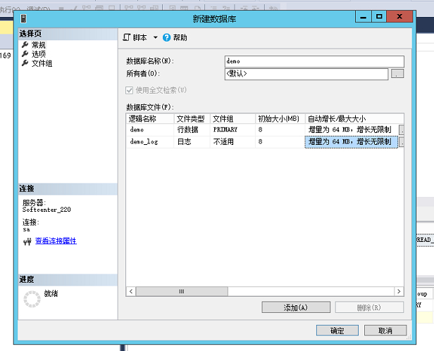
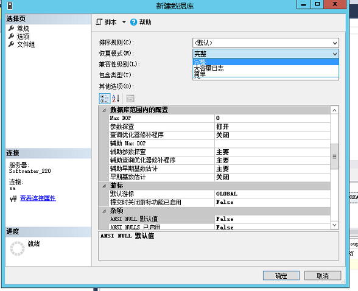

# SQLSERVER的LOG文件过于庞大

> 原创 于 2019-12-03 15:46:45 发布 · 公开 · 5.5k 阅读 · 1 · 6 · 本内容遵循CC 4.0 BY-SA版权协议 版权声明：本文为博主原创文章，遵循 CC 4.0 BY-SA 版权协议，转载请附上原文出处链接和本声明。 · 编辑
> 文章链接：https://blog.csdn.net/tanhongwei1994/article/details/103368737

有次看见windowsserver的C盘只剩下1G内存,后面确认是C:\Program Files\Microsoft SQL Server\MSSQL14.MSSQLSERVER\MSSQL\Log占了40G的内存。

查看恢复模式:

```sql
sp_helpdb '数据库名'   
```

看到恢复模式为full

首先关闭SQLSERVER的服务，删除LOG下面的所有文件(不关闭服务,有些文件会显示正在使用中)

将恢复模式改为simple

```sql
  alter database  数据库名 set recovery simple
```

新建数据库的时候可以选择日志文件的大小,文件存放在C:\Program Files\MicrosoftSQL Server\MSSQL14.MSSQLSERVER\MSSQL\DATA文件夹下。

 

设置恢复模式:
 

参考:

[sqlserver三种恢复模式](https://www.cnblogs.com/OpenCoder/p/5708226.html) 