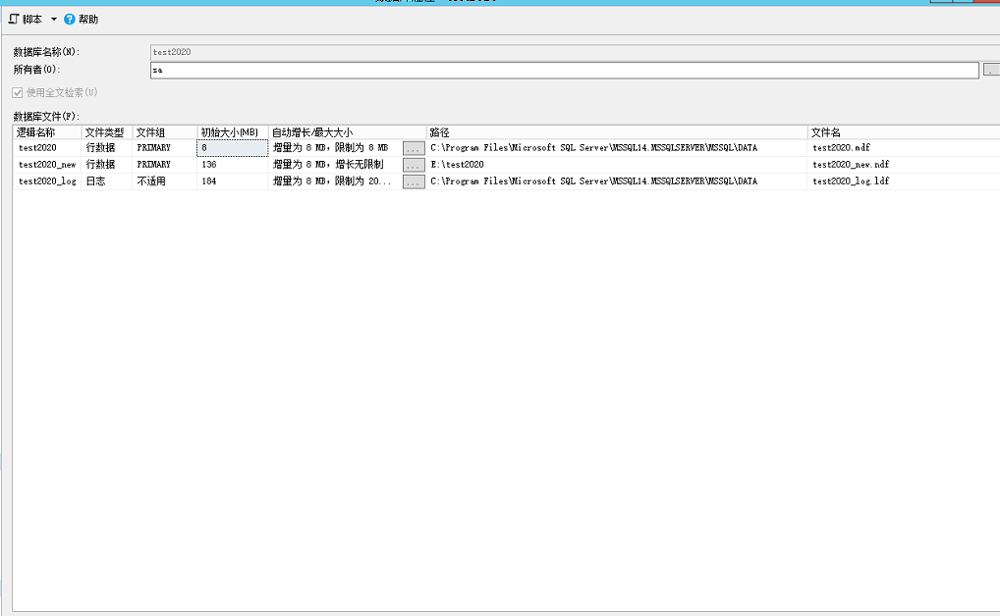
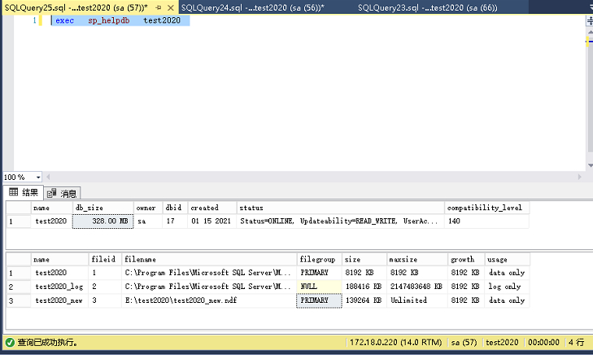

# sqlserver出现文件组‘PRIMARY‘已满

> 原创 于 2021-01-15 16:04:31 发布 · 公开 · 4.5k 阅读 · 0 · 3 · 本内容遵循CC 4.0 BY-SA版权协议 版权声明：本文为博主原创文章，遵循 CC 4.0 BY-SA 版权协议，转载请附上原文出处链接和本声明。 · 编辑
> 文章链接：https://blog.csdn.net/tanhongwei1994/article/details/112673735

> 数据库的大小限制：对SQL Server 2008 R2 Express、SQL Server 2012 Express、SQL Server 2014 Express、SQL Server 2016 Express单个数据库的大小限制最大为 10 GB[4]；而在较早期的SQL Server 2005 Express 和SQL Server 2008 Express 上，单个数据库的大小限制最大为4 GB。

右键数据库属性，选择文件组。添加一个数据库文件，设置初始大小以及增量大小，并选择无限制。

 

查看 数据库test2020的存储情况 发现test2020.mdf文件只有8M其余的数据存在test2020_new.ndf文件中

```sql
 exec   sp_helpdb   test2020  
```

 

查看数据库文件信息

```sql
select * from  sys.database_files
```

参考:

[SQL Server Express](https://zh.wikipedia.org/wiki/SQL_Server_Express) 