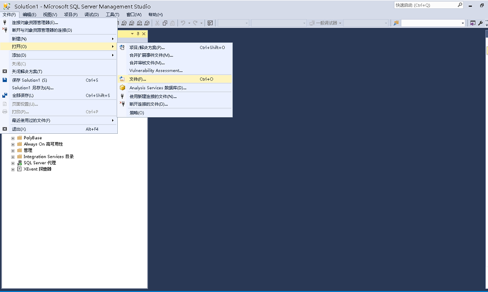

# sqlserver导入sql文件的方式

> 原创 于 2021-02-04 15:41:02 发布 · 公开 · 2.5w 阅读 · 1 · 40 · 本内容遵循CC 4.0 BY-SA版权协议 版权声明：本文为博主原创文章，遵循 CC 4.0 BY-SA 版权协议，转载请附上原文出处链接和本声明。 · 编辑
> 文章链接：https://blog.csdn.net/tanhongwei1994/article/details/113649621

一、 用MicrosoftSQLServer Management Studio 导入

在控制界面选择-> 文件选择->打开再选择->打开文件

 

二、命令行导入(cmd)

```properties
sqlcmd -S SERVERNAME -U USERNAME -P PASSWORD -i filename.sql
```