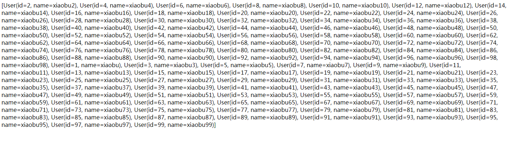
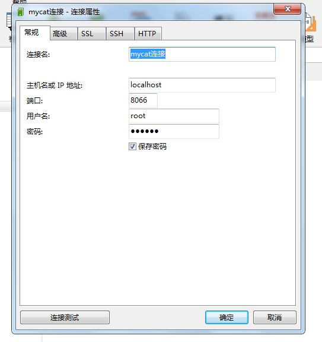
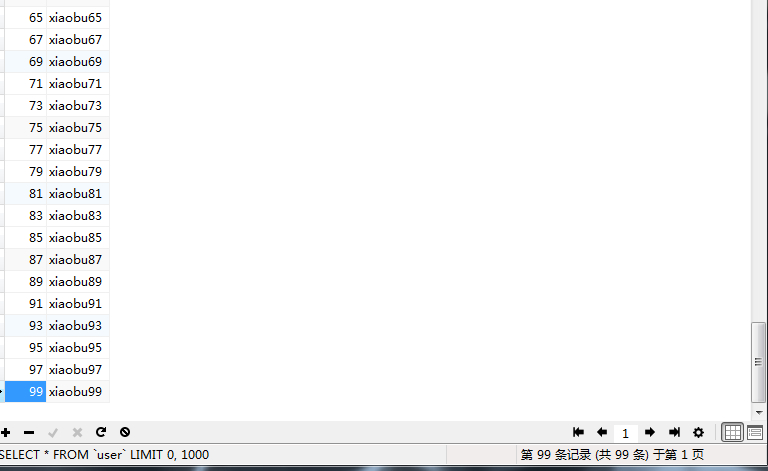
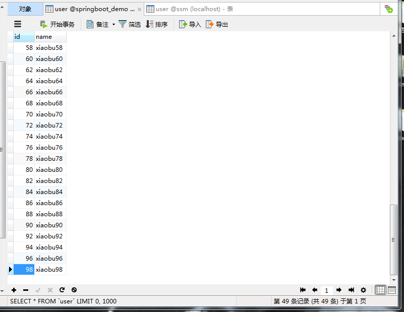
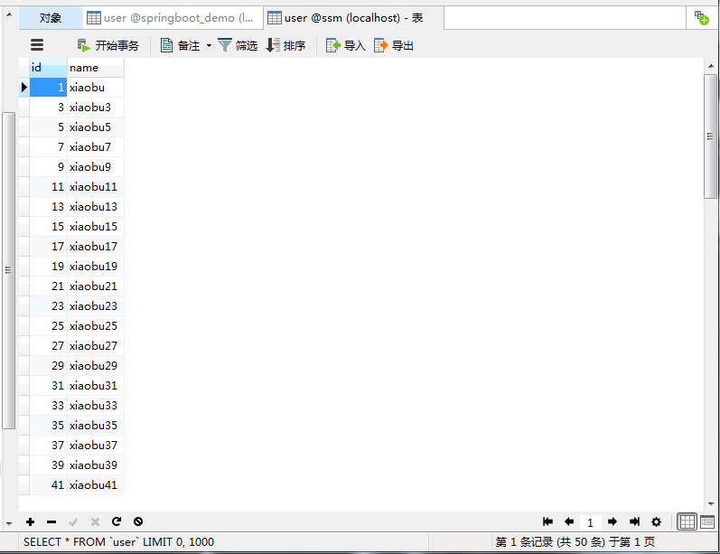

# Mycat+SpringBoot完成分库分表

> 原创 于 2019-12-18 13:49:17 发布 · 公开 · 818 阅读 · 0 · 0 · 本内容遵循CC 4.0 BY-SA版权协议 版权声明：本文为博主原创文章，遵循 CC 4.0 BY-SA 版权协议，转载请附上原文出处链接和本声明。 · 编辑
> 文章链接：https://blog.csdn.net/tanhongwei1994/article/details/103596306

mycat下载

[官网下载](http://dl.mycat.io/1.6-RELEASE/) 

conf下的schema.xml的配置

:表示的是在mycat中的逻辑库配置，逻辑库名称为:TESTDB

:表示在mycat中的逻辑表配置，逻辑表名称为:user,映射到两个数据库节点dataNode中,切分规则为:rule1(在rule.xml配置)
:表示数据库节点,这个节点不一定是单节点，可以配置成读写分离.

:真实的数据库的地址配置

:用户心跳检测

:写库的配置

```xml
<?xml version="1.0"?>
<!DOCTYPE mycat:schema SYSTEM "schema.dtd">
<mycat:schema xmlns:mycat="http://io.mycat/">

    <schema name="TESTDB" checkSQLschema="false" sqlMaxLimit="100">
            <table name="user" primaryKey="id" dataNode="dn01,dn02"  autoIncrement="false" rule="rule1"/>
			 <!-- 未分库的表 -->  
			<table name="city" primaryKey="id" dataNode="dn02"  autoIncrement="false" rule="rule2"/>
    </schema>
	

    
    <!-- 设置dataNode 对应的数据库,及 mycat 连接的地址dataHost -->  
    <dataNode name="dn01" dataHost="dh01" database="springboot_demo" />  
    <dataNode name="dn02" dataHost="dh01" database="ssm" />   
    
    <!-- mycat 逻辑主机dataHost对应的物理主机.其中也设置对应的mysql登陆信息 -->  
    <dataHost name="dh01" maxCon="1000" minCon="10" balance="0" writeType="0" dbType="mysql" dbDriver="native">  
            <heartbeat>select user()</heartbeat>  
            <writeHost host="server1" url="127.0.0.1:3306" user="root" password="113506"/>  
    </dataHost> 
</mycat:schema>
```

分配规则

- 分片枚举

- 固定分片 hash 算法

- 范围约定

- 取模 mod-long

- 按日期（天）分片

- 取模范围约束

- 截取数字做 hash 求模范围约束

- 应用指定

- 截取数字 hash 解析

- 一致性 hash

- 按单月小时拆分

- 范围求模分片

- 日期范围 hash 分片

- 冷热数据分片

- 自然月分片

conf/rule.xml 配置

```xml
<?xml version="1.0" encoding="UTF-8"?>
<!DOCTYPE mycat:rule SYSTEM "rule.dtd">
<mycat:rule xmlns:mycat="http://io.mycat/">
    <tableRule name="rule1">
        <rule>
            <columns>id</columns>
            <algorithm>mod-long</algorithm>
        </rule>
    </tableRule>
	<tableRule name="rule2">
        <rule>
            <columns>id</columns>
            <algorithm>mod-long2</algorithm>
        </rule>
    </tableRule>
    <function name="mod-long" class="io.mycat.route.function.PartitionByMod">
        <!-- how many data nodes -->
        <property name="count">2</property>
    </function>
	
	
	    <function name="mod-long2" class="io.mycat.route.function.PartitionByMod">
        <!-- how many data nodes -->
        <property name="count">1</property>
    </function>
	
</mycat:rule>
```

在两个物理数据库的创建表

```sql
CREATE TABLE user
(
id int PRIMARY KEY ,
name VARCHAR(10)
)

```

springbootd的配置文件这里连接的是mycat

```properties
#配置数据源
spring.datasource.druid.driver-class-name=com.mysql.jdbc.Driver
#这里配置的是Mycat中server.xml中配置账号密码，不是数据库的密码。
spring.datasource.druid.username=root
spring.datasource.druid.password=123456
#mycat的逻辑库 端口也是mycat的
spring.datasource.druid.url=jdbc:mysql://172.18.9.166:8066/TESTDB
```

批量插入数据

```java
    @Test
    void addList() {
        List<User> users = new ArrayList<>();
        for (int i = 3; i < 100; i++) {
            User user = new User();
            //必须设置id，即使物理数据库的id设置为自增长都不行
            user.setId(i);
            user.setName("xiaobu" + i);
            users.add(user);
        }
        int count = userMapper.insertList(users);
        System.out.println("count = " + count);
    }
```

查询

```java
package com.xiaobu.controller;

import com.xiaobu.mapper.UserMapper;
import org.springframework.web.bind.annotation.GetMapping;
import org.springframework.web.bind.annotation.RequestMapping;
import org.springframework.web.bind.annotation.ResponseBody;
import org.springframework.web.bind.annotation.RestController;

import javax.annotation.Resource;

/**
 * @author xiaobu
 * @version JDK1.8.0_171
 * @date on  2019/12/6 10:33
 * @description
 */
@RestController
@RequestMapping("user")
public class UserController {

    @Resource
    private UserMapper userMapper;

    @GetMapping("insert")
    @ResponseBody
    public String insert(){
        return null;
    }


    @GetMapping("selectAll")
    @ResponseBody
    public String selectAll(){
        return userMapper.selectAll().toString();
    }
}
```

可以看到数据插入成功了
 

mycat 连接属性

 

数据查询
 

两个物理表数据存储情况

springboot_demo.user

 

ssm.user

 

参考:

[数据库中间件Mycat+SpringBoot完成分库分表](https://www.jianshu.com/p/f81422b1c915) 