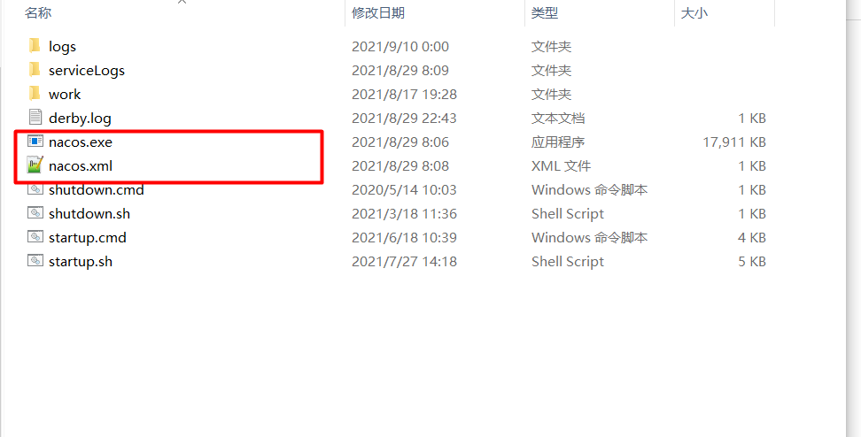
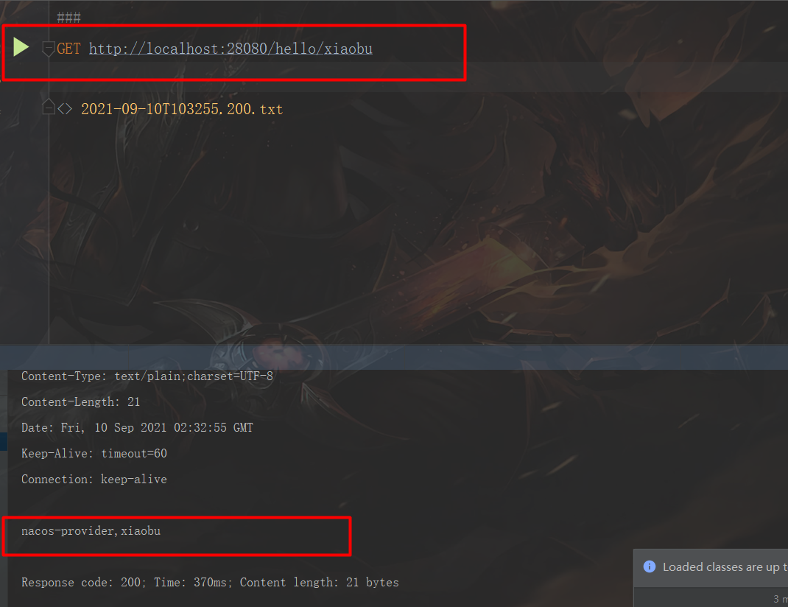

# Spring Cloud Alibaba 注册中心 Nacos 入门

> 原创 于 2021-09-17 15:40:48 发布 · 公开 · 248 阅读 · 1 · 3 · 本内容遵循CC 4.0 BY-SA版权协议 版权声明：本文为博主原创文章，遵循 CC 4.0 BY-SA 版权协议，转载请附上原文出处链接和本声明。 · 编辑
> 文章链接：https://blog.csdn.net/tanhongwei1994/article/details/120350327

## Getting Started

### 下载配置nacos

[nacos下载地址](https://github.com/alibaba/nacos/releases) 

将nacos注册为win服务

参考先前的文章
[Windows下将JAVA jar注册成windows服务](https://blog.csdn.net/%E5%B0%8F%E5%B8%831994/article/details/90044612) 

 

nacos.xml的配置信息

```xml

<service>
    <!-- 指定在Windows系统内部使用的识别服务的ID。在系统中安装的所有服务中，这必须是唯一的，它应该完全由字母数字字符组成 -->
    <id>nacos-id-000001</id>
    <!-- 服务的简短名称，它可以包含空格和其他字符。尽量简短，就像“id”一样，在系统的所有服务名称中，也要保持唯一 -->
    <name>Nacos</name>
    <!-- 该服务可读描述。当选中该服务时，它将显示在Windows服务管理器中 -->
    <description>nacos 服务描述</description>
    <!-- 该元素指定要启动的可执行文件 -->
    <executable>%BASE%\startup.cmd</executable>
    <!-- 指定单机启动 -->
    <arguments>-m standalone</arguments>
    <!-- 日志输出位置 -->
    <logpath>%BASE%\serviceLogs</logpath>
</service>
```

随后启动nacos服务

### 父modulespring-cloud-alibaba-nacos-discovery 信息

pom.xml

```xml
<?xml version="1.0" encoding="UTF-8"?>
<project xmlns:xsi="http://www.w3.org/2001/XMLSchema-instance" xmlns="http://maven.apache.org/POM/4.0.0"
         xsi:schemaLocation="http://maven.apache.org/POM/4.0.0 https://maven.apache.org/xsd/maven-4.0.0.xsd">
    <modelVersion>4.0.0</modelVersion>
    <parent>
        <groupId>com.xiaobu</groupId>
        <artifactId>springcloud-alibaba-learn</artifactId>
        <version>0.0.1-SNAPSHOT</version>
    </parent>
    <artifactId>spring-cloud-alibaba-nacos-discovery</artifactId>
    <version>0.0.1-SNAPSHOT</version>
    <name>spring-cloud-alibaba-nacos-discovery</name>
    <packaging>pom</packaging>
    <description>spring-cloud-alibaba-nacos-discovery</description>

    <modules>
        <module>nacos-consumer</module>
        <module>nacos-provider</module>
    </modules>

</project>

```

### nacos-provider

pom.xml

```xml
<?xml version="1.0" encoding="UTF-8"?>
<project xmlns:xsi="http://www.w3.org/2001/XMLSchema-instance" xmlns="http://maven.apache.org/POM/4.0.0"
         xsi:schemaLocation="http://maven.apache.org/POM/4.0.0 https://maven.apache.org/xsd/maven-4.0.0.xsd">
    <modelVersion>4.0.0</modelVersion>
    <parent>
        <groupId>com.xiaobu</groupId>
        <artifactId>spring-cloud-alibaba-nacos-discovery</artifactId>
        <version>0.0.1-SNAPSHOT</version>
    </parent>
    <artifactId>nacos-provider</artifactId>
    <version>0.0.1-SNAPSHOT</version>
    <name>nacos-provider</name>
    <description>nacos-provider</description>

    <properties>
        <spring.boot.version>2.2.4.RELEASE</spring.boot.version>
        <spring.cloud.version>Hoxton.SR1</spring.cloud.version>
        <spring.cloud.alibaba.version>2.2.0.RELEASE</spring.cloud.alibaba.version>
    </properties>
    <!--
        引入 Spring Boot、Spring Cloud、Spring Cloud Alibaba 三者 BOM 文件，进行依赖版本的管理，防止不兼容。
        在 https://dwz.cn/mcLIfNKt 文章中，Spring Cloud Alibaba 开发团队推荐了三者的依赖关系
     -->
    <dependencyManagement>
        <dependencies>
            <dependency>
                <groupId>org.springframework.boot</groupId>
                <artifactId>spring-boot-starter-parent</artifactId>
                <version>${spring.boot.version}</version>
                <type>pom</type>
                <scope>import</scope>
            </dependency>
            <dependency>
                <groupId>org.springframework.cloud</groupId>
                <artifactId>spring-cloud-dependencies</artifactId>
                <version>${spring.cloud.version}</version>
                <type>pom</type>
                <scope>import</scope>
            </dependency>
            <dependency>
                <groupId>com.alibaba.cloud</groupId>
                <artifactId>spring-cloud-alibaba-dependencies</artifactId>
                <version>${spring.cloud.alibaba.version}</version>
                <type>pom</type>
                <scope>import</scope>
            </dependency>
        </dependencies>
    </dependencyManagement>

    <dependencies>
        <!-- 引入 SpringMVC 相关依赖，并实现对其的自动配置 -->
        <dependency>
            <groupId>org.springframework.boot</groupId>
            <artifactId>spring-boot-starter-web</artifactId>
        </dependency>
        <!-- 引入 Spring Cloud Alibaba Nacos Discovery 相关依赖，将 Nacos 作为注册中心，并实现对其的自动配置 -->
        <dependency>
            <groupId>com.alibaba.cloud</groupId>
            <artifactId>spring-cloud-starter-alibaba-nacos-discovery</artifactId>
        </dependency>
        <!-- 引入 Spring Cloud Alibaba config 相关依赖 -->
        <dependency>
            <groupId>com.alibaba.cloud</groupId>
            <artifactId>spring-cloud-starter-alibaba-nacos-config</artifactId>
        </dependency>
    </dependencies>

</project>

```

application.properties

```properties
#应用程序名称
spring.application.name=nacos-provider
#nacos注册中心地址
spring.cloud.nacos.discovery.server-addr=127.0.0.1:8848
#namespace
spring.cloud.nacos.discovery.service=${spring.application.name}
#应用程序端口
server.port=${random.int[10000,19999]}


```

启动类

> @EnableDiscoveryClient 注解，开启 Spring Cloud 的注册发现功能。不过从 Spring Cloud Edgware 版本开始，实际上已经不需要添加 @EnableDiscoveryClient 注解，只需要引入 Spring Cloud 注册发现组件，就会自动开启注册发现的功能。例如说，我们这里已经引入了 spring-cloud-starter-alibaba-nacos-discovery 依赖，就不用再添加 @EnableDiscoveryClient 注解了。

```java
package com.xiaobu;

import org.springframework.boot.SpringApplication;
import org.springframework.boot.autoconfigure.SpringBootApplication;
import org.springframework.cloud.client.discovery.EnableDiscoveryClient;
import org.springframework.web.bind.annotation.GetMapping;
import org.springframework.web.bind.annotation.PathVariable;
import org.springframework.web.bind.annotation.RestController;

/**
 * The type Nacos provider application.
 *
 * @author 小布
 */
@SpringBootApplication
@EnableDiscoveryClient
public class NacosProviderApplication {


    /**
     * The entry point of application.
     *
     * @param args the input arguments
     */
    public static void main(String[] args) {
        SpringApplication.run(NacosProviderApplication.class, args);
    }

    @RestController
    static class TestController {

        /**
         * Hello string.
         *
         * @param name the name
         * @return the string
         */
        @GetMapping("/hello/{name}")
        public String hello(@PathVariable String name) {
            return String.format("nacos-provider,%s", name);
        }
    }
}
```

### nacos-consumer

pom.xml

```xml
<?xml version="1.0" encoding="UTF-8"?>
<project xmlns:xsi="http://www.w3.org/2001/XMLSchema-instance" xmlns="http://maven.apache.org/POM/4.0.0"
         xsi:schemaLocation="http://maven.apache.org/POM/4.0.0 https://maven.apache.org/xsd/maven-4.0.0.xsd">
    <modelVersion>4.0.0</modelVersion>
    <parent>
        <groupId>com.xiaobu</groupId>
        <artifactId>spring-cloud-alibaba-nacos-discovery</artifactId>
        <version>0.0.1-SNAPSHOT</version>
    </parent>
    <artifactId>nacos-consumer</artifactId>
    <version>0.0.1-SNAPSHOT</version>
    <name>nacos-consumer</name>
    <description>nacos-consumer</description>
    <properties>
        <spring.boot.version>2.2.4.RELEASE</spring.boot.version>
        <spring.cloud.version>Hoxton.SR1</spring.cloud.version>
        <spring.cloud.alibaba.version>2.2.0.RELEASE</spring.cloud.alibaba.version>
    </properties>
    <!--
        引入 Spring Boot、Spring Cloud、Spring Cloud Alibaba 三者 BOM 文件，进行依赖版本的管理，防止不兼容。
        在 https://dwz.cn/mcLIfNKt 文章中，Spring Cloud Alibaba 开发团队推荐了三者的依赖关系
     -->
    <dependencyManagement>
        <dependencies>
            <dependency>
                <groupId>org.springframework.boot</groupId>
                <artifactId>spring-boot-starter-parent</artifactId>
                <version>${spring.boot.version}</version>
                <type>pom</type>
                <scope>import</scope>
            </dependency>
            <dependency>
                <groupId>org.springframework.cloud</groupId>
                <artifactId>spring-cloud-dependencies</artifactId>
                <version>${spring.cloud.version}</version>
                <type>pom</type>
                <scope>import</scope>
            </dependency>
            <dependency>
                <groupId>com.alibaba.cloud</groupId>
                <artifactId>spring-cloud-alibaba-dependencies</artifactId>
                <version>${spring.cloud.alibaba.version}</version>
                <type>pom</type>
                <scope>import</scope>
            </dependency>
        </dependencies>
    </dependencyManagement>

    <dependencies>
        <!-- 引入 SpringMVC 相关依赖，并实现对其的自动配置 -->
        <dependency>
            <groupId>org.springframework.boot</groupId>
            <artifactId>spring-boot-starter-web</artifactId>
        </dependency>

        <!-- 引入 Spring Cloud Alibaba Nacos Discovery 相关依赖，将 Nacos 作为注册中心，并实现对其的自动配置 -->
        <dependency>
            <groupId>com.alibaba.cloud</groupId>
            <artifactId>spring-cloud-starter-alibaba-nacos-discovery</artifactId>
        </dependency>
    </dependencies>

</project>

```

application.properties

```properties
#应用程序名称
spring.application.name=nacos-consumer
#nacos注册中心地址
spring.cloud.nacos.discovery.server-addr=127.0.0.1:8848
#注册到nacos上的服务名称
spring.cloud.nacos.discovery.service=${spring.application.name}
#应用程序端口
server.port=28080


```

启动类

```java
package com.xiaobu;

import org.springframework.beans.factory.annotation.Autowired;
import org.springframework.boot.SpringApplication;
import org.springframework.boot.autoconfigure.SpringBootApplication;
import org.springframework.cloud.client.discovery.EnableDiscoveryClient;
import org.springframework.cloud.client.loadbalancer.LoadBalanced;
import org.springframework.context.annotation.Bean;
import org.springframework.web.bind.annotation.GetMapping;
import org.springframework.web.bind.annotation.PathVariable;
import org.springframework.web.bind.annotation.RestController;
import org.springframework.web.client.RestTemplate;

/**
 * The type Nacos consumer application.
 *
 * @author 小布
 */
@SpringBootApplication
@EnableDiscoveryClient
public class NacosConsumerApplication {
    /**
     * The entry point of application.
     *
     * @param args the input arguments
     */
    public static void main(String[] args) {
        SpringApplication.run(NacosConsumerApplication.class, args);
    }

    /**
     * Rest template rest template.
     *
     * @return the rest template
     */
    @LoadBalanced
    @Bean
    public RestTemplate restTemplate() {
        return new RestTemplate();
    }


    /**
     * The type Test controller.
     */
    @RestController
    public static class TestController {

        /**
         * The Rest template.
         */
        @Autowired
        private RestTemplate restTemplate;

        /**
         * Hello string.
         *
         * @param name the name
         * @return the string
         */
        @GetMapping("/hello/{name}")
        public String hello(@PathVariable String name) {
            return restTemplate.getForObject("http://nacos-provider/hello/" + name, String.class);
        }
    }
}

```

然后 使用Idea的 HttpClient进行方法调用 可以看到已经成功了

 

参考：

[芋道 Spring Boot 注册中心 Nacos 入门](https://www.iocoder.cn/Spring-Boot/registry-nacos/?self) 