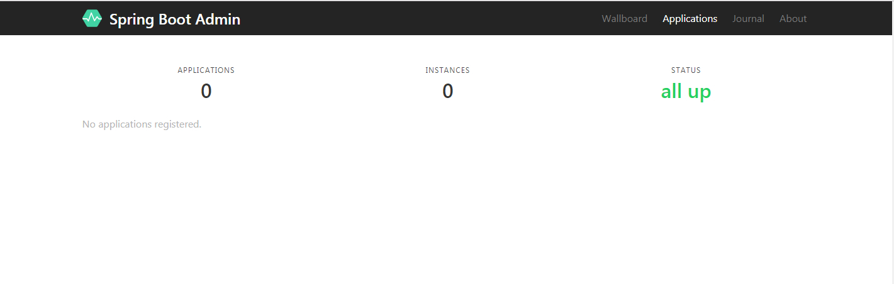
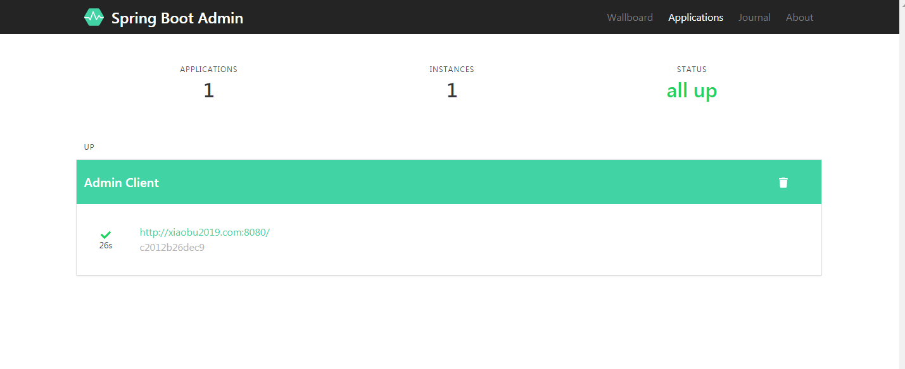
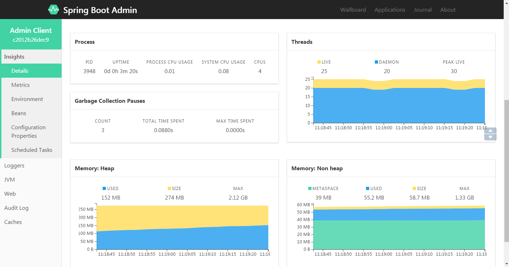

# SpringBoot | 使用 spring-boot-admin 对 Spring Boot 服务进行监控

> 原创 于 2019-09-04 11:22:58 发布 · 公开 · 493 阅读 · 0 · 0 · 本内容遵循CC 4.0 BY-SA版权协议 版权声明：本文为博主原创文章，遵循 CC 4.0 BY-SA 版权协议，转载请附上原文出处链接和本声明。 · 编辑
> 文章链接：https://blog.csdn.net/tanhongwei1994/article/details/100535491

server端项目依赖

```xml
 <dependency>
            <groupId>de.codecentric</groupId>
            <artifactId>spring-boot-admin-starter-server</artifactId>
            <version>2.1.0</version>
        </dependency>
        <dependency>
            <groupId>org.springframework.boot</groupId>
            <artifactId>spring-boot-starter-web</artifactId>
        </dependency>
```

配置文件 application.properties

```ftl]
server.port=8181

spring.application.name=spring-boot-admin-server

```

启动类

```java
package com.xiaobu;

import de.codecentric.boot.admin.server.config.EnableAdminServer;
import org.springframework.boot.CommandLineRunner;
import org.springframework.boot.SpringApplication;
import org.springframework.boot.autoconfigure.SpringBootApplication;


/**
 * @author xiaobu
 */
@EnableAdminServer
@SpringBootApplication
public class SpringbootAdminServerApplication implements CommandLineRunner {

    public static void main(String[] args) {
        SpringApplication.run(SpringbootAdminServerApplication.class, args);
    }

    @Override
    public void run(String... args) throws Exception {
        System.out.println("服务启动成功......");
    }
}

```

启动服务端，浏览器访问http://localhost:8181，即可看到下面的效果。
 

AdminClient端

项目依赖:

```xml
  <dependency>
            <groupId>org.springframework.boot</groupId>
            <artifactId>spring-boot-starter-web</artifactId>
        </dependency>

        <!-- Admin client 端-->
        <dependency>
            <groupId>de.codecentric</groupId>
            <artifactId>spring-boot-admin-starter-client</artifactId>
            <version>2.1.0</version>
        </dependency>
```

配置文件 application.properties

```xml
#springbootadmin 监控
spring.application.name=Admin Client
#配置 Admin Server 的地址
spring.boot.admin.client.url=http://localhost:8181
#打开客户端 Actuator 的监控。
management.endpoints.web.exposure.include=*

```

启动类

```java
package com.xiaobu;

import org.springframework.boot.SpringApplication;
import org.springframework.boot.autoconfigure.SpringBootApplication;

@SpringBootApplication
public class SpringbootAdminClientApplication {

    public static void main(String[] args) {
        SpringApplication.run(SpringbootAdminClientApplication.class, args);
    }

}

```

启动Client后，服务器会自动检测到客户端的变化，并展示应用

 

点击实例详情查看详细监控信息:

 

### 已知bug

java.lang.IllegalStateException: Calling [asyncError()] is not valid for arequestwith Async state [MUST_DISPATCH]