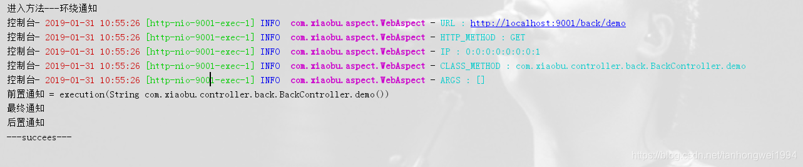

# SpringBoot | 实现切面

> 原创 于 2019-01-31 10:57:52 发布 · 公开 · 1.3k 阅读 · 0 · 2 · 本内容遵循CC 4.0 BY-SA版权协议 版权声明：本文为博主原创文章，遵循 CC 4.0 BY-SA 版权协议，转载请附上原文出处链接和本声明。 · 编辑
> 文章链接：https://blog.csdn.net/tanhongwei1994/article/details/86712058

一、引入AOP依赖

```java
<dependency>
            <groupId>org.springframework.boot</groupId>
            <artifactId>spring-boot-starter-aop</artifactId>
        </dependency>
```


二、具体编码实现

```java
package com.xiaobu.aspect;
 
import lombok.extern.slf4j.Slf4j;
import org.aspectj.lang.JoinPoint;
import org.aspectj.lang.ProceedingJoinPoint;
import org.aspectj.lang.annotation.*;
import org.springframework.stereotype.Component;
 
import javax.annotation.Resource;
import javax.servlet.http.HttpServletRequest;
import java.util.Arrays;
 
/**
 * @author xiaobu
 * @version JDK1.8.0_171
 * @date on  2019/1/29 11:46
 * @description V1.0  切面实现
 */
@Slf4j
@Component
@Aspect
public class WebAspect {
    @Resource
    private HttpServletRequest request;
 
    @Pointcut("execution(* com.xiaobu.controller.back.*.*(..))")
    public void webLog() {
    }
 
    /**
     * 前置通知
     */
    @Before("webLog()")
    public void doBefore(JoinPoint joinPoint) throws Throwable {
        System.out.println("前置通知 = " + joinPoint);
    }
 
 
    /**
     * 声明环绕通知
     */
    @Around("webLog()")
    public Object doAround(ProceedingJoinPoint joinPoint) throws Throwable {
        System.out.println("进入方法---环绕通知");
        // 记录下请求内容
        log.info("URL : " + request.getRequestURL().toString());
        log.info("HTTP_METHOD : " + request.getMethod());
        log.info("IP : " + request.getRemoteAddr());
        log.info("CLASS_METHOD : " + joinPoint.getSignature().getDeclaringTypeName() + "." + joinPoint.getSignature().getName());
        log.info("ARGS : " + Arrays.toString(joinPoint.getArgs()));
        return joinPoint.proceed();
    }
 
 
    /**
     * 声明例外通知
     */
    @AfterThrowing(pointcut = "webLog()", throwing = "e")
    public void doAfterThrowing(Exception e) {
        System.out.println("例外通知");
        System.out.println(e.getMessage());
    }
 
    /**
     * 声明最终通知
     */
    @After("webLog()")
    public void doAfter() {
        System.out.println("最终通知");
    }
 
    /**
     * 声明后置通知
     */
    @AfterReturning(pointcut = "webLog()", returning = "result")
    public void doAfterReturning(String result) {
        System.out.println("后置通知");
        System.out.println("---" + result + "---");
    }
 
 
}
```


三、测试

```java
package com.xiaobu.controller.back;
 
import org.springframework.web.bind.annotation.GetMapping;
import org.springframework.web.bind.annotation.RequestMapping;
import org.springframework.web.bind.annotation.RestController;
 
/**
 * @author xiaobu
 * @version JDK1.8.0_171
 * @date on  2019/1/31 9:36
 * @description V1.0
 */
@RestController
@RequestMapping("back")
public class BackController {
 
    @GetMapping("demo")
    public String demo(){
        return "succees";
    }
 
}
```

四、结果

 

