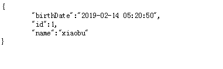

# SpringBoot | 配置fastjson

> 原创 于 2019-02-14 17:22:01 发布 · 公开 · 1.7k 阅读 · 0 · 2 · 本内容遵循CC 4.0 BY-SA版权协议 版权声明：本文为博主原创文章，遵循 CC 4.0 BY-SA 版权协议，转载请附上原文出处链接和本声明。 · 编辑
> 文章链接：https://blog.csdn.net/tanhongwei1994/article/details/87284034

两种方式配置fastjson

一、在启动类直接注入bean

```java
   @Bean
    public HttpMessageConverters fastJsonHttpMessageConverters(){
        //1. 需要定义一个converter转换消息的对象
        FastJsonHttpMessageConverter fasHttpMessageConverter = new FastJsonHttpMessageConverter();
 
        //2. 添加fastjson的配置信息，比如:是否需要格式化返回的json的数据
        FastJsonConfig fastJsonConfig = new FastJsonConfig();
        fastJsonConfig.setSerializerFeatures(SerializerFeature.PrettyFormat);
 
        //3. 在converter中添加配置信息
        fasHttpMessageConverter.setFastJsonConfig(fastJsonConfig);
        return new HttpMessageConverters((HttpMessageConverter<?>) fasHttpMessageConverter);
    }
```

二、创建config类实现WebMvcConfigurer(springboot为2.0版本的)

```java
package com.example.config;
 
import com.alibaba.fastjson.serializer.SerializerFeature;
import com.alibaba.fastjson.support.config.FastJsonConfig;
import com.alibaba.fastjson.support.spring.FastJsonHttpMessageConverter;
import org.springframework.context.annotation.Configuration;
import org.springframework.http.MediaType;
import org.springframework.http.converter.HttpMessageConverter;
import org.springframework.http.converter.json.MappingJackson2HttpMessageConverter;
import org.springframework.web.servlet.config.annotation.ResourceHandlerRegistry;
import org.springframework.web.servlet.config.annotation.WebMvcConfigurer;
 
import java.util.ArrayList;
import java.util.List;
 
/**
 * @author xiaobu
 * @version JDK1.8.0_171
 * @date on  2019/1/14 12:46
 * @description V1.0
 */
@Configuration
public class WebMvcConfig implements WebMvcConfigurer {
 
 
    @Override
    public void configureMessageConverters(List<HttpMessageConverter<?>> converters) {
        converters.removeIf(converter -> converter instanceof MappingJackson2HttpMessageConverter);
        converters.add(fastJsonHttpMessageConverter());
        System.out.println("converters = " + converters);
    }
 
 
 
    /**
     * fastJson相关设置
     */
    private FastJsonHttpMessageConverter fastJsonHttpMessageConverter() {
        FastJsonHttpMessageConverter fastJsonHttpMessageConverter = new FastJsonHttpMessageConverter();
        List<MediaType> supportedMediaTypes = new ArrayList<MediaType>();
        supportedMediaTypes.add(MediaType.APPLICATION_JSON_UTF8);
        fastJsonHttpMessageConverter.setSupportedMediaTypes(supportedMediaTypes);
        fastJsonHttpMessageConverter.setFastJsonConfig(getFastJsonConfig());
        return fastJsonHttpMessageConverter;
    }
 
    /**
     * fastJson相关设置
     */
    private FastJsonConfig getFastJsonConfig() {
        FastJsonConfig fastJsonConfig = new FastJsonConfig();
        // 在serializerFeatureList中添加转换规则
        List<SerializerFeature> serializerFeatureList = new ArrayList<SerializerFeature>();
        serializerFeatureList.add(SerializerFeature.PrettyFormat);
        serializerFeatureList.add(SerializerFeature.WriteMapNullValue);
        serializerFeatureList.add(SerializerFeature.WriteNullStringAsEmpty);
        serializerFeatureList.add(SerializerFeature.WriteNullListAsEmpty);
        serializerFeatureList.add(SerializerFeature.DisableCircularReferenceDetect);
        SerializerFeature[] serializerFeatures = serializerFeatureList.toArray(new SerializerFeature[0]);
        fastJsonConfig.setSerializerFeatures(serializerFeatures);
        return fastJsonConfig;
    }
 
 
}
```

三、测试

新建个pojo类

```java
package com.example.entity;
 
import com.alibaba.fastjson.annotation.JSONField;
import lombok.Data;
 
import java.time.LocalDateTime;
 
/**
 * @author xiaobu
 * @version JDK1.8.0_171
 * @date on  2019/2/14 10:09
 * @description V1.0
 */
 
@Data
public class FastJson {
 
    private int id;
 
    private String name;
 
    @JSONField(format = "yyyy-MM-dd hh:mm:ss")
    private LocalDateTime birthDate;
}
```


接着创建个控制器类

```java
package com.example.controller;
 
import com.alibaba.fastjson.JSON;
import com.example.entity.FastJson;
import org.springframework.web.bind.annotation.GetMapping;
import org.springframework.web.bind.annotation.RequestMapping;
import org.springframework.web.bind.annotation.RestController;
 
import java.time.LocalDateTime;
 
/**
 * @author xiaobu
 * @version JDK1.8.0_171
 * @date on  2019/2/14 9:59
 * @description V1.0 验证项目集成fastjson是否成功  观察下面的demo2方法表明fastjson配置生效了,默认是启用jackjson
 */
 
@RestController
@RequestMapping("fastJson")
public class FastJsonController {
 
    @GetMapping("demo2")
    public FastJson demo2(){
        FastJson fastJson = new FastJson();
        fastJson.setId(1);
        fastJson.setName("xiaobu");
        fastJson.setBirthDate(LocalDateTime.now());
        return  fastJson;
    }
 
    @GetMapping("demo3")
    public String demo3(){
        FastJson fastJson = new FastJson();
        fastJson.setId(1);
        fastJson.setName("xiaobu");
        fastJson.setBirthDate(LocalDateTime.now());
       return JSON.toJSONString(fastJson);
    }
}
```

结果：

 

---

参考： [https://segmentfault.com/a/1190000015975405](https://segmentfault.com/a/1190000015975405) 