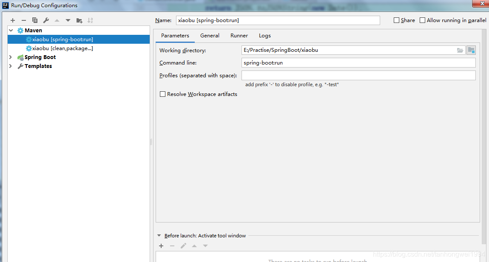

# SpringBoot | 以maven的方式启动项目

> 原创 于 2019-01-18 10:51:27 发布 · 公开 · 2.4k 阅读 · 1 · 1 · 本内容遵循CC 4.0 BY-SA版权协议 版权声明：本文为博主原创文章，遵循 CC 4.0 BY-SA 版权协议，转载请附上原文出处链接和本声明。 · 编辑
> 文章链接：https://blog.csdn.net/tanhongwei1994/article/details/86536105

一、pom.xml文件配置

```java
  <plugin>
                <groupId>org.springframework.boot</groupId>
                <artifactId>spring-boot-maven-plugin</artifactId>
                <!-- spring-boot:run 中文乱码解决 -->
                <configuration>
                    <fork>true</fork>
                    <!--增加jvm参数-->
                    <jvmArguments>-Dfile.encoding=UTF-8</jvmArguments>
                </configuration>
                <dependencies>
                    <!-- meaven方式启动实现热编译-->
                    <dependency>
                        <groupId>org.springframework</groupId>
                        <artifactId>springloaded</artifactId>
                        <version>1.2.6.RELEASE</version>
                    </dependency>
                </dependencies>
            </plugin>
```

二、通过 `mvn spring-boot:run ` 启动(maven方式启动的不能debug)


 

---

注:若SpringBoot项目是以启动类启动的话不会把新添加的资源文件打包到对应的目录下，因为这是maven项目。程序运行的时候 并不是访问你的源码路径。