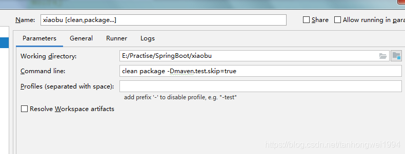

# SpringBoot | 打成jar包部署项目

> 原创 于 2019-01-11 09:53:48 发布 · 公开 · 350 阅读 · 0 · 0 · 本内容遵循CC 4.0 BY-SA版权协议 版权声明：本文为博主原创文章，遵循 CC 4.0 BY-SA 版权协议，转载请附上原文出处链接和本声明。 · 编辑
> 文章链接：https://blog.csdn.net/tanhongwei1994/article/details/86286865

一、pom.xml的配置

1.1 包的类型

```java
<groupId>com.xiaobu</groupId>
    <artifactId>xiaobu</artifactId>
    <version>0.0.1-SNAPSHOT</version>
    <packaging>jar</packaging>
    <name>xiaobu</name>
```

1.2 设置jar包名称

```java
  <build>
        <resources>
            <resource>
                <directory>src/main/resources</directory>
            </resource>
            <resource>
                <directory>src/main/java</directory>
                <includes>
                    <include>**/*.xml</include>
                </includes>
                <filtering>true</filtering>
            </resource>
        </resources>
		<!-- jar包名称-->
        <finalName>ROOT</finalName>
        <plugins>
            <plugin>
                <groupId>org.springframework.boot</groupId>
                <artifactId>spring-boot-maven-plugin</artifactId>
            </plugin>
        </plugins>
    </build>

```

二、idea打包去除test测试代码

```java
clean package -Dmaven.test.skip=true
```


 

三、启动服务。

3.1、进入jar所在的根目录。

windows下运行jar包

```java
java -jar  ROOT.jar
```

linux下运行jar包

1、最基本的jar包执行方式，但是当我们用ctrl+c中断或者关闭窗口时，程序也会中断执行。

```java
java -jar ROOT.jar
```

2、&代表在后台运行，使用ctrl+c不会中断程序的运行，但是关闭窗口会中断程序的运行。

```java
java -jar XXX.jar &
```

3、使用这种方式运行的程序日志会输出到当前目录下的nohup.out文件，使用ctrl+c中断或者关闭窗口都不会中断程序的执行。

```java
nohup java -jar XXX.jar &
```

4、启动并设置jvm内存大小以及内存快照和内存快照文件的存储路径

```ruby
java -Xms50m -Xmx50m -XX:+HeapDumpOnOutOfMemoryError -XX:HeapDumpPath=D:/heapdump -jar  ssm.jar
```

5、Springboot启动指定环境

```java
java -jar G:\TetraPak2019.jar --spring.profiles.active=dev
```