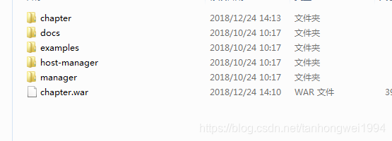

# SpringBoot之打包成war包部署到tomcat

> 原创 于 2018-12-24 17:41:34 发布 · 公开 · 216 阅读 · 0 · 0 · 本内容遵循CC 4.0 BY-SA版权协议 版权声明：本文为博主原创文章，遵循 CC 4.0 BY-SA 版权协议，转载请附上原文出处链接和本声明。 · 编辑
> 文章链接：https://blog.csdn.net/tanhongwei1994/article/details/85232640

**一、修改pom.xml文件将默认的jar方式改为war：** 

```java
<groupId>com.xiaobu</groupId>
    <artifactId>chapter</artifactId>
    <version>0.0.1-SNAPSHOT</version>
    <packaging>war</packaging>
    <name>chapter</name>
    <description>Demo project for Spring Boot</description>
```


**二、排除内置的Tomcat容器以及添加依赖：** 

```java
<dependency>
            <groupId>org.springframework.boot</groupId>
            <artifactId>spring-boot-starter-web</artifactId>
          <!--  spring-boot-starter-web中的Tomcat排除-->
            <exclusions>
                <exclusion>
                    <groupId>org.springframework.boot</groupId>
                    <artifactId>spring-boot-starter-tomcat</artifactId>
                </exclusion>
            </exclusions>
        </dependency>
        <dependency>
            <groupId>org.springframework.boot</groupId>
            <artifactId>spring-boot-starter-tomcat</artifactId>
            <!--打包的时候可以不用包进去，别的设施会提供。事实上该依赖理论上可以参与编译，测试，运行等周期。
        相当于compile，但是打包阶段做了exclude操作-->
            <scope>provided</scope>
        </dependency>
```

**三、继承org.springframework.boot.web.servlet.support.SpringBootServletInitializer，实现configure方法：** 

```java
package com.xiaobu;
 
import org.springframework.boot.SpringApplication;
import org.springframework.boot.autoconfigure.SpringBootApplication;
import org.springframework.boot.builder.SpringApplicationBuilder;
import org.springframework.boot.web.servlet.ServletComponentScan;
import org.springframework.boot.web.servlet.support.SpringBootServletInitializer;
import tk.mybatis.spring.annotation.MapperScan;
 
/**
 * @author xiaobu
 * @date 2018/12/24 13:43
 * @descprition   如果您正在构建WAR文件并部署它，则需要WebApplicationInitializer。
 * @version 1.0
 */
@MapperScan(basePackages = "com.xiaobu.mapper")
@SpringBootApplication
@ServletComponentScan
public class ChapterApplication extends SpringBootServletInitializer {
    @Override
    protected SpringApplicationBuilder configure(SpringApplicationBuilder builder) {
        return builder.sources(ChapterApplication.class);
    }
 
    public static void main(String[] args) {
        SpringApplication.run(ChapterApplication.class, args);
    }
}
```

四、设置war包名称

```java
 <build>
        <resources>
            <resource>
                <directory>src/main/resources</directory>
            </resource>
            <resource>
                <directory>src/main/java</directory>
                <includes>
                    <include>**/*.xml</include>
                </includes>
                <filtering>true</filtering>
            </resource>
        </resources>
        <!--  项目名称 这个需要添加在访问路径的前面 如果是ROOT的话则不需要。tomcat默认访问-->
        <finalName>chapter</finalName>
        <plugins>
            <plugin>
                <groupId>org.springframework.boot</groupId>
                <artifactId>spring-boot-maven-plugin</artifactId>
            </plugin>
        </plugins>
    </build>
	
```

五、复制war包到tomcat的webapps目录下：

 

六、访问localhost:8080/chapter/demo/demo.