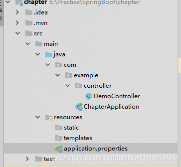
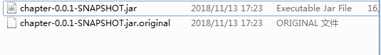

# SpringBoot | 第一章：构建第一个SpringBoot工程

> 原创 于 2018-11-13 17:39:44 发布 · 公开 · 645 阅读 · 0 · 0 · 本内容遵循CC 4.0 BY-SA版权协议 版权声明：本文为博主原创文章，遵循 CC 4.0 BY-SA 版权协议，转载请附上原文出处链接和本声明。 · 编辑
> 文章链接：https://blog.csdn.net/tanhongwei1994/article/details/84032364

一、新建个工程选择SpringInitializr模式勾选web选项

1.1、创建的工程的pom.xml内容如下：

```java
<?xml version="1.0" encoding="UTF-8"?>
<project xmlns="http://maven.apache.org/POM/4.0.0" xmlns:xsi="http://www.w3.org/2001/XMLSchema-instance"
         xsi:schemaLocation="http://maven.apache.org/POM/4.0.0 http://maven.apache.org/xsd/maven-4.0.0.xsd">
    <modelVersion>4.0.0</modelVersion>
 
    <groupId>com.example</groupId>
    <artifactId>chapter</artifactId>
    <version>0.0.1-SNAPSHOT</version>
    <packaging>jar</packaging>
 
    <name>chapter</name>
    <description>Demo project for Spring Boot</description>
 
    <parent>
        <groupId>org.springframework.boot</groupId>
        <artifactId>spring-boot-starter-parent</artifactId>
        <version>2.1.0.RELEASE</version>
        <relativePath/> <!-- lookup parent from repository -->
    </parent>
 
    <properties>
        <project.build.sourceEncoding>UTF-8</project.build.sourceEncoding>
        <project.reporting.outputEncoding>UTF-8</project.reporting.outputEncoding>
        <java.version>1.8</java.version>
    </properties>
 
    <dependencies>
        <dependency>
            <groupId>org.springframework.boot</groupId>
            <artifactId>spring-boot-starter-web</artifactId>
        </dependency>
        <dependency>
            <groupId>org.springframework.boot</groupId>
            <artifactId>spring-boot-starter-test</artifactId>
            <scope>test</scope>
        </dependency>
    </dependencies>
 
    <build>
        <plugins>
            <plugin>
                <groupId>org.springframework.boot</groupId>
                <artifactId>spring-boot-maven-plugin</artifactId>
            </plugin>
        </plugins>
    </build>
 
 
</project>
```

1.2、项目结构如下：

 

1.3、启动类的定义如下：

```java
package com.example;
 
import org.springframework.boot.CommandLineRunner;
import org.springframework.boot.SpringApplication;
import org.springframework.boot.autoconfigure.SpringBootApplication;
import org.springframework.context.ApplicationContext;
import org.springframework.context.annotation.Bean;
 
import java.util.Arrays;
 
@SpringBootApplication
public class ChapterApplication {
 
    public static void main(String[] args) {
        SpringApplication.run(ChapterApplication.class, args);
    }
 
 
    @Bean
    public CommandLineRunner commandLineRunner(ApplicationContext ctx) {
        // 目的是
        return args -> {
            System.out.println("来看看 SpringBoot 默认为我们提供的 Bean：");
            String[] beanNames = ctx.getBeanDefinitionNames();
            Arrays.sort(beanNames);
            Arrays.stream(beanNames).forEach(System.out::println);
        };
    }
}
```

1.4、启动之后springboot自动注入了很多个bean：


```java
来看看 SpringBoot 默认为我们提供的 Bean：
applicationTaskExecutor
basicErrorController
beanNameHandlerMapping
beanNameViewResolver
chapterApplication
characterEncodingFilter
commandLineRunner
conventionErrorViewResolver
defaultServletHandlerMapping
defaultValidator
defaultViewResolver
demoController
dispatcherServlet
dispatcherServletRegistration
error
errorAttributes
errorPageCustomizer
errorPageRegistrarBeanPostProcessor
faviconHandlerMapping
faviconRequestHandler
formContentFilter
handlerExceptionResolver
hiddenHttpMethodFilter
httpRequestHandlerAdapter
jacksonCodecCustomizer
jacksonObjectMapper
jacksonObjectMapperBuilder
jsonComponentModule
localeCharsetMappingsCustomizer
loggingCodecCustomizer
mappingJackson2HttpMessageConverter
mbeanExporter
mbeanServer
messageConverters
methodValidationPostProcessor
multipartConfigElement
multipartResolver
mvcContentNegotiationManager
mvcConversionService
mvcHandlerMappingIntrospector
mvcPathMatcher
mvcResourceUrlProvider
mvcUriComponentsContributor
mvcUrlPathHelper
mvcValidator
mvcViewResolver
objectNamingStrategy
org.springframework.boot.autoconfigure.AutoConfigurationPackages
org.springframework.boot.autoconfigure.admin.SpringApplicationAdminJmxAutoConfiguration
org.springframework.boot.autoconfigure.condition.BeanTypeRegistry
org.springframework.boot.autoconfigure.context.ConfigurationPropertiesAutoConfiguration
org.springframework.boot.autoconfigure.context.PropertyPlaceholderAutoConfiguration
org.springframework.boot.autoconfigure.http.HttpMessageConvertersAutoConfiguration
org.springframework.boot.autoconfigure.http.HttpMessageConvertersAutoConfiguration$StringHttpMessageConverterConfiguration
org.springframework.boot.autoconfigure.http.JacksonHttpMessageConvertersConfiguration
org.springframework.boot.autoconfigure.http.JacksonHttpMessageConvertersConfiguration$MappingJackson2HttpMessageConverterConfiguration
org.springframework.boot.autoconfigure.http.codec.CodecsAutoConfiguration
org.springframework.boot.autoconfigure.http.codec.CodecsAutoConfiguration$JacksonCodecConfiguration
org.springframework.boot.autoconfigure.http.codec.CodecsAutoConfiguration$LoggingCodecConfiguration
org.springframework.boot.autoconfigure.info.ProjectInfoAutoConfiguration
org.springframework.boot.autoconfigure.internalCachingMetadataReaderFactory
org.springframework.boot.autoconfigure.jackson.JacksonAutoConfiguration
org.springframework.boot.autoconfigure.jackson.JacksonAutoConfiguration$Jackson2ObjectMapperBuilderCustomizerConfiguration
org.springframework.boot.autoconfigure.jackson.JacksonAutoConfiguration$JacksonObjectMapperBuilderConfiguration
org.springframework.boot.autoconfigure.jackson.JacksonAutoConfiguration$JacksonObjectMapperConfiguration
org.springframework.boot.autoconfigure.jackson.JacksonAutoConfiguration$ParameterNamesModuleConfiguration
org.springframework.boot.autoconfigure.jmx.JmxAutoConfiguration
org.springframework.boot.autoconfigure.task.TaskExecutionAutoConfiguration
org.springframework.boot.autoconfigure.task.TaskSchedulingAutoConfiguration
org.springframework.boot.autoconfigure.validation.ValidationAutoConfiguration
org.springframework.boot.autoconfigure.web.client.RestTemplateAutoConfiguration
org.springframework.boot.autoconfigure.web.embedded.EmbeddedWebServerFactoryCustomizerAutoConfiguration
org.springframework.boot.autoconfigure.web.embedded.EmbeddedWebServerFactoryCustomizerAutoConfiguration$TomcatWebServerFactoryCustomizerConfiguration
org.springframework.boot.autoconfigure.web.servlet.DispatcherServletAutoConfiguration
org.springframework.boot.autoconfigure.web.servlet.DispatcherServletAutoConfiguration$DispatcherServletConfiguration
org.springframework.boot.autoconfigure.web.servlet.DispatcherServletAutoConfiguration$DispatcherServletRegistrationConfiguration
org.springframework.boot.autoconfigure.web.servlet.HttpEncodingAutoConfiguration
org.springframework.boot.autoconfigure.web.servlet.MultipartAutoConfiguration
org.springframework.boot.autoconfigure.web.servlet.ServletWebServerFactoryAutoConfiguration
org.springframework.boot.autoconfigure.web.servlet.ServletWebServerFactoryConfiguration$EmbeddedTomcat
org.springframework.boot.autoconfigure.web.servlet.WebMvcAutoConfiguration
org.springframework.boot.autoconfigure.web.servlet.WebMvcAutoConfiguration$EnableWebMvcConfiguration
org.springframework.boot.autoconfigure.web.servlet.WebMvcAutoConfiguration$WebMvcAutoConfigurationAdapter
org.springframework.boot.autoconfigure.web.servlet.WebMvcAutoConfiguration$WebMvcAutoConfigurationAdapter$FaviconConfiguration
org.springframework.boot.autoconfigure.web.servlet.error.ErrorMvcAutoConfiguration
org.springframework.boot.autoconfigure.web.servlet.error.ErrorMvcAutoConfiguration$DefaultErrorViewResolverConfiguration
org.springframework.boot.autoconfigure.web.servlet.error.ErrorMvcAutoConfiguration$WhitelabelErrorViewConfiguration
org.springframework.boot.autoconfigure.websocket.servlet.WebSocketServletAutoConfiguration
org.springframework.boot.autoconfigure.websocket.servlet.WebSocketServletAutoConfiguration$TomcatWebSocketConfiguration
org.springframework.boot.context.properties.ConfigurationBeanFactoryMetadata
org.springframework.boot.context.properties.ConfigurationPropertiesBindingPostProcessor
org.springframework.context.annotation.internalAutowiredAnnotationProcessor
org.springframework.context.annotation.internalCommonAnnotationProcessor
org.springframework.context.annotation.internalConfigurationAnnotationProcessor
org.springframework.context.event.internalEventListenerFactory
org.springframework.context.event.internalEventListenerProcessor
parameterNamesModule
preserveErrorControllerTargetClassPostProcessor
propertySourcesPlaceholderConfigurer
requestContextFilter
requestMappingHandlerAdapter
requestMappingHandlerMapping
resourceHandlerMapping
restTemplateBuilder
server-org.springframework.boot.autoconfigure.web.ServerProperties
servletWebServerFactoryCustomizer
simpleControllerHandlerAdapter
spring.http-org.springframework.boot.autoconfigure.http.HttpProperties
spring.info-org.springframework.boot.autoconfigure.info.ProjectInfoProperties
spring.jackson-org.springframework.boot.autoconfigure.jackson.JacksonProperties
spring.mvc-org.springframework.boot.autoconfigure.web.servlet.WebMvcProperties
spring.resources-org.springframework.boot.autoconfigure.web.ResourceProperties
spring.servlet.multipart-org.springframework.boot.autoconfigure.web.servlet.MultipartProperties
spring.task.execution-org.springframework.boot.autoconfigure.task.TaskExecutionProperties
spring.task.scheduling-org.springframework.boot.autoconfigure.task.TaskSchedulingProperties
springApplicationAdminRegistrar
standardJacksonObjectMapperBuilderCustomizer
stringHttpMessageConverter
taskExecutorBuilder
taskSchedulerBuilder
tomcatServletWebServerFactory
tomcatServletWebServerFactoryCustomizer
tomcatWebServerFactoryCustomizer
viewControllerHandlerMapping
viewResolver
webServerFactoryCustomizerBeanPostProcessor
websocketServletWebServerCustomizer
welcomePageHandlerMapping
```

1.5、创建个控制器类，定义如下：

```java
package com.example.controller;
 
import org.springframework.web.bind.annotation.GetMapping;
import org.springframework.web.bind.annotation.RequestMapping;
import org.springframework.web.bind.annotation.RestController;
 
/**
 * @author xiaobu
 * @version JDK1.8.0_171
 * @date on  2018/11/13 17:20
 * @description V1.0
 */
@RestController
@RequestMapping("/demo")
public class DemoController {
 
    @GetMapping("demo")
    public String demo(){
        return "Hi,我是admin";
    }
}
```

访问 [http://localhost:8080/demo/demo](http://localhost:8080/demo/demo) 出现如下结果：

 

二、打包运行项目

2.1、CMD进入工程目录下（我的项目路径E:\Practise\SpringBoot\chapter）

```bash
E:
 
cd  E:\Practise\SpringBoot\chapter
#执行打包命令
mvn package
#进入target目录下
cd E:\Practise\SpringBoot\chapter\target
 
#后面是更改环境，没有可以忽略
java -jar chapter2-0.0.1-SNAPSHOT.jar --spring.profiles.active=test 
```

执行完打包进入target目录下会新增两个打包文件：

 

然后继续访问 [http://localhost:8080/demo/demo](http://localhost:8080/demo/demo) 也会出现一样的效果。（确保端口不被占用）