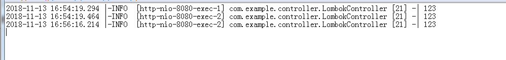
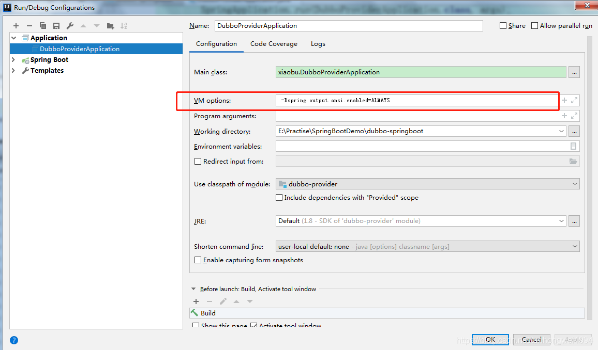
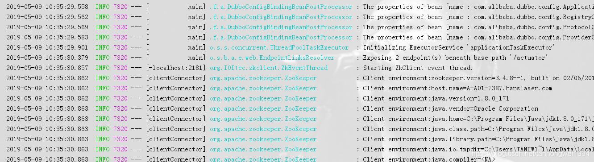

# SpringBoot | 配置logback-spring.xml

> 原创 于 2018-11-13 17:07:18 发布 · 公开 · 1k 阅读 · 0 · 0 · 本内容遵循CC 4.0 BY-SA版权协议 版权声明：本文为博主原创文章，遵循 CC 4.0 BY-SA 版权协议，转载请附上原文出处链接和本声明。 · 编辑
> 文章链接：https://blog.csdn.net/tanhongwei1994/article/details/84031958

日志加载顺序：logback.xml-> application.properties -> logback-spring.xml

一、logback-spring.xml配置如下

```java
<?xml version="1.0" encoding="UTF-8"?>
<!-- 从高到地低 OFF 、 FATAL 、 ERROR 、 WARN 、 INFO 、 DEBUG 、 TRACE 、 ALL -->
<!-- 日志输出规则  根据当前ROOT 级别，日志输出时，级别高于root默认的级别时  会输出 -->
<!-- 以下 每个配置的 filter 是过滤掉输出文件里面，会出现高级别文件，依然出现低级别的日志信息，通过filter 过滤只记录本级别的日志-->
 
<!-- 属性描述
scan：设置为true时，配置文件如果发生改变，将会被重新加载，默认值为true
scanPeriod:设置监测配置文件是否有修改的时间间隔，如果没有给出时间单位，默认单位是毫秒。
当scan为true时，此属性生效。默认的时间间隔为1分钟。
debug:当此属性设置为true时，将打印出logback内部日志信息，实时查看logback运行状态。默认值为false。
-->
<configuration scan="true" scanPeriod="10 seconds">
    <contextName>logback</contextName>
    <property name="logPath" value="D:/AppLog"/>
    <!--    <springProperty scope="context" name="logPath" source="D:/AppLog"/>-->
    <property name="FILE_PATTERN" value="%-12(%d{yyyy-MM-dd HH:mm:ss.SSS}) |-%-5level [%thread] %c [%L] -| %msg%n"/>
    <property name="CONSOLE_PATTERN"
              value="%black(控制台-) %red(%d{yyyy-MM-dd HH:mm:ss}) %green([%thread]) %highlight(%-5level) %boldMagenta(%logger) - %cyan(%msg%n)"/>
    <appender name="CONSOLE" class="ch.qos.logback.core.ConsoleAppender">
        <target>System.out</target>
        <!--此日志appender是为开发使用，只配置最底级别，控制台输出的日志级别是大于或等于此级别的日志信息-->
        <filter class="ch.qos.logback.classic.filter.ThresholdFilter">
            <!--            表明控制台只输出Info级别的-->
            <level>info</level>
        </filter>
        <encoder>
            <pattern>${CONSOLE_PATTERN}</pattern>
            <!-- 设置字符集 FATAL_FILE-->
            <charset>UTF-8</charset>
        </encoder>
    </appender>
    <!-- 时间滚动输出 level为 DEBUG 日志 -->
    <appender name="DEBUG_FILE" class="ch.qos.logback.core.rolling.RollingFileAppender">
        <!-- 正在记录的日志文件的路径及文件名 -->
        <!--<file>${logPath}/log_debug.log</file>-->
        <!--日志文件输出格式-->
        <encoder>
            <pattern>${FILE_PATTERN}</pattern>
            <charset>UTF-8</charset> <!-- 设置字符集 -->
        </encoder>
        <!-- 日志记录器的滚动策略，按日期，按大小记录 -->
        <rollingPolicy class="ch.qos.logback.core.rolling.TimeBasedRollingPolicy">
            <!-- 日志归档 -->
            <fileNamePattern>${logPath}/debug/log-debug-%d{yyyy-MM-dd}.%i.log</fileNamePattern>
            <timeBasedFileNamingAndTriggeringPolicy class="ch.qos.logback.core.rolling.SizeAndTimeBasedFNATP">
                <maxFileSize>100MB</maxFileSize>
            </timeBasedFileNamingAndTriggeringPolicy>
            <!--日志文件保留天数-->
            <maxHistory>15</maxHistory>
        </rollingPolicy>
        <!-- 此日志文件只记录debug级别的 -->
        <filter class="ch.qos.logback.classic.filter.LevelFilter">
            <level>debug</level>
            <onMatch>ACCEPT</onMatch>
            <onMismatch>DENY</onMismatch>
        </filter>
    </appender>
    <!-- 时间滚动输出 level为 INFO 日志 -->
    <appender name="INFO_FILE" class="ch.qos.logback.core.rolling.RollingFileAppender">
        <!-- 正在记录的日志文件的路径及文件名 -->
        <!--<file>${logPath}/log_info.log</file>-->
        <!--日志文件输出格式-->
        <encoder>
            <pattern>${FILE_PATTERN}</pattern>
            <charset>UTF-8</charset>
        </encoder>
        <!-- 日志记录器的滚动策略，按日期，按大小记录 -->
        <rollingPolicy class="ch.qos.logback.core.rolling.TimeBasedRollingPolicy">
            <!-- 每天日志归档路径以及格式 -->
            <fileNamePattern>${logPath}/info/log-info-%d{yyyy-MM-dd}.%i.log</fileNamePattern>
            <timeBasedFileNamingAndTriggeringPolicy class="ch.qos.logback.core.rolling.SizeAndTimeBasedFNATP">
                <maxFileSize>100MB</maxFileSize>
            </timeBasedFileNamingAndTriggeringPolicy>
            <!--日志文件保留天数-->
            <maxHistory>15</maxHistory>
        </rollingPolicy>
        <!-- 此日志文件只记录info级别的 -->
        <filter class="ch.qos.logback.classic.filter.LevelFilter">
            <level>info</level>
            <onMatch>ACCEPT</onMatch>
            <onMismatch>DENY</onMismatch>
        </filter>
    </appender>
    <!-- 时间滚动输出 level为 ERROR 日志 -->
    <appender name="ERROR_FILE" class="ch.qos.logback.core.rolling.RollingFileAppender">
        <!-- 正在记录的日志文件的路径及文件名 -->
        <!--<file>${logPath}/log_error.log</file>-->
        <!--日志文件输出格式-->
        <encoder>
            <pattern>${FILE_PATTERN}</pattern>
            <charset>UTF-8</charset> <!-- 此处设置字符集 -->
        </encoder>
        <!-- 日志记录器的滚动策略，按日期，按大小记录 -->
        <rollingPolicy class="ch.qos.logback.core.rolling.TimeBasedRollingPolicy">
            <fileNamePattern>${logPath}/error/log-error-%d{yyyy-MM-dd}.%i.log</fileNamePattern>
            <timeBasedFileNamingAndTriggeringPolicy class="ch.qos.logback.core.rolling.SizeAndTimeBasedFNATP">
                <maxFileSize>100MB</maxFileSize>
            </timeBasedFileNamingAndTriggeringPolicy>
            <!--日志文件保留天数-->
            <maxHistory>15</maxHistory>
        </rollingPolicy>
        <!-- 此日志文件只记录ERROR级别的 -->
        <filter class="ch.qos.logback.classic.filter.ThresholdFilter">
            <level>ERROR</level>
        </filter>
    </appender>
    <!--为何root配置的INFO，logger特殊指定的包/类日志DEBUG级别，最后也能打印出来？
    因为没有设置addtivity="false",logger有一个配置addtivity="true" 默认就是true,标识向上级传递日志（INFO是DEBUG的上级）。只有显示指定为false时，才不会向上级输出。-->
    <!--    可以记录mybatis的sql日志 info级别不行-->
    <logger name="com.xiaobu" level="debug"/>
 
    <!--    这个和CONSOLE设置的级别取交集 如果一个info一个debug 取info-->
    <root level="info">
        <appender-ref ref="CONSOLE"/>
    </root>
    <!--开发环境:打印控制台 写入debug文件 -->
    <springProfile name="dev">
        <logger name="com.xiaobu" level="debug"/>
    </springProfile>
</configuration>
```

二、引入lombok的maven依赖

```java
 <dependency>
            <groupId>org.projectlombok</groupId>
            <artifactId>lombok</artifactId>
            <version>1.16.10</version>
        </dependency>
```

三、在要输出的类上添加注解@Log4j2

```java
package com.example.controller;
 
import lombok.extern.log4j.Log4j2;
import org.springframework.web.bind.annotation.GetMapping;
import org.springframework.web.bind.annotation.RequestMapping;
import org.springframework.web.bind.annotation.RestController;
 
/**
 * @author xiaobu
 * @version JDK1.8.0_171
 * @date on  2018/11/13 15:44
 * @description V1.0
 */
@RestController
@RequestMapping("/lombok")
@Log4j2
public class LombokController {
 
    @GetMapping("demo")
    public String demo(){
        log.info("123");
        return "hello admin";
    }
}
```

四、输出的结果：

 

---

输出彩色日志：

添加参数    -Dspring.output.ansi.enabled=ALWAYS


 

运行效果：

 

