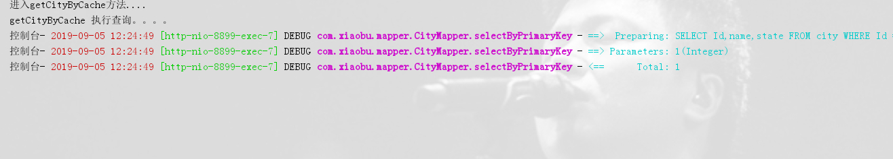

# SpringBoot | 整合CacheEHCACHE

> 原创 于 2019-09-05 12:32:40 发布 · 公开 · 235 阅读 · 0 · 0 · 本内容遵循CC 4.0 BY-SA版权协议 版权声明：本文为博主原创文章，遵循 CC 4.0 BY-SA 版权协议，转载请附上原文出处链接和本声明。 · 编辑
> 文章链接：https://blog.csdn.net/tanhongwei1994/article/details/100555743

POM依赖

```xml
    <dependency>
               <groupId>org.springframework.boot</groupId>
               <artifactId>spring-boot-starter-web</artifactId>
           </dependency>
```

启动类

```java
package com.xiaobu;

import lombok.extern.slf4j.Slf4j;
import org.springframework.boot.CommandLineRunner;
import org.springframework.boot.SpringApplication;
import org.springframework.boot.autoconfigure.SpringBootApplication;
import org.springframework.cache.annotation.CacheConfig;
import org.springframework.cache.annotation.EnableCaching;
import org.springframework.scheduling.annotation.EnableAsync;
import org.springframework.scheduling.annotation.EnableScheduling;
import org.springframework.web.servlet.config.annotation.WebMvcConfigurer;
import tk.mybatis.spring.annotation.MapperScan;

/**
 * @author xiaobu
 * @EnableCaching  开启缓存 @CacheConfig(cacheNames = {"myCache"})   cacheNames 必须和ehcache.xml里面的name必须一致
 */
@CacheConfig(cacheNames = {"myCache"})
@EnableCaching
@EnableAsync
@EnableScheduling
@SpringBootApplication
@Slf4j
@MapperScan(basePackages = "com.xiaobu.mapper")
public class SsmApplication implements WebMvcConfigurer, CommandLineRunner {

    public static void main(String[] args) {
        SpringApplication.run(SsmApplication.class, args);
    }

    @Override
    public void run(String... args) throws Exception {
        log.info("服务启动成功。。。。");
    }


}


```

配置文件

```properties
spring.cache.type=ehcache
spring.cache.ehcache.config=classpath:/ehcache.xml
```

ehcache.xml

```xml
<ehcache>

    <!--
        磁盘存储:将缓存中暂时不使用的对象,转移到硬盘,类似于Windows系统的虚拟内存
        path:指定在硬盘上存储对象的路径
        path可以配置的目录有：
            user.home（用户的家目录）
            user.dir（用户当前的工作目录）
            java.io.tmpdir（默认的临时目录）
            ehcache.disk.store.dir（ehcache的配置目录）
            绝对路径（如：d:\\ehcache）
        查看路径方法：String tmpDir = System.getProperty("java.io.tmpdir");
     -->
    <diskStore path="java.io.tmpdir" />

    <!--
        defaultCache:默认的缓存配置信息,如果不加特殊说明,则所有对象按照此配置项处理
        maxElementsInMemory:设置了缓存的上限,最多存储多少个记录对象
        eternal:代表对象是否永不过期 (指定true则下面两项配置需为0无限期)
        timeToIdleSeconds:最大的发呆时间 /秒
        timeToLiveSeconds:最大的存活时间 /秒
        overflowToDisk:是否允许对象被写入到磁盘
        说明：下列配置自缓存建立起600秒(10分钟)有效 。
        在有效的600秒(10分钟)内，如果连续120秒(2分钟)未访问缓存，则缓存失效。
        就算有访问，也只会存活600秒。
     -->
    <defaultCache maxElementsInMemory="10000" eternal="false"
                  timeToIdleSeconds="600" timeToLiveSeconds="600" overflowToDisk="true" />

    <cache name="myCache" maxElementsInMemory="10000" eternal="false"
           timeToIdleSeconds="120" timeToLiveSeconds="600" overflowToDisk="true" />

</ehcache>
```

使用SpringCache自动根据方法生成缓存

- key： 缓存的 key，可以为空，如果指定要按照 SpEL 表达式编写，如果不指定，则缺省按照方法的所有参数进行组合。例如：@Cacheable(value=”testcache”,key=”#id”)

- value： 缓存的名称，必须指定至少一个。例如：@Cacheable(value=”mycache”) 或者@Cacheable(value={”cache1”,”cache2”}

- condition： 缓存的条件，可以为空，使用 SpEL 编写，返回 true 或者 false，只有为 true 才进行缓存(如：condition ="#id<2"，只缓存id<2的;condition=”#userName.length()>2”只缓存名字长度大于2的)

> @Cacheable注解会先查询是否已经有缓存，有会使用缓存，没有则会执行方法并缓存。

> @CachePut注解的作用 主要针对方法配置，能够根据方法的请求参数对其结果进行缓存，和 @Cacheable 不同的是，它每次都会触发真实方法的调用 。简单来说就是用户更新缓存数据。但需要注意的是该注解的value 和 key 必须与要更新的缓存相同，也就是与@Cacheable 相同。

> @CachEvict 的作用 主要针对方法配置，能够根据一定的条件对缓存进行清空 。

- allEntries: 是否清空所有缓存内容，缺省为 false，如果指定为 true，则方法调用后将立即清空所有缓存。

- beforeInvocation: 是否在方法执行前就清空，缺省为 false，如果指定为 true，则在方法还没有执行的时候就清空缓存，缺省情况下，如果方法执行抛出异常，则不会清空缓存。

控制层

```java
package com.xiaobu.controller;

import com.xiaobu.entity.City;
import com.xiaobu.service.CityService;
import org.springframework.cache.annotation.Cacheable;
import org.springframework.web.bind.annotation.GetMapping;
import org.springframework.web.bind.annotation.PathVariable;
import org.springframework.web.bind.annotation.RequestMapping;
import org.springframework.web.bind.annotation.RestController;

import javax.annotation.Resource;

/**
 * @author xiaobu
 * @version JDK1.8.0_171
 * @date on  2019/9/4 16:25
 * @description
 */
@RestController
@RequestMapping("/ehcache")

public class EhcacheController {

    @Resource
    private CityService cityService;

    @Cacheable(value = "cacheCity",key ="#id", condition ="#id<2")
    @GetMapping("getCityByCache/{id}")
    public City getCityByCache(@PathVariable Integer id) {
        System.out.println("进入getCityByCache方法....");
        return cityService.getCityByCache(id);
    }

}

```

服务层:

```java

package com.xiaobu.service;

import com.github.pagehelper.PageHelper;
import com.xiaobu.entity.City;
import com.xiaobu.mapper.CityMapper;
import org.springframework.beans.factory.annotation.Autowired;
import org.springframework.stereotype.Service;

import java.util.List;

/**
 * @author xiaobu
 * @since 2019-09-04 11:09
 */
@Service
public class CityService {

    @Autowired
    private CityMapper cityMapper;


    public City getCityByCache(Integer id){
        System.out.println("getCityByCache 执行查询。。。。");
        return cityMapper.selectByPrimaryKey(id);
    }

    public City getCityByCachePut(Integer id){
        System.out.println("getCityByCachePut 执行查询。。。。");
        City city= cityMapper.selectByPrimaryKey(id);
        city.setState("广东");
        cityMapper.updateByPrimaryKey(city);
        return city;
    }


    public City getCityByNoCache(Integer id){
        System.out.println("getCityByNoCache 执行查询。。。。");
        return cityMapper.selectByPrimaryKey(id);
    }
}

```

访问http://localhost:8899/ehcache/getCityByCache/1 第一次会去数据库查，第二次则直接在缓存里面查找。

 

参考:

[史上超详细的SpringBoot整合Cache使用教程-Java知音](https://www.javazhiyin.com/4618.html) 