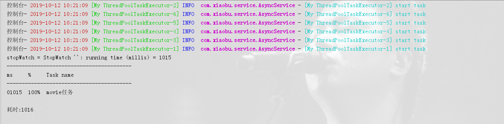
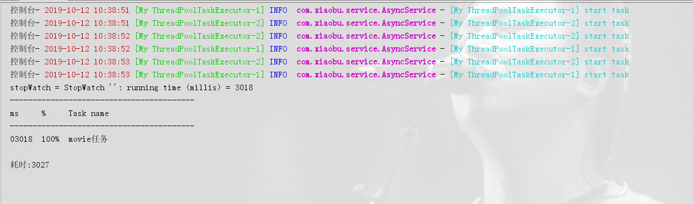
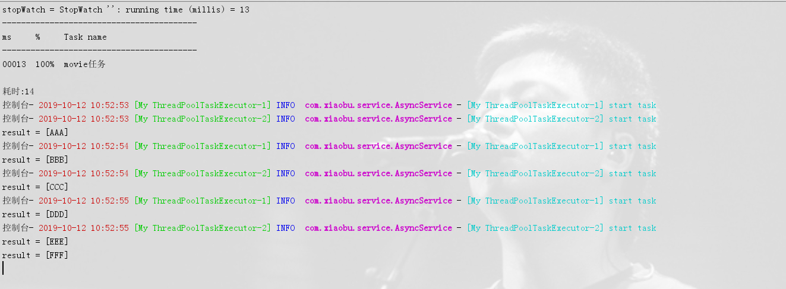

# SpringBoot | 异步编程

> 原创 于 2019-10-12 11:11:40 发布 · 公开 · 639 阅读 · 0 · 2 · 本内容遵循CC 4.0 BY-SA版权协议 版权声明：本文为博主原创文章，遵循 CC 4.0 BY-SA 版权协议，转载请附上原文出处链接和本声明。 · 编辑
> 文章链接：https://blog.csdn.net/tanhongwei1994/article/details/102516804


- @EnableAsync：通过在配置类或者Main类上加@EnableAsync开启对异步方法的支持。

- @Async 可以作用在类上或者方法上，作用在类上代表这个类的所有方法都是异步方法。

创建一个异步的任务配置类

```java
package com.xiaobu.config;

import org.springframework.context.annotation.Bean;
import org.springframework.context.annotation.Configuration;
import org.springframework.scheduling.annotation.EnableAsync;
import org.springframework.scheduling.concurrent.ThreadPoolTaskExecutor;

import java.util.concurrent.Executor;
import java.util.concurrent.ThreadPoolExecutor;

/**
 * @author xiaobu
 * @version JDK1.8.0_171
 * @date on  2019/10/10 16:38
 * @description 异步任务配置类
 */
@Configuration
@EnableAsync
public class AsyncConfig {
    private static final int CORE_POOL_SIZE = 6;
    private static final int MAX_POOL_SIZE = 10;
    private static final int QUEUE_CAPACITY = 100;


    @Bean
    public Executor taskExecutor() {
        ThreadPoolTaskExecutor threadPoolTaskExecutor = new ThreadPoolTaskExecutor();
        threadPoolTaskExecutor.setCorePoolSize(CORE_POOL_SIZE);
        threadPoolTaskExecutor.setMaxPoolSize(MAX_POOL_SIZE);
        threadPoolTaskExecutor.setQueueCapacity(QUEUE_CAPACITY);
        // 当最大池已满时，此策略保证不会丢失任务请求，但是可能会影响应用程序整体性能。
        threadPoolTaskExecutor.setRejectedExecutionHandler(new ThreadPoolExecutor.CallerRunsPolicy());
        threadPoolTaskExecutor.setThreadNamePrefix("My ThreadPoolTaskExecutor-");
        threadPoolTaskExecutor.initialize();
        return threadPoolTaskExecutor;
    }

}
```

CompletableFuture.completedFuture(results) 完成之后再返回结果

```java
package com.xiaobu.service;

import com.xiaobu.mapper.AreaMapper;
import lombok.extern.slf4j.Slf4j;
import org.springframework.scheduling.annotation.Async;
import org.springframework.stereotype.Service;

import javax.annotation.Resource;
import java.util.Arrays;
import java.util.List;
import java.util.concurrent.CompletableFuture;
import java.util.concurrent.TimeUnit;
import java.util.stream.Collectors;

/**
 * @author xiaobu
 * @version JDK1.8.0_171
 * @date on  2019/10/10
 * @description V1.0
 */
@Service
@Slf4j
public class AsyncService {

    private List<String> movies = Arrays.asList("AAA", "BBB", "CCC", "DDD", "EEE", "FFF");


    @Async
    public CompletableFuture<List<String>>  ompletableFutureTask(String start){
        log.info("[{}] start task",Thread.currentThread().getName());
        List<String> result=movies.stream().filter(movie->movie.startsWith(start)).collect(Collectors.toList());
        try {
            //模拟执行时间
            TimeUnit.SECONDS.sleep(1);
        } catch (InterruptedException e) {
            e.printStackTrace();

        }
        //返回一个已经用给定值完成的新的CompletableFuture。
        return CompletableFuture.completedFuture(result);
    }


    public static void main(String[] args) {
        AsyncService service = new AsyncService();
        service.ompletableFutureTask("A");
        List<String> words = Arrays.asList("A", "B");
        List<CompletableFuture<List<String>>> completableFutureList = words.stream().map(service::ompletableFutureTask).collect(Collectors.toList());
        System.out.println("completableFutureList = " + completableFutureList);
    }
}


```

编写异步方法

```java
package com.xiaobu.controller;

import com.xiaobu.base.utils.CmdUtils;
import com.xiaobu.service.AsyncService;
import org.springframework.util.StopWatch;
import org.springframework.web.bind.annotation.GetMapping;
import org.springframework.web.bind.annotation.RequestMapping;
import org.springframework.web.bind.annotation.RestController;

import javax.annotation.Resource;
import java.util.Arrays;
import java.util.List;
import java.util.concurrent.CompletableFuture;
import java.util.concurrent.TimeUnit;
import java.util.stream.Collectors;

/**
 * @author xiaobu
 * @version JDK1.8.0_171
 * @date on  2019/8/23 13:40
 * @description
 */
@RestController
@RequestMapping("async")
public class AsyncController {

    @Resource
    private AsyncService asyncService;

    @GetMapping("movie")
    public String movies() {
        long startTime = System.currentTimeMillis();
        StopWatch stopWatch = new StopWatch();
        stopWatch.start("movie任务");
        List<String> words = Arrays.asList("A", "B","C","D","E","F");
        List<CompletableFuture<List<String>>> completableFutureList = words.stream().map(word -> asyncService.ompletableFutureTask(word)).collect(Collectors.toList());
        List<List<String>> results = completableFutureList.stream().map(CompletableFuture::join).collect(Collectors.toList());
        stopWatch.stop();
        System.out.println("stopWatch = " + stopWatch.prettyPrint());
        System.out.println("耗时:"+(System.currentTimeMillis() - startTime));
        return results.toString();
    }
}

```

结果如下:

 

可以看出执行任务花费了1秒钟的时间，6个线程异步执行的。下面将核心线程池大小改成2之后，查看下执行结果。

 

改造下service和controller类 业务层设置无返回值

```java
 @Async
    public void ompletableFutureTask(String start){
        log.info("[{}] start task",Thread.currentThread().getName());
        List<String> result=movies.stream().filter(movie->movie.startsWith(start)).collect(Collectors.toList());
        try {
            //模拟执行时间
            TimeUnit.SECONDS.sleep(1);
        } catch (InterruptedException e) {
            e.printStackTrace();

        }
        //返回一个已经用给定值完成的新的CompletableFuture。
        System.out.println("result = " + result);
    }
```

```java
@GetMapping("movie")
    public String movies() {
        long startTime = System.currentTimeMillis();
        StopWatch stopWatch = new StopWatch();
        stopWatch.start("movie任务");
        List<String> words = Arrays.asList("A", "B","C","D","E","F");
       words.stream().forEach(word -> asyncService.ompletableFutureTask(word));
        stopWatch.stop();
        System.out.println("stopWatch = " + stopWatch.prettyPrint());
        System.out.println("耗时:"+(System.currentTimeMillis() - startTime));
        return "success";
    }

```

 

结果:先返回结果，然后系统再执行。