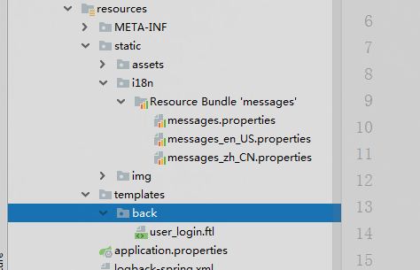

# SpringBoot国际化

> 原创 于 2019-10-25 10:56:17 发布 · 公开 · 248 阅读 · 0 · 0 · 本内容遵循CC 4.0 BY-SA版权协议 版权声明：本文为博主原创文章，遵循 CC 4.0 BY-SA 版权协议，转载请附上原文出处链接和本声明。 · 编辑
> 文章链接：https://blog.csdn.net/tanhongwei1994/article/details/102738856


1. 配置文件
   spring.properties

```properties
# 默认的 8080 我们将它改成 9090
server.port=8888
# 未定义上下文路径之前 地址是 http://localhost:8080 定义了后 http://localhost:9090/chapter1 你能在tomcat做的事情，配置文件都可以
#server.servlet.context-path=/chapter1


#=====================文件上传======================================
# 是否支持批量上传   (默认值 true)
spring.servlet.multipart.enabled=true
# 上传文件的临时目录 （一般情况下不用特意修改）
spring.servlet.multipart.location=
# 上传文件最大为 1M （默认值 1M 根据自身业务自行控制即可）
spring.servlet.multipart.max-file-size=10MB
# 上传请求最大为 10M（默认值10M 根据自身业务自行控制即可）
spring.servlet.multipart.max-request-size=20MB
# 文件大小阈值，当大于这个阈值时将写入到磁盘，否则存在内存中，（默认值0 一般情况下不用特意修改）
spring.servlet.multipart.file-size-threshold=0

# 判断是否要延迟解析文件（相当于懒加载，一般情况下不用特意修改）
spring.servlet.multipart.resolve-lazily=false


#解决中文乱码
server.tomcat.uri-encoding=UTF-8
spring.http.encoding.force=true
spring.http.encoding.enabled=true
spring.http.encoding.charset=UTF-8
spring.messages.encoding=UTF-8

#热编译
spring.devtools.restart.enabled=true


#freemarker热部署
spring.freemarker.cache=false
spring.freemarker.settings.template_update_delay=0
#设定ftl文件路径
spring.freemarker.template-loader-path=classpath:/templates/
spring.freemarker.allow-request-override=false
spring.freemarker.allow-session-override=false
spring.freemarker.charset=UTF-8
spring.freemarker.check-template-location=true
spring.freemarker.content-type=text/html
spring.freemarker.enabled=true
spring.freemarker.expose-request-attributes=false
spring.freemarker.expose-session-attributes=false
spring.freemarker.expose-spring-macro-helpers=true
spring.freemarker.prefer-file-system-access=true
spring.freemarker.suffix=.ftl
spring.freemarker.settings.default_encoding=UTF-8
spring.freemarker.settings.classic_compatible=true
spring.freemarker.settings.date_format=yyyy-MM-dd
spring.freemarker.settings.time_format=HH:mm:ss
spring.freemarker.settings.datetime_format=yyyy-MM-dd HH:mm:ss

#设定静态文件路径，js,css等  访问时需要加/static
spring.mvc.static-path-pattern=/static/**

#测试可以 改成true 会自动启动
spring.auto.openurl=true
spring.web.loginurl=http://localhost:${server.port}/user/toLogin
spring.web.googleexcute=C:\\Program Files (x86)\\Google\\Chrome\\Application\\chrome.exe


#国际化文件的相对路径 由于前设置了静态文件路径所以需要添加static
spring.messages.basename=static/i18n/messages

```

messages_en_US.properties

```properties
userName=userName
password=password
language.cn = Chinese
language.en = English
internationalisation = \u0020Internationalisation
welcome = Welcome to visit "zifangsky's personal blog",URL：http://www.zifangsky.cn
Home=Home  
login=login
remember=remember
forget=forget password
```

messages_zh_CN.properties

```properties
#用户名
userName=用户名
#密码
password=密码
language.cn = 中文
language.en = 英文
internationalisation = 国际化
welcome = 欢迎访问“zifangsky的个人博客”，URL：http://www.zifangsky.cn
Home=首页
login=登录
remember=记住
forget=忘记密码
```

1. 语言国际化配置类

```java
package com.xiaobu.config;

import org.springframework.context.annotation.Bean;
import org.springframework.context.annotation.Configuration;
import org.springframework.web.servlet.LocaleResolver;
import org.springframework.web.servlet.config.annotation.InterceptorRegistry;
import org.springframework.web.servlet.config.annotation.WebMvcConfigurer;
import org.springframework.web.servlet.i18n.CookieLocaleResolver;
import org.springframework.web.servlet.i18n.LocaleChangeInterceptor;

/**
 * @author xiaobu
 * @version JDK1.8.0_171
 * @date on  2019/10/24 17:29
 * @description 国际化配置
 */
@Configuration
public class LocaleConfig {
    @Bean
    public LocaleResolver localeResolver() {
        CookieLocaleResolver slr = new CookieLocaleResolver();
        slr.setCookieMaxAge(3600);
        //设置存储的Cookie的name为Language
        slr.setCookieName("Language");
        return slr;
    }

    @Bean
    public WebMvcConfigurer webMvcConfigurer() {
        //LocaleChangeInterceptor拦截器来拦截国际化语言的变化
        return new WebMvcConfigurer() {
            //拦截器
            @Override
            public void addInterceptors(InterceptorRegistry registry) {
                registry.addInterceptor(new LocaleChangeInterceptor()).addPathPatterns("/**");
            }
        };
    }
}
```

1. 控制器类

```java
package com.xiaobu.controller;

import org.springframework.stereotype.Controller;
import org.springframework.web.bind.annotation.GetMapping;
import org.springframework.web.bind.annotation.RequestMapping;

/**
 * @author xiaobu
 * @version JDK1.8.0_171
 * @date on  2019/10/25 9:09
 * @description
 */
@Controller
@RequestMapping("user")
public class UserController {


    @GetMapping("toLogin")
    public String toLogin(){
        return "back/user_login";
    }

}
```

1. 前端页面

```ftl
<!DOCTYPE html PUBLIC "-//W3C//DTD XHTML 1.0 Transitional//EN"
        "http://www.w3.org/TR/xhtml1/DTD/xhtml1-transitional.dtd">
<html xmlns="http://www.w3.org/1999/xhtml">
<head>
    <meta http-equiv="Content-Type" content="text/html; charset=utf-8"/>
    <title>Tetra Pak</title>
    <#import "spring.ftl" as spring>
    <link href="/static/assets/css/style.css" rel="stylesheet" type="text/css">

</head>
<link rel="icon" type="image/x-icon" href="/static/img/favicon.ico">
<body class="login">
<div align="right" style="margin-right: 50px">
    <h3>
        Language: <a href="?locale=zh_CN"><@spring.message code="language.cn" /></a> -
        <a href="?locale=en_US"><@spring.message code="language.en" /></a>
    </h3>
</div>
<div class="login_m">
    <form action="/user/doLogin" method="post">
        <center><p class="login-box-msg" style="color: red">${msg!''}</p></center>
        <div class="login_boder">
            <div class="login_padding">
                <h2><@spring.message code="userName" /></h2>
                <label>
                    <input type="text" id="employeeID" name="employeeID" class="txt_input txt_input2"
                           οnfοcus="if (value ==&#39;Your name&#39;){value =&#39;&#39;}"
                           οnblur="if (value ==&#39;&#39;){value=&#39;Your name&#39;}"
                           value="${(user.loginName)?default('')}">
                </label>
                <h2><@spring.message code="password" /></h2>
                <label>
                    <input type="password" name="password" id="password" class="txt_input"
                           value="${(user.password)?default('')}"
                           οnfοcus="if (value ==&#39;******&#39;){value =&#39;&#39;}"
                           οnblur="if (value ==&#39;&#39;){value=&#39;******&#39;}" value="******">
                </label>
                <p class="forgot"><a href="javascript:void(0);"><@spring.message code="forget" />?</a></p>
                <div class="rem_sub">
                    <div class="rem_sub_l">
                        <input type="checkbox" name="checkbox" id="save_me"/>
                        <label for="checkbox"><@spring.message code="remember" /></label>
                    </div>
                    <label>
                        <input type="submit" class="sub_button" name="button" id="button"
                               value="<@spring.message code="login" />" style="opacity: 0.7;">
                    </label>
                </div>
            </div>
        </div><!--login_boder end-->

    </form>
</div><!--login_m end-->
<br/>
<br/>

</body>
</html>
```

项目结构:

 

然后点击语言切换按钮,即可实现语言的转换。

参考:

[自己动手在Spring-Boot上加强国际化功能](https://segmentfault.com/a/1190000014538512) 