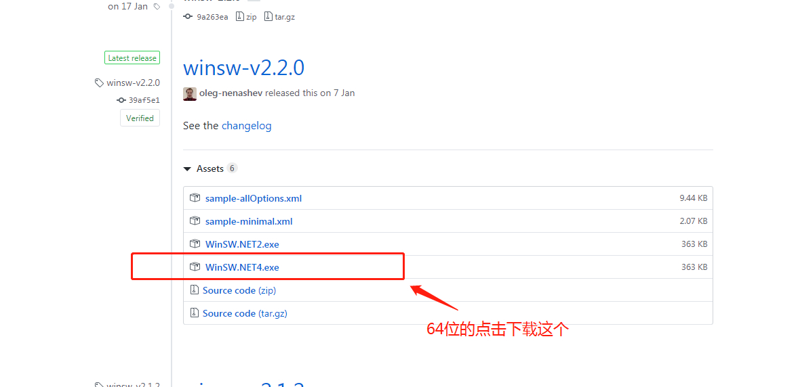
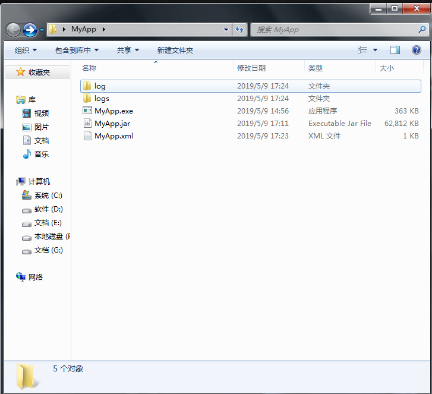

# Windows下将JAVA jar注册成windows服务

> 原创 于 2019-05-09 17:52:11 发布 · 公开 · 9.3k 阅读 · 3 · 18 · 本内容遵循CC 4.0 BY-SA版权协议 版权声明：本文为博主原创文章，遵循 CC 4.0 BY-SA 版权协议，转载请附上原文出处链接和本声明。 · 编辑
> 文章链接：https://blog.csdn.net/tanhongwei1994/article/details/90044612

## 下载WindowsService Wrapper

[github](https://github.com/kohsuke/winsw) 下载

 

### 安装windows服务

1. 将java jar包和下载的WinSW.NET4.exe放在同一个文件夹目录下面

2. 重命名WinSW.NET4.exe为MyApp.exe(这个可以任意取)，新建个MyApp.xml(这个必须和前者的exe文件名字相同)
    

3. 编辑MyApp.xml文件

```cmd
<configuration>
    <id>MyApp</id>
    <name>MyApp</name>
    <description>This is MyApp.</description>
    
    <executable>java</executable>
    <arguments>-jar C:\Users\tanhw119214\Desktop\MyApp\MyApp.jar</arguments>
      <!-- 开机启动 -->
     <startmode>Automatic</startmode>
    <logpath>C:\Users\tanhw119214\Desktop\MyApp\logs</logpath>
    <log mode="roll-by-time">
    <pattern>yyyyMMdd</pattern>
    </log>
</configuration>
```

> C:\Users\tanhw119214\Desktop\MyApp 为你要要注册服务的文件的父路径

4.进入根目录下面，执行以下cmd命令，注册服务。

```cmd
MyApp.exe install 
```

然后在服务里面就能找到这个实例了。

---

- 启动命令

```cmd
net start MyApp
```

- 停止命令

```cmd
net stop MyApp
```

- 卸载命令

```cmd
sc delete MyApp
```