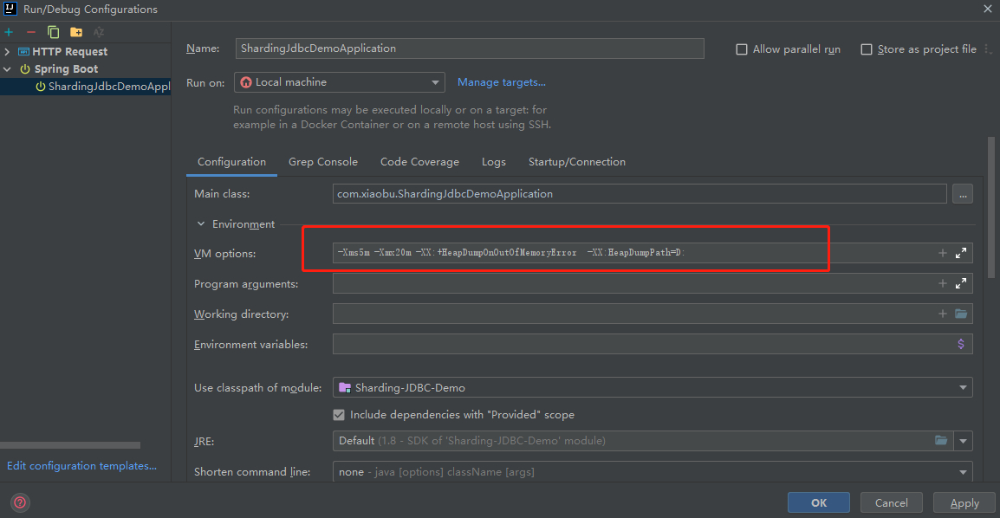
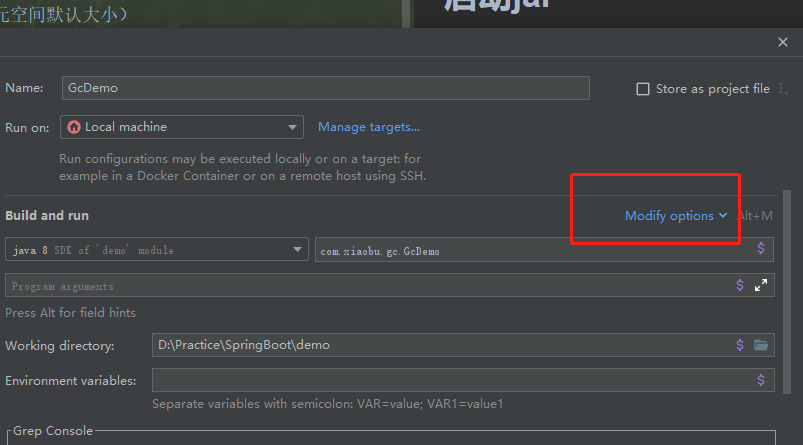
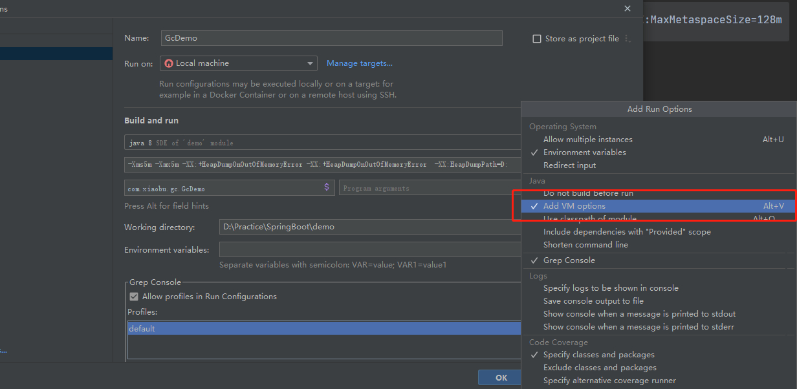

# JVM参数

> 原创 于 2021-08-22 20:49:58 发布 · 公开 · 495 阅读 · 0 · 0 · 本内容遵循CC 4.0 BY-SA版权协议 版权声明：本文为博主原创文章，遵循 CC 4.0 BY-SA 版权协议，转载请附上原文出处链接和本声明。 · 编辑
> 文章链接：https://blog.csdn.net/tanhongwei1994/article/details/119857661

### JVM参数

```text
-XX:MetaspaceSize=128m （元空间默认大小）
-XX:MaxMetaspaceSize=128m （元空间最大大小）
-Xms1024m （堆默认大小）
-Xmx1024m （堆最大大小）
-Xmn256m （新生代大小）
-Xss256k （棧最大深度大小）
-XX:SurvivorRatio=8 （新生代分区比例 8:2）
-XX:+UseConcMarkSweepGC （指定使用的垃圾收集器，这里使用CMS收集器）
-XX:+PrintGCDetails （打印详细的GC日志） 
XX:+HeapDumpOnOutOfMemoryError （参数表示当JVM发生OOM时，自动生成DUMP文件） 
-XX:HeapDumpPath=D: （将heapdump文件存放在D盘） 
```

### ideajava类设置 java options

 

 

 

### SpringBoot 启动参数设置

> SpringBoot会用JVM自身默认的配置策略。默认情况下 最大堆内存占用物理内存的1/4，如果应用程序超过该上限，则会抛出OutOfMemoryError异常。初始堆内存大小为物理内存的1/64。

> 如果应用程序运行在手机上或物理内存小于192M时，最大堆内存为物理内存的1/2，初始堆内存大小为物理内存的1/64， 但当初始堆内存最小为8MB，则为8MB。

> 默认空余堆内存小于40%时，JVM就会增大堆直到-Xmx的最大限制；空余堆内存大于70%时，JVM会减少堆直到 -Xms的最小限制。因

### idea设置javaoptions

```text
-XX:MetaspaceSize=128m -XX:MaxMetaspaceSize=128m -Xms1024m -Xmx1024m -Xmn256m -Xss256k -XX:SurvivorRatio=8 -XX:+UseConcMarkSweepGC
```

### idea设置java options

```text
-Xms5m -Xmx5m -XX:+HeapDumpOnOutOfMemoryError -XX:+HeapDumpOnOutOfMemoryError  -XX:HeapDumpPath=D:
```

### 启动jar

```text
java -jar -XX:MetaspaceSize=128m -XX:MaxMetaspaceSize=128m -Xms1024m -Xmx1024m -Xmn256m -Xss256k -XX:SurvivorRatio=8 -XX:+UseConcMarkSweepGC newframe-1.0.0.jar
```

### 查看系统默认内存设置

linux

```text
java -XX:+PrintFlagsFinal -version | grep HeapSize
```

window

```text
java -XX:+PrintFlagsFinal -version | findstr HeapSize
```