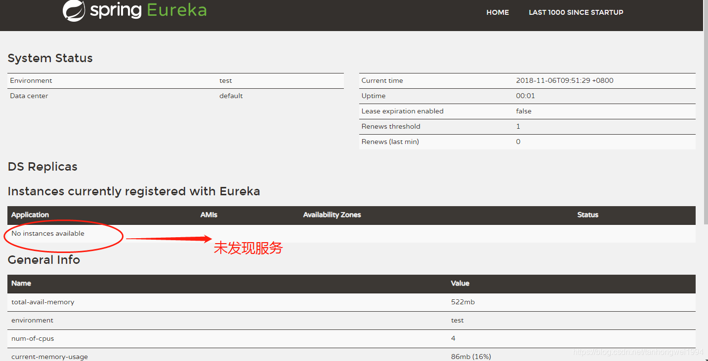
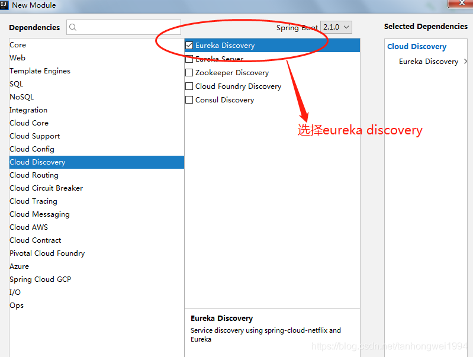
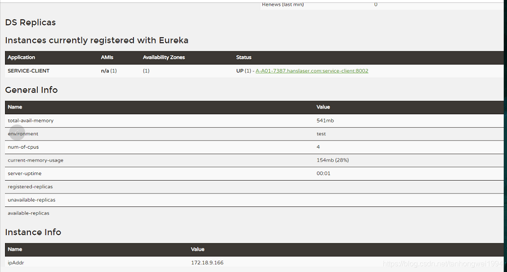
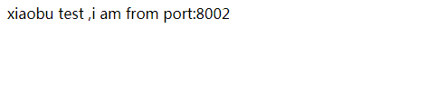
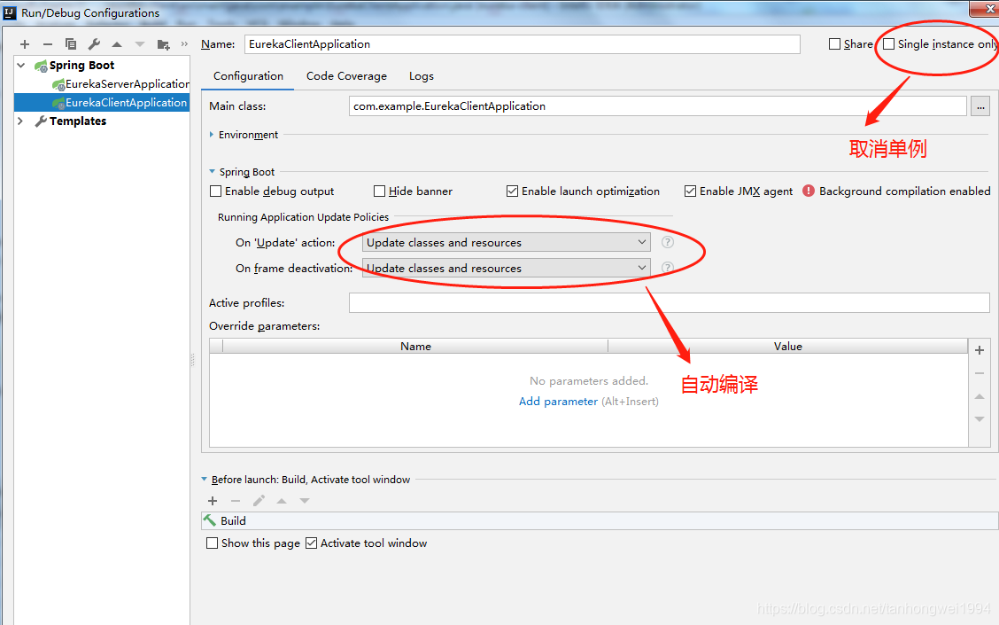

# 第一篇： 服务的注册与发现Eureka(Greenwich版)

> 原创 最新推荐文章于 2025-03-09 20:45:00 发布 · 公开 · 1.5k 阅读 · 0 · 0 · 本内容遵循CC 4.0 BY-SA版权协议 版权声明：本文为博主原创文章，遵循 CC 4.0 BY-SA 版权协议，转载请附上原文出处链接和本声明。 · 编辑
> 文章链接：https://blog.csdn.net/tanhongwei1994/article/details/83756077

### 一、创建服务注册中心

新建个主工程（这个pom文件作为父pom文件，起到依赖版本控制的作用，其他module工程继承该pom）并删除掉src目录

 

父pom.xml代码如下

```java
<?xml version="1.0" encoding="UTF-8"?>
<project xmlns="http://maven.apache.org/POM/4.0.0" xmlns:xsi="http://www.w3.org/2001/XMLSchema-instance"
         xsi:schemaLocation="http://maven.apache.org/POM/4.0.0 http://maven.apache.org/xsd/maven-4.0.0.xsd">
    <modelVersion>4.0.0</modelVersion>

    <groupId>com.example</groupId>
    <artifactId>chapter1</artifactId>
    <version>0.0.1-SNAPSHOT</version>
    <packaging>jar</packaging>

    <name>chapter1</name>
    <description>Demo project for Spring Boot</description>

    <parent>
        <groupId>org.springframework.boot</groupId>
        <artifactId>spring-boot-starter-parent</artifactId>
        <version>2.1.0.RELEASE</version>
        <relativePath/> <!-- lookup parent from repository -->
    </parent>

    <modules>
        <module>eureka-server</module>
        <module>eureka-client</module>
    </modules>

    <properties>
        <project.build.sourceEncoding>UTF-8</project.build.sourceEncoding>
        <project.reporting.outputEncoding>UTF-8</project.reporting.outputEncoding>
        <java.version>1.8</java.version>
        <spring-cloud.version>Greenwich.M1</spring-cloud.version>
    </properties>

    <dependencies>
        <dependency>
            <groupId>org.springframework.boot</groupId>
            <artifactId>spring-boot-starter-web</artifactId>
        </dependency>

        <dependency>
            <groupId>org.springframework.boot</groupId>
            <artifactId>spring-boot-starter-test</artifactId>
            <scope>test</scope>
        </dependency>
    </dependencies>

    <build>
        <plugins>
            <plugin>
                <groupId>org.springframework.boot</groupId>
                <artifactId>spring-boot-maven-plugin</artifactId>
            </plugin>
        </plugins>
    </build>


</project>
```


二、创建eureka-server子工程（右键父工程 new module）

eureka-server pom.xml代码如下

```java
<?xml version="1.0" encoding="UTF-8"?>
<project xmlns="http://maven.apache.org/POM/4.0.0" xmlns:xsi="http://www.w3.org/2001/XMLSchema-instance"
         xsi:schemaLocation="http://maven.apache.org/POM/4.0.0 http://maven.apache.org/xsd/maven-4.0.0.xsd">
    <modelVersion>4.0.0</modelVersion>

    <artifactId>eureka-server</artifactId>
    <version>0.0.1-SNAPSHOT</version>
    <packaging>jar</packaging>

    <name>eureka-server</name>
    <description>Demo project for Spring Boot</description>

    <parent>
        <groupId>com.example</groupId>
        <artifactId>chapter2</artifactId>
        <version>0.0.1-SNAPSHOT</version>
    </parent>


    <dependencies>
        <dependency>
            <groupId>org.springframework.cloud</groupId>
            <artifactId>spring-cloud-starter-netflix-eureka-server</artifactId>
        </dependency>
    </dependencies>

    <dependencyManagement>
        <dependencies>
            <dependency>
                <groupId>org.springframework.cloud</groupId>
                <artifactId>spring-cloud-dependencies</artifactId>
                <version>${spring-cloud.version}</version>
                <type>pom</type>
                <scope>import</scope>
            </dependency>
            <!-- 热编译-->
            <dependency>
                <groupId>org.springframework.boot</groupId>
                <artifactId>spring-boot-devtools</artifactId>
                <optional>true</optional>
            </dependency>
        </dependencies>
    </dependencyManagement>

    <build>
        <plugins>
            <plugin>
                <groupId>org.springframework.boot</groupId>
                <artifactId>spring-boot-maven-plugin</artifactId>
            </plugin>
        </plugins>
    </build>

    <repositories>
        <repository>
            <id>spring-milestones</id>
            <name>Spring Milestones</name>
            <url>https://repo.spring.io/milestone</url>
            <snapshots>
                <enabled>false</enabled>
            </snapshots>
        </repository>
    </repositories>


</project>
```

application.properties配置文件：

```java
#服务启动端口
server.port=8001
#主机地址
eureka.instance.hostname=localhost
#这两个false表明这个服务为eureka server
eureka.client.fetch-registry=false
eureka.client.register-with-eureka=false
#服务地址
eureka.client.service-url.defaultZone=http://${eureka.instance.hostname}:${server.port}/eureka/
#服务名称
spring.application.name=eureka-server
```

EurekaServerApplication 启动类：

```java
package com.example;

import org.springframework.boot.SpringApplication;
import org.springframework.boot.autoconfigure.SpringBootApplication;
import org.springframework.cloud.netflix.eureka.server.EnableEurekaServer;

/**
 * @author xiaobu
 */
@EnableEurekaServer
@SpringBootApplication
public class EurekaServerApplication {

    public static void main(String[] args) {
        SpringApplication.run(EurekaServerApplication.class, args);
    }
}
```

输入 [http://localhost:8001/](http://localhost:8001/) 界面如下所示：

 

三、在父工程右键新建一个eureka-client模块 选择 eureka-discovery

 

对应的pom.xml如下所示

```java
<?xml version="1.0" encoding="UTF-8"?>
<project xmlns="http://maven.apache.org/POM/4.0.0" xmlns:xsi="http://www.w3.org/2001/XMLSchema-instance"
         xsi:schemaLocation="http://maven.apache.org/POM/4.0.0 http://maven.apache.org/xsd/maven-4.0.0.xsd">
    <modelVersion>4.0.0</modelVersion>

    <artifactId>eureka-client</artifactId>
    <version>0.0.1-SNAPSHOT</version>
    <packaging>jar</packaging>

    <name>eureka-client</name>
    <description>eureka-client for Spring Boot</description>

    <parent>
        <groupId>com.example</groupId>
        <artifactId>chapter1</artifactId>
        <version>0.0.1-SNAPSHOT</version>
    </parent>

    <properties>
        <project.build.sourceEncoding>UTF-8</project.build.sourceEncoding>
        <project.reporting.outputEncoding>UTF-8</project.reporting.outputEncoding>
        <java.version>1.8</java.version>
    </properties>

    <dependencies>
        <dependency>
            <groupId>org.springframework.cloud</groupId>
            <artifactId>spring-cloud-starter-netflix-eureka-client</artifactId>
        </dependency>

    </dependencies>

    <dependencyManagement>
        <dependencies>
            <dependency>
                <groupId>org.springframework.cloud</groupId>
                <artifactId>spring-cloud-dependencies</artifactId>
                <version>${spring-cloud.version}</version>
                <type>pom</type>
                <scope>import</scope>
            </dependency>
        </dependencies>
    </dependencyManagement>

    <build>
        <plugins>
            <plugin>
                <groupId>org.springframework.boot</groupId>
                <artifactId>spring-boot-maven-plugin</artifactId>
            </plugin>
        </plugins>
    </build>

    <repositories>
        <repository>
            <id>spring-milestones</id>
            <name>Spring Milestones</name>
            <url>https://repo.spring.io/milestone</url>
            <snapshots>
                <enabled>false</enabled>
            </snapshots>
        </repository>
    </repositories>


</project>
```

application.properties配置如下：

```java
eureka.client.service-url.defaultZone=http://localhost:8001/eureka/
server.port=8002
spring.application.name=eureka-client
```

```html
启动类EurekaClientApplication配置如下：
```

```java
package com.example;

import org.springframework.beans.factory.annotation.Value;
import org.springframework.boot.SpringApplication;
import org.springframework.boot.autoconfigure.SpringBootApplication;
import org.springframework.cloud.netflix.eureka.EnableEurekaClient;
import org.springframework.web.bind.annotation.RequestMapping;
import org.springframework.web.bind.annotation.RequestParam;
import org.springframework.web.bind.annotation.RestController;

/**
 * @author xiaobu
 */
@EnableEurekaClient
@RestController
@SpringBootApplication
public class EurekaClientApplication {

    public static void main(String[] args) {
        SpringApplication.run(EurekaClientApplication.class, args);
    }

    @Value("${server.port}")
    String port;

    @RequestMapping("/test")
    public String test(@RequestParam(value = "name", defaultValue = "admin") String name) {
        return name +"test ,i am from port:" + port;
    }
}
```

启动eureka-client刷新http://localhost:8001 效果如下所示：

 

输入 [http://localhost:8002/test?name=xiaobu](http://localhost:8002/test?name=xiaobu) 效果图如下：

 

启动多个实例以及自动编译(修改端口，取消热编译)

```
        <!-- 热编译-->
<!--        <dependency>
            <groupId>org.springframework.boot</groupId>
            <artifactId>spring-boot-devtools</artifactId>
            <optional>true</optional>
        </dependency>-->
```

 

