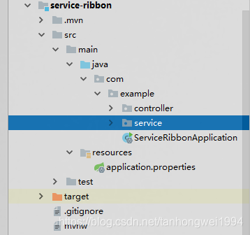

# 第二篇: 服务消费者（rest+ribbon）(Greenwich版本)

> 原创 最新推荐文章于 2022-08-24 07:08:53 发布 · 公开 · 646 阅读 · 0 · 0 · 本内容遵循CC 4.0 BY-SA版权协议 版权声明：本文为博主原创文章，遵循 CC 4.0 BY-SA 版权协议，转载请附上原文出处链接和本声明。 · 编辑
> 文章链接：https://blog.csdn.net/tanhongwei1994/article/details/83785366

一、在前一章的基础上启动eureka-server和两个eureka-client实例（在application.properties更改下端口号）新增一个模块service-ribbon

<div style="text-align:center;"></div>


修改父工程的pom.xml文件在<Modules>节点处增加service-ribbon

```java
 <modules>
        <module>eureka-server</module>
        <module>eureka-client</module>
        <module>service-ribbon</module>
    </modules>
	
	
```

service-ribbon的pom.xml的内容如下：

```java
<?xml version="1.0" encoding="UTF-8"?>
<project xmlns="http://maven.apache.org/POM/4.0.0" xmlns:xsi="http://www.w3.org/2001/XMLSchema-instance"
         xsi:schemaLocation="http://maven.apache.org/POM/4.0.0 http://maven.apache.org/xsd/maven-4.0.0.xsd">
    <modelVersion>4.0.0</modelVersion>

    <artifactId>service-ribbon</artifactId>
    <version>0.0.1-SNAPSHOT</version>
    <packaging>jar</packaging>

    <name>service-ribbon</name>
    <description>Demo project for Spring Boot</description>

    <parent>
        <groupId>com.example</groupId>
        <artifactId>chapter2</artifactId>
        <version>0.0.1-SNAPSHOT</version>
    </parent>

    <properties>
        <project.build.sourceEncoding>UTF-8</project.build.sourceEncoding>
        <project.reporting.outputEncoding>UTF-8</project.reporting.outputEncoding>
        <java.version>1.8</java.version>
    </properties>

    <dependencies>
        <!-- ribbon-->
        <dependency>
            <groupId>org.springframework.cloud</groupId>
            <artifactId>spring-cloud-starter-netflix-ribbon</artifactId>
        </dependency>

        <!-- eureka discovery -->
        <dependency>
            <groupId>org.springframework.cloud</groupId>
            <artifactId>spring-cloud-starter-netflix-eureka-client</artifactId>
        </dependency>
    </dependencies>

    <dependencyManagement>
        <dependencies>
            <dependency>
                <groupId>org.springframework.cloud</groupId>
                <artifactId>spring-cloud-dependencies</artifactId>
                <version>${spring-cloud.version}</version>
                <type>pom</type>
                <scope>import</scope>
            </dependency>
        </dependencies>
    </dependencyManagement>

    <build>
        <plugins>
            <plugin>
                <groupId>org.springframework.boot</groupId>
                <artifactId>spring-boot-maven-plugin</artifactId>
            </plugin>
        </plugins>
    </build>

    <repositories>
        <repository>
            <id>spring-milestones</id>
            <name>Spring Milestones</name>
            <url>https://repo.spring.io/milestone</url>
            <snapshots>
                <enabled>false</enabled>
            </snapshots>
        </repository>
    </repositories>


</project>
```

配置文件application-properties内容如下：

```java
#server 地址
eureka.client.service-url.defaultZone=http://localhost:8001/eureka/
#一个server 8001 两个client分别为8002 8003
server.port=8004
#实例名
spring.application.name=service-ribbon
```

启动类ServiceRibbonApplication的内容如下：

```java
package com.example;

import org.springframework.boot.SpringApplication;
import org.springframework.boot.autoconfigure.SpringBootApplication;
import org.springframework.cloud.client.discovery.EnableDiscoveryClient;
import org.springframework.cloud.client.loadbalancer.LoadBalanced;
import org.springframework.cloud.netflix.eureka.EnableEurekaClient;
import org.springframework.context.annotation.Bean;
import org.springframework.web.client.RestTemplate;

/**
 * 通过@EnableDiscoveryClient向服务中心注册；并且向程序的ioc注入一个bean
 * @author xiaobu
 */
@EnableEurekaClient
@EnableDiscoveryClient
@SpringBootApplication
public class ServiceRibbonApplication {

    public static void main(String[] args) {
        SpringApplication.run(ServiceRibbonApplication.class, args);
    }


    /***
     * @author xiaobu
     * @date 2018/11/6 11:32
     * @return org.springframework.web.client.RestTemplate
     * @descprition restTemplate;并通过@LoadBalanced注解表明这个restRemplate开启负载均衡的功能。
     * @version 1.0
     */
    @Bean
    @LoadBalanced
    RestTemplate restTemplate(){
        return new RestTemplate();
    }

}
```

service-ribbon的目录结构如下

 

定义一个消费接口ClientService

```java
package com.example.service;

import org.springframework.beans.factory.annotation.Autowired;
import org.springframework.stereotype.Service;
import org.springframework.web.client.RestTemplate;

/**
 * @author xiaobu
 * @version JDK1.8.0_171
 * @date on  2018/11/6 11:34
 * @descrption
 */
@Service
public class ClientService {
    @Autowired
    RestTemplate restTemplate;

    /***
     * @author xiaobu
     * @date 2018/11/6 11:42
     * @param name 名字
     * @return java.lang.String
     * @descprition  直接用的程序名替代了具体的url地址，
     * 在ribbon中它会根据服务名来选择具体的服务实例，
     * 根据服务实例在请求的时候会用具体的url替换掉服务名
     * @version 1.0
     */
    public String clientService(String name){
        return restTemplate.getForObject("http://eureka-client/test?name=" + name, String.class);
    }

}
```

再定义个controller

```java
package com.example.controller;

import com.example.service.ClientService;
import com.sun.org.glassfish.gmbal.ParameterNames;
import org.springframework.beans.factory.annotation.Autowired;
import org.springframework.web.bind.annotation.GetMapping;
import org.springframework.web.bind.annotation.RequestParam;
import org.springframework.web.bind.annotation.RestController;

/**
 * @author xiaobu
 * @version JDK1.8.0_171
 * @date on  2018/11/6 11:36
 * @description V1.0
 */
@RestController
public class ClientController {
    @Autowired
    ClientService clientService;


    @GetMapping("/test")
    public String test(@RequestParam String name){
        return clientService.clientService(name);
    }
}
```

多次访问 [http://localhost:8004/test?name=admin](http://localhost:8004/test?name=admin) 出现的效果如下：

 

 

