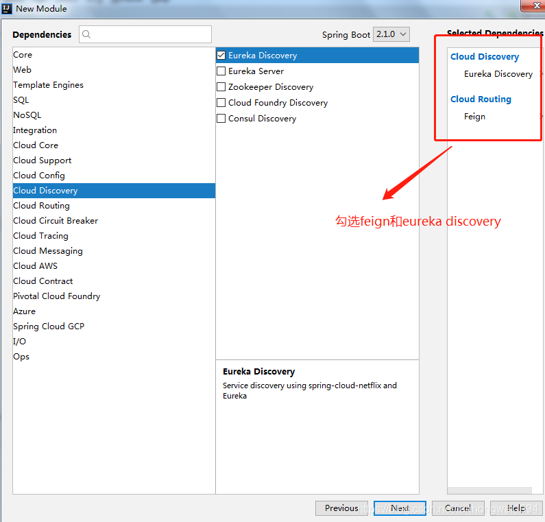
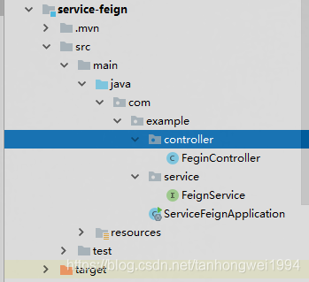

# 第三篇: 服务消费者（Feign）(Greenwich版本)

> 原创 最新推荐文章于 2024-07-25 11:03:47 发布 · 公开 · 2.2k 阅读 · 0 · 2 · 本内容遵循CC 4.0 BY-SA版权协议 版权声明：本文为博主原创文章，遵循 CC 4.0 BY-SA 版权协议，转载请附上原文出处链接和本声明。 · 编辑
> 文章链接：https://blog.csdn.net/tanhongwei1994/article/details/83793151

一、在前面的工程基础上，增加一个service-feign的子模块。

 

修改父工程的pom.xml 把service-feign添加到它的子模块里面去

```java

    <modules>
        <module>eureka-server</module>
        <module>eureka-client</module>
        <module>service-ribbon</module>
        <module>service-feign</module>
    </modules>
```

service-feign的pom.xml内容如下：

```java
<?xml version="1.0" encoding="UTF-8"?>
<project xmlns="http://maven.apache.org/POM/4.0.0" xmlns:xsi="http://www.w3.org/2001/XMLSchema-instance"
         xsi:schemaLocation="http://maven.apache.org/POM/4.0.0 http://maven.apache.org/xsd/maven-4.0.0.xsd">
    <modelVersion>4.0.0</modelVersion>

    <artifactId>service-feign</artifactId>
    <version>0.0.1-SNAPSHOT</version>
    <packaging>jar</packaging>

    <name>service-feign</name>
    <description>Demo project for Spring Boot</description>

    <parent>
        <groupId>com.example</groupId>
        <artifactId>chapter2</artifactId>
        <version>0.0.1-SNAPSHOT</version>
    </parent>

    <properties>
        <project.build.sourceEncoding>UTF-8</project.build.sourceEncoding>
        <project.reporting.outputEncoding>UTF-8</project.reporting.outputEncoding>
        <java.version>1.8</java.version>
    </properties>

    <dependencies>
        <dependency>
            <groupId>org.springframework.cloud</groupId>
            <artifactId>spring-cloud-starter-netflix-eureka-client</artifactId>
        </dependency>
        <dependency>
            <groupId>org.springframework.cloud</groupId>
            <artifactId>spring-cloud-starter-openfeign</artifactId>
        </dependency>
    </dependencies>

    <dependencyManagement>
        <dependencies>
            <dependency>
                <groupId>org.springframework.cloud</groupId>
                <artifactId>spring-cloud-dependencies</artifactId>
                <version>${spring-cloud.version}</version>
                <type>pom</type>
                <scope>import</scope>
            </dependency>
        </dependencies>
    </dependencyManagement>

    <build>
        <plugins>
            <plugin>
                <groupId>org.springframework.boot</groupId>
                <artifactId>spring-boot-maven-plugin</artifactId>
            </plugin>
        </plugins>
    </build>

    <repositories>
        <repository>
            <id>spring-milestones</id>
            <name>Spring Milestones</name>
            <url>https://repo.spring.io/milestone</url>
            <snapshots>
                <enabled>false</enabled>
            </snapshots>
        </repository>
    </repositories>


</project>
```

application.properties配置如下：

```java
eureka.client.service-url.defaultZone=http://localhost:8001/eureka/
spring.application.name=service-feign
server.port=8005
```

```
ServiceFeignApplication配置如下：
```

```java
package com.example;

import org.springframework.boot.SpringApplication;
import org.springframework.boot.autoconfigure.SpringBootApplication;
import org.springframework.cloud.client.discovery.EnableDiscoveryClient;
import org.springframework.cloud.netflix.eureka.EnableEurekaClient;
import org.springframework.cloud.openfeign.EnableFeignClients;

/**
 * @author xiaobu @EnableFeignClients 开启feign功能
 */
@SpringBootApplication
@EnableDiscoveryClient
@EnableEurekaClient
@EnableFeignClients
public class ServiceFeignApplication {

    public static void main(String[] args) {
        SpringApplication.run(ServiceFeignApplication.class, args);
    }
}
```

feign目录结构如下：

 

定义一个feign接口

```
package com.example.service;

import org.springframework.cloud.openfeign.FeignClient;
import org.springframework.web.bind.annotation.GetMapping;
import org.springframework.web.bind.annotation.RequestParam;

/**
 * @author xiaobu
 * @version JDK1.8.0_171
 * @date on  2018/11/6 14:24
 * @description V1.0 定义个feign接口 @FeignClient("服务名") 来确定调哪个服务
 */
@FeignClient("eureka-client")
public interface FeignService {
    /***
     * @author xiaobu
     * @date 2018/11/6 14:34
     * @param name 名字
     * @return java.lang.String
     * @descprition value为test则是调用 eureka-client的test的方法
     * RequestMapping(value="/test",method = RequestMethod.GET)与GetMapping(value="/test")等价
     * RequestParam.value() was empty on parameter 0 第一个参数不能为空
     * @version 1.0
     */
    //@RequestMapping(value="/test",method = RequestMethod.GET)
    @GetMapping(value="/test")
    String testFromClient(@RequestParam(value = "name") String name);
}
```


定义一个controller

```java
package com.example.controller;

import com.example.service.FeignService;
import org.springframework.beans.factory.annotation.Autowired;
import org.springframework.web.bind.annotation.GetMapping;
import org.springframework.web.bind.annotation.RequestParam;
import org.springframework.web.bind.annotation.RestController;

/**
 * @author xiaobu
 * @version JDK1.8.0_171
 * @date on  2018/11/6 14:22
 * @description V1.0 调用feignService的test方法
 */
@RestController
public class FeginController {
    @Autowired
    FeignService feignService;


    @GetMapping("/test")
    public String test(@RequestParam String name){
        return feignService.testFromClient(name);
    }
}
```

输入 [http://localhost:8005/test?name=admin](http://localhost:8005/test?name=admin) 结果如下：

 

 

