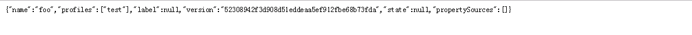

# 第六篇: 分布式配置中心(Greenwich版本)

> 原创 最新推荐文章于 2022-04-04 17:31:22 发布 · 公开 · 472 阅读 · 0 · 0 · 本内容遵循CC 4.0 BY-SA版权协议 版权声明：本文为博主原创文章，遵循 CC 4.0 BY-SA 版权协议，转载请附上原文出处链接和本声明。 · 编辑
> 文章链接：https://blog.csdn.net/tanhongwei1994/article/details/84028298

一、新建个项目，并创建个父工程。

pom.xml内容如下：

```java
<?xml version="1.0" encoding="UTF-8"?>
<project xmlns="http://maven.apache.org/POM/4.0.0" xmlns:xsi="http://www.w3.org/2001/XMLSchema-instance"
         xsi:schemaLocation="http://maven.apache.org/POM/4.0.0 http://maven.apache.org/xsd/maven-4.0.0.xsd">
    <modelVersion>4.0.0</modelVersion>

    <groupId>com.example</groupId>
    <artifactId>cloud-config</artifactId>
    <version>0.0.1-SNAPSHOT</version>
    <packaging>jar</packaging>

    <name>cloud-config</name>
    <description>cloud-config project for Spring Boot</description>

    <parent>
        <groupId>org.springframework.boot</groupId>
        <artifactId>spring-boot-starter-parent</artifactId>
        <version>2.1.0.RELEASE</version>
        <relativePath/> <!-- lookup parent from repository -->
    </parent>


    <modules>
        <module>config-server</module>
        <module>config-client</module>
    </modules>

    <properties>
        <project.build.sourceEncoding>UTF-8</project.build.sourceEncoding>
        <project.reporting.outputEncoding>UTF-8</project.reporting.outputEncoding>
        <java.version>1.8</java.version>
    </properties>

    <dependencies>
        <dependency>
            <groupId>org.springframework.boot</groupId>
            <artifactId>spring-boot-starter-web</artifactId>
        </dependency>

        <dependency>
            <groupId>org.springframework.boot</groupId>
            <artifactId>spring-boot-starter-test</artifactId>
            <scope>test</scope>
        </dependency>
    </dependencies>

    <build>
        <plugins>
            <plugin>
                <groupId>org.springframework.boot</groupId>
                <artifactId>spring-boot-maven-plugin</artifactId>
            </plugin>
        </plugins>
    </build>


</project>
```

二、创建个config-server子工程并继承父工程

2.1、pom.xml的配置如下：

```java
<?xml version="1.0" encoding="UTF-8"?>
<project xmlns="http://maven.apache.org/POM/4.0.0" xmlns:xsi="http://www.w3.org/2001/XMLSchema-instance"
         xsi:schemaLocation="http://maven.apache.org/POM/4.0.0 http://maven.apache.org/xsd/maven-4.0.0.xsd">
    <modelVersion>4.0.0</modelVersion>

    <artifactId>config-server</artifactId>
    <version>0.0.1-SNAPSHOT</version>
    <packaging>jar</packaging>

    <name>config-server</name>
    <description>config-server project for Spring Boot</description>

    <parent>
        <groupId>com.example</groupId>
        <artifactId>cloud-config</artifactId>
        <version>0.0.1-SNAPSHOT</version>
    </parent>

    <properties>
        <project.build.sourceEncoding>UTF-8</project.build.sourceEncoding>
        <project.reporting.outputEncoding>UTF-8</project.reporting.outputEncoding>
        <java.version>1.8</java.version>
        <spring-cloud.version>Greenwich.M1</spring-cloud.version>
    </properties>

    <dependencies>
        <dependency>
            <groupId>org.springframework.cloud</groupId>
            <artifactId>spring-cloud-config-server</artifactId>
        </dependency>
    </dependencies>

    <dependencyManagement>
        <dependencies>
            <dependency>
                <groupId>org.springframework.cloud</groupId>
                <artifactId>spring-cloud-dependencies</artifactId>
                <version>${spring-cloud.version}</version>
                <type>pom</type>
                <scope>import</scope>
            </dependency>
        </dependencies>
    </dependencyManagement>

    <build>
        <plugins>
            <plugin>
                <groupId>org.springframework.boot</groupId>
                <artifactId>spring-boot-maven-plugin</artifactId>
            </plugin>
        </plugins>
    </build>

    <repositories>
        <repository>
            <id>spring-milestones</id>
            <name>Spring Milestones</name>
            <url>https://repo.spring.io/milestone</url>
            <snapshots>
                <enabled>false</enabled>
            </snapshots>
        </repository>
    </repositories>


</project>
```

2.2、application.properties文件配置如下：

```java
server.port=8007
spring.application.name=config-server
#github地址
spring.cloud.config.server.git.uri=https://github.com/xiaobu1994/SpringCloudConfig/
#分支
spring.cloud.config.label=master
#仓库路径
spring.cloud.config.server.git.search-paths=respo
#账户名和密码
spring.cloud.config.server.git.username=
spring.cloud.config.server.git.password=
```

2.3、ConfigServerApplication 文件配置如下：


```java
package com.example;

import org.springframework.boot.SpringApplication;
import org.springframework.boot.autoconfigure.SpringBootApplication;
import org.springframework.cloud.config.server.EnableConfigServer;


/**
 * @author xiaobu EnableConfigServer开启配置服务器的功能
 */
@EnableConfigServer
@SpringBootApplication
public class ConfigServerApplication {

    public static void main(String[] args) {
        SpringApplication.run(ConfigServerApplication.class, args);
    }
}
```

2.4、访问 [http://localhost:8007/foo/test](http://localhost:8007/foo/test) 出现如下效果

 

三、创建另外个子工程config-client

3.1、 pom.xml配置如下：

```java
<?xml version="1.0" encoding="UTF-8"?>
<project xmlns="http://maven.apache.org/POM/4.0.0" xmlns:xsi="http://www.w3.org/2001/XMLSchema-instance"
         xsi:schemaLocation="http://maven.apache.org/POM/4.0.0 http://maven.apache.org/xsd/maven-4.0.0.xsd">
    <modelVersion>4.0.0</modelVersion>

    <artifactId>config-client</artifactId>
    <version>0.0.1-SNAPSHOT</version>
    <packaging>jar</packaging>

    <name>config-client</name>
    <description>config-client project for Spring Boot</description>

    <parent>
        <groupId>com.example</groupId>
        <artifactId>cloud-config</artifactId>
        <version>0.0.1-SNAPSHOT</version>
    </parent>

    <properties>
        <project.build.sourceEncoding>UTF-8</project.build.sourceEncoding>
        <project.reporting.outputEncoding>UTF-8</project.reporting.outputEncoding>
        <java.version>1.8</java.version>
        <spring-cloud.version>Greenwich.M1</spring-cloud.version>
    </properties>

    <dependencies>
        <dependency>
            <groupId>org.springframework.cloud</groupId>
            <artifactId>spring-cloud-starter-config</artifactId>
        </dependency>

    </dependencies>

    <dependencyManagement>
        <dependencies>
            <dependency>
                <groupId>org.springframework.cloud</groupId>
                <artifactId>spring-cloud-dependencies</artifactId>
                <version>${spring-cloud.version}</version>
                <type>pom</type>
                <scope>import</scope>
            </dependency>
        </dependencies>
    </dependencyManagement>

    <build>
        <plugins>
            <plugin>
                <groupId>org.springframework.boot</groupId>
                <artifactId>spring-boot-maven-plugin</artifactId>
            </plugin>
        </plugins>
    </build>

    <repositories>
        <repository>
            <id>spring-milestones</id>
            <name>Spring Milestones</name>
            <url>https://repo.spring.io/milestone</url>
            <snapshots>
                <enabled>false</enabled>
            </snapshots>
        </repository>
    </repositories>


</project>
```

3.2、bootstrap.properties配置如下（必须是以bootstrap命名，它比application.properties要先加载）：

```java
server.port=8008
#bootstrap和application 先加载bootstrap 再加载application。 切忌在这个地方要用bootstrap
#最终访问的文件为${git.uri}/${spring.application.name}-${spring.cloud.config.profile}.properties
#即https://github.com/xiaobu1994/SpringCloudConfig/config-client-test.properties
spring.application.name=config-client
#配置环境
spring.cloud.config.profile=test
#分支
spring.cloud.config.label=master
#配置服务中心网址
spring.cloud.config.uri=http://localhost:8007/
```

3.3、ConfigClientApplication文件定义如下：

```java
package com.example;

import org.springframework.beans.factory.annotation.Value;
import org.springframework.boot.SpringApplication;
import org.springframework.boot.autoconfigure.SpringBootApplication;
import org.springframework.web.bind.annotation.RequestMapping;
import org.springframework.web.bind.annotation.RestController;


@RestController
@SpringBootApplication
public class ConfigClientApplication {

    public static void main(String[] args) {
        SpringApplication.run(ConfigClientApplication.class, args);
    }


@Value("${name}")
String name;
@RequestMapping("/getResult")
public String getResult(){
    return name;
}


}
```

[https://github.com/xiaobu1994/SpringCloudConfig/blob/master/respo/config-client-test.properties](https://github.com/xiaobu1994/SpringCloudConfig/blob/master/respo/config-client-test.properties) 该文件的内容为：

```java
name = xiaobu version1.0
```

3.4、访问 [http://localhost:8008/getResult](http://localhost:8008/getResult) 出现如下结果：

 

