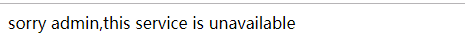

# 第四篇: 熔断器（Ribbon+Feign）(Greenwich版本)

> 原创 最新推荐文章于 2023-03-08 21:39:29 发布 · 公开 · 797 阅读 · 1 · 2 · 本内容遵循CC 4.0 BY-SA版权协议 版权声明：本文为博主原创文章，遵循 CC 4.0 BY-SA 版权协议，转载请附上原文出处链接和本声明。 · 编辑
> 文章链接：https://blog.csdn.net/tanhongwei1994/article/details/83820894

一、增加Ribbon的熔断功能

1.1、改造service-ribbon的pom.xml 增加hystrix依赖后<dependencies>节点如下所示：

```java
<dependencies>
        <!-- ribbon-->
        <dependency>
            <groupId>org.springframework.cloud</groupId>
            <artifactId>spring-cloud-starter-netflix-ribbon</artifactId>
        </dependency>

        <!-- eureka discovery -->
        <dependency>
            <groupId>org.springframework.cloud</groupId>
            <artifactId>spring-cloud-starter-netflix-eureka-client</artifactId>
        </dependency>

        <!-- 熔断器-->
        <dependency>
            <groupId>org.springframework.cloud</groupId>
            <artifactId>spring-cloud-starter-netflix-hystrix</artifactId>
        </dependency>
    </dependencies>
```

1.2 在启动类ServiceRibbonApplication增加@EnableHystrix注解开启Hystrix

```java
package com.example;

import org.springframework.boot.SpringApplication;
import org.springframework.boot.autoconfigure.SpringBootApplication;
import org.springframework.cloud.client.discovery.EnableDiscoveryClient;
import org.springframework.cloud.client.loadbalancer.LoadBalanced;
import org.springframework.cloud.netflix.eureka.EnableEurekaClient;
import org.springframework.cloud.netflix.hystrix.EnableHystrix;
import org.springframework.context.annotation.Bean;
import org.springframework.web.client.RestTemplate;

/**
 * 通过@EnableDiscoveryClient向服务中心注册；并且向程序的ioc注入一个bean
 * @author xiaobu
 */
@EnableEurekaClient
@EnableDiscoveryClient
@SpringBootApplication
@EnableHystrix
public class ServiceRibbonApplication {

    public static void main(String[] args) {
        SpringApplication.run(ServiceRibbonApplication.class, args);
    }


    /***
     * @author xiaobu
     * @date 2018/11/6 11:32
     * @return org.springframework.web.client.RestTemplate
     * @descprition restTemplate;并通过@LoadBalanced注解表明这个restRemplate开启负载均衡的功能。
     * @version 1.0
     */
    @Bean
    @LoadBalanced
    RestTemplate restTemplate(){
        return new RestTemplate();
    }

}
```

1.3在ClientService上方法上增加@HystrixCommand注解表明该方法支持熔断功能

```java
package com.example.service;

import com.netflix.hystrix.contrib.javanica.annotation.HystrixCommand;
import org.springframework.beans.factory.annotation.Autowired;
import org.springframework.stereotype.Service;
import org.springframework.web.client.RestTemplate;

/**
 * @author xiaobu
 * @version JDK1.8.0_171
 * @date on  2018/11/6 11:34
 * @descrption
 */
@Service
public class ClientService {
    @Autowired
    RestTemplate restTemplate;

    /***
     * @author xiaobu
     * @date 2018/11/6 11:42
     * @param name 名字  @HystrixCommand 这个表明加上了熔断器的功能
     * @return java.lang.String
     * @descprition  直接用的程序名替代了具体的url地址，
     * 在ribbon中它会根据服务名来选择具体的服务实例，
     * 根据服务实例在请求的时候会用具体的url替换掉服务名
     * @version 1.0
     */
    @HystrixCommand(fallbackMethod ="error" )
    public String clientService(String name){
        return restTemplate.getForObject("http://eureka-client/test?name=" + name, String.class);
    }

    /**
     * @author xiaobu
     * @date 2018/11/7 11:27
     * @param name 名字
     * @return java.lang.String
     * @descprition  error要与  @HystrixCommand(fallbackMethod ="error" )的方法名要相对应
     * @version 1.0
     */
    public String error(String name){
        return "hi "+name+",this service is  unavailable";
    }

}
```

1.4 启动两个client实例。端口分别为8002和8003 关闭端口为8003的服务。访问 [http://localhost:8004/test?name=admin](http://localhost:8004/test?name=admin) 

8003服务则不可用则效果如下：

 

 

二、增加Feign的熔断功能。

2.1 feign的熔断功能默认是关闭的，所以在配置文件中打开。

```java
eureka.client.service-url.defaultZone=http://localhost:8001/eureka/
spring.application.name=service-feign
server.port=8005
#打开feign的熔断功能
feign.hystrix.enabled=true
```

2.2 改造FeignService

```java
package com.example.service;

import org.springframework.cloud.openfeign.FeignClient;
import org.springframework.web.bind.annotation.GetMapping;
import org.springframework.web.bind.annotation.RequestParam;

/**
 * @author xiaobu
 * @version JDK1.8.0_171
 * @date on  2018/11/6 14:24
 * @description V1.0 定义个feign接口 @FeignClient("服务名") 来确定调哪个服务
 */
@FeignClient(value = "eureka-client",fallback = FeignHystrixServiceImpl.class)
public interface FeignService {
    /**
     * @author xiaobu
     * @date 2018/11/6 14:34
     * @param name 名字
     * @return java.lang.String
     * @descprition value为test则是调用 eureka-client的test的方法
     * RequestMapping(value="/test",method = RequestMethod.GET)与GetMapping(value="/test")等价
     * RequestParam.value() was empty on parameter 0 第一个参数不能为空
     * @version 1.0
     */

    //@RequestMapping(value="/test",method = RequestMethod.GET)
    @GetMapping(value="/test")
    String testFromClient(@RequestParam(value = "name") String name);
}
```

2.3增加实现类：

```
package com.example.service;

import org.springframework.stereotype.Component;

/**
 * @author xiaobu
 * @version JDK1.8.0_171
 * @date on  2018/11/7 11:34
 * @description V1.0
 */
@Component
public class FeignHystrixServiceImpl implements FeignService {
    @Override
    public String testFromClient(String name) {
        return "sorry "+name+",this service is unavailable";
    }
}
```

2.4、访问 [http://localhost:8005/test?name=admin](http://localhost:8005/test?name=admin) 出现如下效果。

 

 

OK。