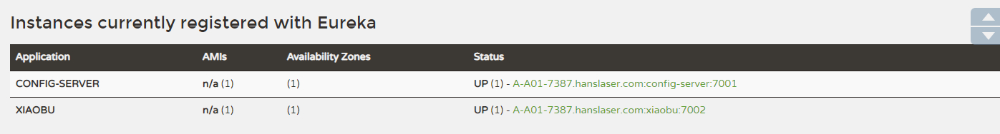

# 第七篇： 分布式配置中心(Greenwich版)

> 原创 最新推荐文章于 2025-10-26 12:19:31 发布 · 公开 · 186 阅读 · 0 · 0 · 本内容遵循CC 4.0 BY-SA版权协议 版权声明：本文为博主原创文章，遵循 CC 4.0 BY-SA 版权协议，转载请附上原文出处链接和本声明。 · 编辑
> 文章链接：https://blog.csdn.net/tanhongwei1994/article/details/112540932

### 改造eureka-server

```xml

<?xml version="1.0" encoding="UTF-8"?>
<project xmlns="http://maven.apache.org/POM/4.0.0" xmlns:xsi="http://www.w3.org/2001/XMLSchema-instance"
         xsi:schemaLocation="http://maven.apache.org/POM/4.0.0 https://maven.apache.org/xsd/maven-4.0.0.xsd">
    <modelVersion>4.0.0</modelVersion>

    <artifactId>eureka-server</artifactId>
    <version>0.0.1-SNAPSHOT</version>
    <name>eureka-server</name>
    <description>eureka-server project for Spring Boot</description>

    <parent>
        <groupId>com.xiaobu</groupId>
        <artifactId>springcloud-demo</artifactId>
        <version>0.0.1-SNAPSHOT</version>
    </parent>

    <dependencies>
        <dependency>
            <groupId>org.springframework.cloud</groupId>
            <artifactId>spring-cloud-starter-netflix-eureka-server</artifactId>
        </dependency>
        <dependency>
            <groupId>org.springframework.cloud</groupId>
            <artifactId>spring-cloud-starter-netflix-eureka-client</artifactId>
        </dependency>
        <dependency>
            <groupId>org.springframework.cloud</groupId>
            <artifactId>spring-cloud-config-server</artifactId>
        </dependency>

    </dependencies>

    <dependencyManagement>
        <dependencies>
            <dependency>
                <groupId>org.springframework.cloud</groupId>
                <artifactId>spring-cloud-dependencies</artifactId>
                <version>${spring-cloud.version}</version>
                <type>pom</type>
                <scope>import</scope>
            </dependency>
        </dependencies>
    </dependencyManagement>

    <build>
        <plugins>
            <plugin>
                <groupId>org.springframework.boot</groupId>
                <artifactId>spring-boot-maven-plugin</artifactId>
            </plugin>
        </plugins>
    </build>


</project>

```

### 改造config-server

```xml

<?xml version="1.0" encoding="UTF-8"?>
<project xmlns="http://maven.apache.org/POM/4.0.0" xmlns:xsi="http://www.w3.org/2001/XMLSchema-instance"
         xsi:schemaLocation="http://maven.apache.org/POM/4.0.0 https://maven.apache.org/xsd/maven-4.0.0.xsd">
    <modelVersion>4.0.0</modelVersion>
    <parent>
        <groupId>com.xiaobu</groupId>
        <artifactId>springcloud-demo</artifactId>
        <version>0.0.1-SNAPSHOT</version>
    </parent>


    <artifactId>config-server</artifactId>
    <version>0.0.1-SNAPSHOT</version>
    <name>config-server</name>
    <description>config-server project for Spring Boot</description>


    <properties>
        <project.build.sourceEncoding>UTF-8</project.build.sourceEncoding>
        <project.reporting.outputEncoding>UTF-8</project.reporting.outputEncoding>
        <java.version>1.8</java.version>
    </properties>


    <!-- 使用dependencyManagement进行版本管理 -->
    <dependencyManagement>
        <dependencies>
            <dependency>
                <groupId>org.springframework.cloud</groupId>
                <artifactId>spring-cloud-dependencies</artifactId>
                <version>${spring-cloud.version}</version>
                <type>pom</type>
                <scope>import</scope>
            </dependency>
        </dependencies>
    </dependencyManagement>

    <dependencies>

        <dependency>
            <groupId>org.springframework.boot</groupId>
            <artifactId>spring-boot-starter</artifactId>
        </dependency>
        <!-- 引入config server依赖 -->
        <dependency>
            <groupId>org.springframework.cloud</groupId>
            <artifactId>spring-cloud-config-server</artifactId>
        </dependency>
        <dependency>
            <groupId>org.springframework.cloud</groupId>
            <artifactId>spring-cloud-starter-netflix-eureka-client</artifactId>
        </dependency>

    </dependencies>

    <build>
        <plugins>
            <plugin>
                <groupId>org.springframework.boot</groupId>
                <artifactId>spring-boot-maven-plugin</artifactId>
            </plugin>
            <!-- 指定jdk，防止update project -->
            <plugin>
                <groupId>org.apache.maven.plugins</groupId>
                <artifactId>maven-compiler-plugin</artifactId>
                <configuration>
                    <source>1.8</source>
                    <target>1.8</target>
                    <!-- 项目编码-->
                    <encoding>UTF-8</encoding>
                </configuration>
            </plugin>
        </plugins>
    </build>

</project>

```

```properties
server.port=7001
spring.application.name=config-server

#配置Git仓库的地址
spring.cloud.config.server.git.uri=https://gitee.com/xiaobu1994/spring-cloud-learning
#配置仓库路径下的相对搜索位置，可以配置多个
spring.cloud.config.server.git.search-paths=spring-cloud-config-file
#这里配置你的Git仓库的用户名
spring.cloud.config.server.git.username=username
#这里配置你的Git仓库的密码
spring.cloud.config.server.git.password=password

eureka.client.serviceUrl.defaultZone=http://localhost:8001/eureka/


```

### 改造config-client

```xml
<?xml version="1.0" encoding="UTF-8"?>
<project xmlns="http://maven.apache.org/POM/4.0.0" xmlns:xsi="http://www.w3.org/2001/XMLSchema-instance"
         xsi:schemaLocation="http://maven.apache.org/POM/4.0.0 https://maven.apache.org/xsd/maven-4.0.0.xsd">
    <modelVersion>4.0.0</modelVersion>
    <parent>
        <groupId>com.xiaobu</groupId>
        <artifactId>springcloud-demo</artifactId>
        <version>0.0.1-SNAPSHOT</version>
    </parent>


    <artifactId>config-client</artifactId>
    <version>0.0.1-SNAPSHOT</version>
    <name>config-client</name>
    <description>config-client project for Spring Boot</description>

    <properties>
        <java.version>1.8</java.version>
    </properties>


    <!-- 使用dependencyManagement进行版本管理 -->
    <dependencyManagement>
        <dependencies>
            <dependency>
                <groupId>org.springframework.cloud</groupId>
                <artifactId>spring-cloud-dependencies</artifactId>
                <version>${spring-cloud.version}</version>
                <type>pom</type>
                <scope>import</scope>
            </dependency>
        </dependencies>
    </dependencyManagement>

    <dependencies>
        <dependency>
            <groupId>org.springframework.boot</groupId>
            <artifactId>spring-boot-starter</artifactId>
        </dependency>

        <!-- 引入config依赖 -->
        <dependency>
            <groupId>org.springframework.cloud</groupId>
            <artifactId>spring-cloud-starter-config</artifactId>
        </dependency>


        <dependency>
            <groupId>org.springframework.cloud</groupId>
            <artifactId>spring-cloud-starter-netflix-eureka-client</artifactId>
        </dependency>
    </dependencies>

    <build>
        <plugins>
            <plugin>
                <groupId>org.springframework.boot</groupId>
                <artifactId>spring-boot-maven-plugin</artifactId>
            </plugin>
        </plugins>
    </build>


</project>

```

bootstrap.properties

```properties

# 从config-server获取配置信息

#server.port=7002
#{application}
#spring.application.name=xiaobu
#{profile}
#spring.cloud.config.profile=dev
#{label}
#spring.cloud.config.label=master

# spring.cloud.config.uri=http://localhost:7001/

# 从eureka-server获取配置信息


#{application}
spring.application.name=xiaobu
#{profile}
spring.cloud.config.profile=dev
#{label}
spring.cloud.config.label=master
spring.cloud.config.uri= http://localhost:7001/

eureka.client.serviceUrl.defaultZone=http://localhost:8001/eureka/
spring.cloud.config.discovery.enabled=true
spring.cloud.config.discovery.serviceId=config-server
server.port=7002
```

一次启动eureka-server、config-server、config-client

访问 http://localhost:8001/  如下：

 

访问 http://localhost:7002/from

> git-dev-1.0

