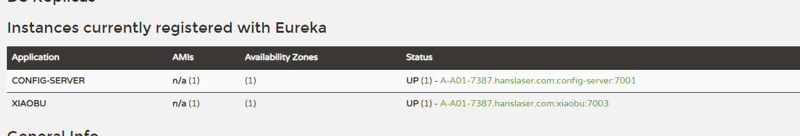

# 第八篇： Spring Cloud Bus（Hoxton版本）

> 原创 最新推荐文章于 2025-01-13 22:45:35 发布 · 公开 · 241 阅读 · 0 · 0 · 本内容遵循CC 4.0 BY-SA版权协议 版权声明：本文为博主原创文章，遵循 CC 4.0 BY-SA 版权协议，转载请附上原文出处链接和本声明。 · 编辑
> 文章链接：https://blog.csdn.net/tanhongwei1994/article/details/112619945

pom.xml

```xml
<?xml version="1.0" encoding="UTF-8"?>
<project xmlns="http://maven.apache.org/POM/4.0.0" xmlns:xsi="http://www.w3.org/2001/XMLSchema-instance"
         xsi:schemaLocation="http://maven.apache.org/POM/4.0.0 https://maven.apache.org/xsd/maven-4.0.0.xsd">
    <modelVersion>4.0.0</modelVersion>
    <parent>
        <groupId>com.xiaobu</groupId>
        <artifactId>springcloud-demo</artifactId>
        <version>0.0.1-SNAPSHOT</version>
    </parent>

    <groupId>com.xiaonbu</groupId>
    <artifactId>config-bus</artifactId>
    <version>0.0.1-SNAPSHOT</version>
    <name>config-bus</name>
    <description>config-bus project for Spring Boot</description>

    <properties>
        <java.version>1.8</java.version>
    </properties>

    <dependencies>
        <dependency>
            <groupId>org.springframework.cloud</groupId>
            <artifactId>spring-cloud-starter-config</artifactId>
        </dependency>

        <dependency>
            <groupId>org.springframework.boot</groupId>
            <artifactId>spring-boot-starter</artifactId>
        </dependency>

        <dependency>
            <groupId>org.springframework.cloud</groupId>
            <artifactId>spring-cloud-starter-netflix-eureka-client</artifactId>
        </dependency>

        <dependency>
            <groupId>org.springframework.cloud</groupId>
            <artifactId>spring-cloud-starter-bus-amqp</artifactId>
        </dependency>

        <dependency>
            <groupId>org.springframework.boot</groupId>
            <artifactId>spring-boot-starter-actuator</artifactId>
        </dependency>
    </dependencies>

    <!-- 使用dependencyManagement进行版本管理 -->
    <dependencyManagement>
        <dependencies>
            <dependency>
                <groupId>org.springframework.cloud</groupId>
                <artifactId>spring-cloud-dependencies</artifactId>
                <version>${spring-cloud.version}</version>
                <type>pom</type>
                <scope>import</scope>
            </dependency>
        </dependencies>
    </dependencyManagement>

    <build>
        <plugins>
            <plugin>
                <groupId>org.springframework.boot</groupId>
                <artifactId>spring-boot-maven-plugin</artifactId>
            </plugin>
        </plugins>
    </build>

</project>

```

bootstrap.properties

```properties
# 从config-server获取配置信息
#server.port=7002
#{application}
#spring.application.name=xiaobu
#{profile}
#spring.cloud.config.profile=dev
#{label}
#spring.cloud.config.label=master
# spring.cloud.config.uri=http://localhost:7001/
# 从eureka-server获取配置信息
#{application}
spring.application.name=xiaobu
#{profile}
spring.cloud.config.profile=dev
#{label}
spring.cloud.config.label=master
spring.cloud.config.uri=http://localhost:7001/
eureka.client.serviceUrl.defaultZone=http://localhost:8001/eureka/
spring.cloud.config.discovery.enabled=true
spring.cloud.config.discovery.serviceId=config-server
server.port=7003
```

ConfigBusApplication

```java
package com.xiaonbu;

import lombok.extern.slf4j.Slf4j;
import org.springframework.beans.factory.annotation.Value;
import org.springframework.boot.CommandLineRunner;
import org.springframework.boot.SpringApplication;
import org.springframework.boot.autoconfigure.SpringBootApplication;
import org.springframework.cloud.client.discovery.EnableDiscoveryClient;
import org.springframework.cloud.context.config.annotation.RefreshScope;
import org.springframework.cloud.netflix.eureka.EnableEurekaClient;
import org.springframework.web.bind.annotation.GetMapping;
import org.springframework.web.bind.annotation.RestController;

@SpringBootApplication
@EnableEurekaClient
@EnableDiscoveryClient
@RestController
@RefreshScope
@Slf4j
public class ConfigBusApplication implements CommandLineRunner {

    public static void main(String[] args) {
        SpringApplication.run(ConfigBusApplication.class, args);
    }


    @Value("${server.port}")
    private String port;


    @Override
    public void run(String... args) throws Exception {
        log.info("config-client 在端口{}启动成功", port);
    }


    @Value("${from}")
    String from;

    @GetMapping("/from")
    public String from() {
        return from;
    }
}

```

依次启动 eureka-server config-server config-bus

访问http://localhost:8001/

 

访问 http://localhost:7003/from

> git-dev-1.0 QAQ

修改代码仓库的文件内容 from=git-dev-1.0 hasagei!

先post一下 http://localhost:7003/actuator/bus-refresh

然后先前是G版本的 无论怎么post都不行，后面查资料才知道Greenwich.M1版本的bus总线/actuactor/bus-refresh时发生问题。

所以改成了H版本 一下就成功了。

```xml
    <parent>
        <groupId>org.springframework.boot</groupId>
        <artifactId>spring-boot-starter-parent</artifactId>
        <version>2.2.0.RELEASE</version>
        <relativePath/> <!-- lookup parent from repository -->
    </parent>
    <properties>
        <project.build.sourceEncoding>UTF-8</project.build.sourceEncoding>
        <project.reporting.outputEncoding>UTF-8</project.reporting.outputEncoding>
        <java.version>1.8</java.version>
        <spring-cloud.version>Hoxton.RELEASE</spring-cloud.version>
    </properties>
```

再访问 http://localhost:7003/from 出现

> git-dev-1.0 hasagei!

[spring cloud config+bus配置中心，出现Dispatcher has no subscribers错误](https://segmentfault.com/q/1010000016994575) 