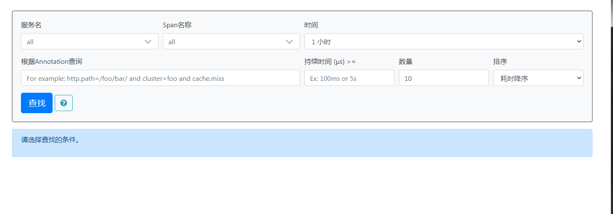
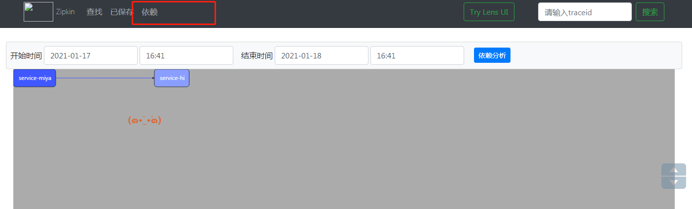
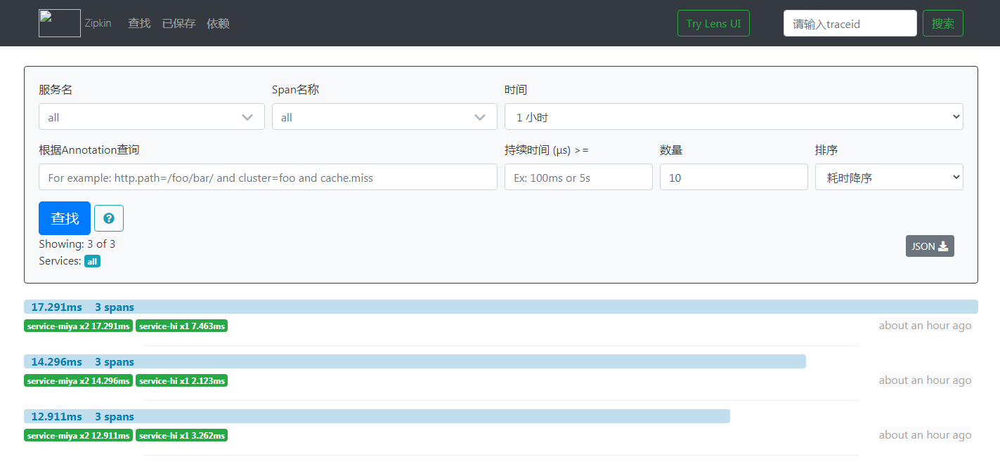

# 第九篇： Spring Cloud Sleuth（Hoxton版本）

> 原创 最新推荐文章于 2022-12-17 17:59:56 发布 · 公开 · 408 阅读 · 0 · 0 · 本内容遵循CC 4.0 BY-SA版权协议 版权声明：本文为博主原创文章，遵循 CC 4.0 BY-SA 版权协议，转载请附上原文出处链接和本声明。 · 编辑
> 文章链接：https://blog.csdn.net/tanhongwei1994/article/details/112788611

一、 构建Zipkin Server,官方推荐下载jar即可:

https://dl.bintray.com/openzipkin/maven/io/zipkin/java/zipkin-server/

> java -jar zipkin-server-2.12.9-exec.jar

默认端口是9411  启动完成后访问:http://localhost:9411/

 

二、创建service-hi

```xml
<?xml version="1.0" encoding="UTF-8"?>
<project xmlns="http://maven.apache.org/POM/4.0.0" xmlns:xsi="http://www.w3.org/2001/XMLSchema-instance"
        xsi:schemaLocation="http://maven.apache.org/POM/4.0.0 https://maven.apache.org/xsd/maven-4.0.0.xsd">
   <modelVersion>4.0.0</modelVersion>
   <parent>
       <groupId>com.xiaobu</groupId>
       <artifactId>springcloud-demo</artifactId>
       <version>0.0.1-SNAPSHOT</version>
   </parent>


   <artifactId>service-hi</artifactId>
   <version>0.0.1-SNAPSHOT</version>
   <name>service-hi</name>
   <description>service-hi project for Spring Boot</description>

   <properties>
       <java.version>1.8</java.version>
   </properties>

   <dependencies>
       <dependency>
           <groupId>org.springframework.boot</groupId>
           <artifactId>spring-boot-starter</artifactId>
       </dependency>
       <dependency>
           <groupId>org.springframework.cloud</groupId>
           <artifactId>spring-cloud-starter-zipkin</artifactId>
       </dependency>
   </dependencies>


   <dependencyManagement>
       <dependencies>
           <dependency>
               <groupId>org.springframework.cloud</groupId>
               <artifactId>spring-cloud-dependencies</artifactId>
               <version>${spring-cloud.version}</version>
               <type>pom</type>
               <scope>import</scope>
           </dependency>
       </dependencies>
   </dependencyManagement>

   <build>
       <plugins>
           <plugin>
               <groupId>org.springframework.boot</groupId>
               <artifactId>spring-boot-maven-plugin</artifactId>
           </plugin>
       </plugins>
   </build>

</project>

```

application.properties

```properties
server.port=8988
spring.zipkin.base-url=http://localhost:9411
spring.application.name=service-hi

```

通过引入spring-cloud-starter-zipkin依赖和设置spring.zipkin.base-url就可以了。

接口暴露:

```java
package com.xiaobu;

import brave.sampler.Sampler;
import lombok.extern.slf4j.Slf4j;
import org.springframework.beans.factory.annotation.Autowired;
import org.springframework.beans.factory.annotation.Value;
import org.springframework.boot.CommandLineRunner;
import org.springframework.boot.SpringApplication;
import org.springframework.boot.autoconfigure.SpringBootApplication;
import org.springframework.context.annotation.Bean;
import org.springframework.web.bind.annotation.GetMapping;
import org.springframework.web.bind.annotation.RequestMapping;
import org.springframework.web.bind.annotation.RestController;
import org.springframework.web.client.RestTemplate;

/**
 * @author xiaobu
 */
@SpringBootApplication
@RestController
@Slf4j
public class ServiceHiApplication implements CommandLineRunner {

    public static void main(String[] args) {
        SpringApplication.run(ServiceHiApplication.class, args);
    }

    @Value("${server.port}")
    private String port;
    @Override
    public void run(String... args) throws Exception {
        System.out.println("service-hi在端口： " +port+"启动完成....." );
    }


    @Autowired
    private RestTemplate restTemplate;

    @Bean
    public RestTemplate getRestTemplate(){
        return new RestTemplate();
    }

    @GetMapping("/hi")
    public String callHome(){
        log.info("calling trace service-hi  ");
        return restTemplate.getForObject("http://localhost:8989/miya", String.class);
    }
    @GetMapping("/info")
    public String info(){
        log.info("calling trace service-hi ");
        return "i'm service-hi";
    }

    @Bean
    public Sampler defaultSampler() {
        return Sampler.ALWAYS_SAMPLE;
    }


}

```

三、 创建service-miya

相同的依赖,修改下server port端口以及服务名即可

接口暴露:

```java
package com.xiaobu;

import brave.sampler.Sampler;
import lombok.extern.slf4j.Slf4j;
import org.springframework.beans.factory.annotation.Autowired;
import org.springframework.beans.factory.annotation.Value;
import org.springframework.boot.CommandLineRunner;
import org.springframework.boot.SpringApplication;
import org.springframework.boot.autoconfigure.SpringBootApplication;
import org.springframework.context.annotation.Bean;
import org.springframework.web.bind.annotation.GetMapping;
import org.springframework.web.bind.annotation.RequestMapping;
import org.springframework.web.bind.annotation.RestController;
import org.springframework.web.client.RestTemplate;

@SpringBootApplication
@Slf4j
@RestController
public class ServiceMiyaApplication implements CommandLineRunner {

    public static void main(String[] args) {
        SpringApplication.run(ServiceMiyaApplication.class, args);
    }

    @Value("${server.port}")
    private String port;

    @Override
    public void run(String... args) throws Exception {
        log.info("service-miya在端口:{} 启动完成....." ,port);

    }

    @RequestMapping("/hi")
    public String home(){
        log.info( "hi is being called");
        return "hi i'm miya!";
    }

    @GetMapping("/miya")
    public String info(){
        log.info("info is being called");
        return restTemplate.getForObject("http://localhost:8988/info",String.class);
    }

    @Autowired
    private RestTemplate restTemplate;

    @Bean
    public RestTemplate getRestTemplate(){
        return new RestTemplate();
    }


    @Bean
    public Sampler defaultSampler() {
        return Sampler.ALWAYS_SAMPLE;
    }
}

```

访问http://localhost:8989/miya 出现:

> i’m service-hi

点击依赖:

 

点击查找,查看具体服务相互调用的数据

 

