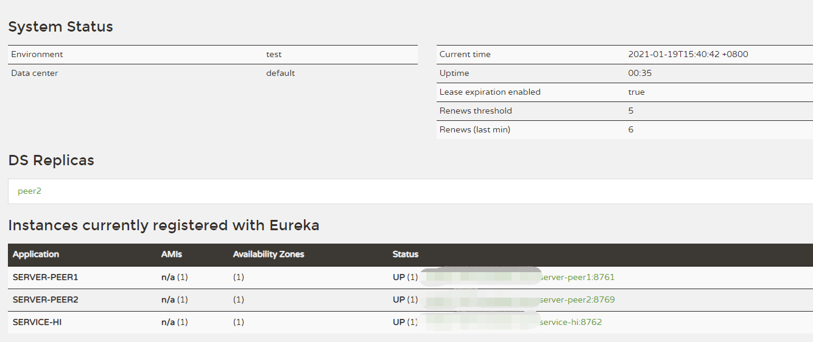
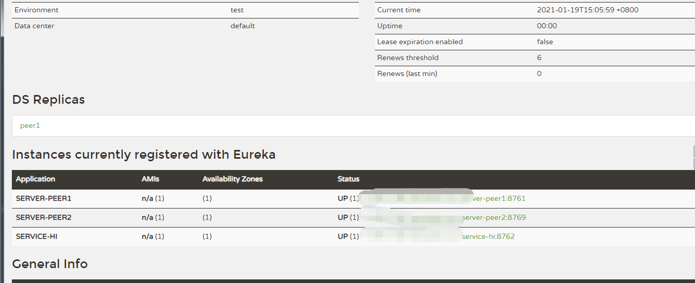

# 第九篇：高可用的服务注册中心

> 原创 最新推荐文章于 2025-06-19 13:12:13 发布 · 公开 · 218 阅读 · 0 · 0 · 本内容遵循CC 4.0 BY-SA版权协议 版权声明：本文为博主原创文章，遵循 CC 4.0 BY-SA 版权协议，转载请附上原文出处链接和本声明。 · 编辑
> 文章链接：https://blog.csdn.net/tanhongwei1994/article/details/112842735

新建high-availability-eureka-server

application.properties

```properties
spring.profiles.active=peer1
#spring.profiles.active=peer2
```

在resources下面添加两个 properties

application-peer1.properties:

```properties

server.port=8761
# 如果设置eureka.instance.prefer-ip-address为false时，那么注册到Eureka中的Ip地址就是本机的Ip地址； 如果设置了true并且也设置了eureka.instance.ip-address=ipValue那么就将此ipValue注册到Eureka中
eureka.instance.prefer-ip-address=true
eureka.instance.ip-address=127.0.0.1
#spring.profiles=peer1
eureka.instance.hostname=peer1
eureka.client.serviceUrl.defaultZone=http://peer2:8769/eureka/
spring.application.name=server-peer1


```

application-peer2.properties:

```properties
server.port=8769
# 如果设置eureka.instance.prefer-ip-address为false时，那么注册到Eureka中的Ip地址就是本机的Ip地址； 如果设置了true并且也设置了eureka.instance.ip-address=ipValue那么就将此ipValue注册到Eureka中
eureka.instance.prefer-ip-address=true
eureka.instance.ip-address=127.0.0.1
#spring.profiles=peer2
eureka.instance.hostname=peer2
eureka.client.serviceUrl.defaultZone=http://peer1:8761/eureka/
spring.application.name=server-peer2


```

```xml
<?xml version="1.0" encoding="UTF-8"?>
<project xmlns="http://maven.apache.org/POM/4.0.0" xmlns:xsi="http://www.w3.org/2001/XMLSchema-instance"
         xsi:schemaLocation="http://maven.apache.org/POM/4.0.0 https://maven.apache.org/xsd/maven-4.0.0.xsd">
    <modelVersion>4.0.0</modelVersion>
    <parent>
        <groupId>com.xiaobu</groupId>
        <artifactId>springcloud-demo</artifactId>
        <version>0.0.1-SNAPSHOT</version>
    </parent>
    <artifactId>high-availability-eureka-server</artifactId>
    <version>0.0.1-SNAPSHOT</version>
    <name>high-availability-eureka-server</name>
    <description>high-availability-eureka-server project for Spring Boot</description>

    <properties>
        <java.version>1.8</java.version>
    </properties>


    <dependencies>
        <dependency>
            <groupId>org.springframework.cloud</groupId>
            <artifactId>spring-cloud-starter-netflix-eureka-server</artifactId>
        </dependency>
        <dependency>
            <groupId>org.springframework.cloud</groupId>
            <artifactId>spring-cloud-starter-netflix-eureka-client</artifactId>
        </dependency>
        <dependency>
            <groupId>org.springframework.cloud</groupId>
            <artifactId>spring-cloud-config-server</artifactId>
        </dependency>

    </dependencies>


    <dependencyManagement>
        <dependencies>
            <dependency>
                <groupId>org.springframework.cloud</groupId>
                <artifactId>spring-cloud-dependencies</artifactId>
                <version>${spring-cloud.version}</version>
                <type>pom</type>
                <scope>import</scope>
            </dependency>
        </dependencies>
    </dependencyManagement>

    <build>
        <plugins>
            <plugin>
                <groupId>org.springframework.boot</groupId>
                <artifactId>spring-boot-maven-plugin</artifactId>
            </plugin>
        </plugins>
    </build>

</project>

```

HighAvailabilityEurekaServerApplication.java

```java
package com.xiaobu;

import lombok.extern.slf4j.Slf4j;
import org.springframework.boot.SpringApplication;
import org.springframework.boot.autoconfigure.SpringBootApplication;
import org.springframework.cloud.netflix.eureka.server.EnableEurekaServer;

/**
 * @author xiaobu
 */
@SpringBootApplication
@EnableEurekaServer
@Slf4j
public class HighAvailabilityEurekaServerApplication {

    public static void main(String[] args) {
        SpringApplication.run(HighAvailabilityEurekaServerApplication.class, args);
    }

}

```

工程： high-availability-service-hi

application.properties

```properties
eureka.client.serviceUrl.defaultZone=http://peer1:8761/eureka/
server.port=8762
spring.application.name=service-hi


```

HighAvailabilityServiceHiApplication.java

```java
package com.xiaobu;

import lombok.extern.slf4j.Slf4j;
import org.springframework.boot.SpringApplication;
import org.springframework.boot.autoconfigure.SpringBootApplication;
import org.springframework.cloud.netflix.eureka.EnableEurekaClient;
import org.springframework.web.bind.annotation.RestController;

@EnableEurekaClient
@RestController
@SpringBootApplication
@Slf4j
public class HighAvailabilityServiceHiApplication {

    public static void main(String[] args) {
        SpringApplication.run(HighAvailabilityServiceHiApplication.class, args);
    }

}

```

访问: http://peer1:8761/

 

访问: http://peer2:8769/

 

