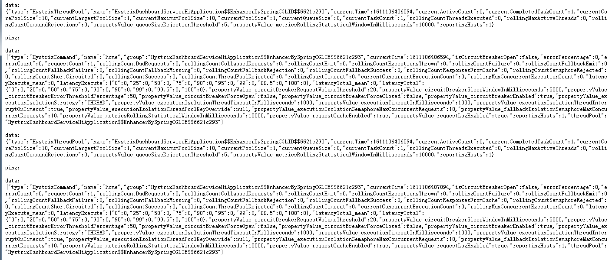
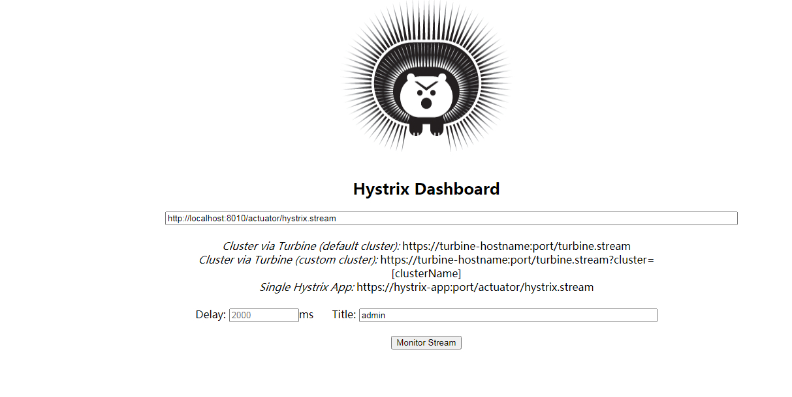
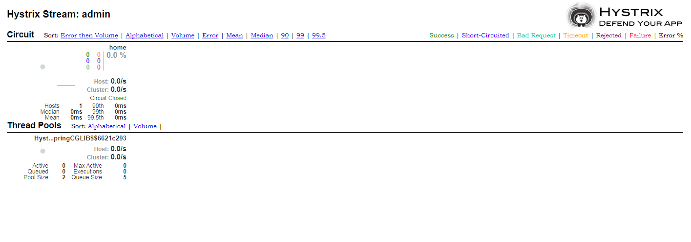

# 第十篇： Hystrix Dashboard（Hoxton版本）

> 原创 最新推荐文章于 2024-04-18 06:36:00 发布 · 公开 · 466 阅读 · 0 · 0 · 本内容遵循CC 4.0 BY-SA版权协议 版权声明：本文为博主原创文章，遵循 CC 4.0 BY-SA 版权协议，转载请附上原文出处链接和本声明。 · 编辑
> 文章链接：https://blog.csdn.net/tanhongwei1994/article/details/112858880

新建hystrix-dashboard-service-hi模块

pom文件

```xml
<?xml version="1.0" encoding="UTF-8"?>
<project xmlns="http://maven.apache.org/POM/4.0.0" xmlns:xsi="http://www.w3.org/2001/XMLSchema-instance"
         xsi:schemaLocation="http://maven.apache.org/POM/4.0.0 https://maven.apache.org/xsd/maven-4.0.0.xsd">
    <modelVersion>4.0.0</modelVersion>
    <parent>
        <groupId>com.xiaobu</groupId>
        <artifactId>springcloud-demo</artifactId>
        <version>0.0.1-SNAPSHOT</version>
    </parent>

    <artifactId>hystrix-dashboard-service-hi</artifactId>
    <version>0.0.1-SNAPSHOT</version>
    <name>hystrix-dashboard-service-hi</name>
    <description>hystrix-dashboard-service-hi project for Spring Boot</description>

    <properties>
        <java.version>1.8</java.version>
    </properties>

    <dependencies>
        <dependency>
            <groupId>org.springframework.boot</groupId>
            <artifactId>spring-boot-starter</artifactId>
        </dependency>
        <dependency>
            <groupId>org.springframework.cloud</groupId>
            <artifactId>spring-cloud-starter-netflix-eureka-client</artifactId>
        </dependency>
        <dependency>
            <groupId>org.springframework.boot</groupId>
            <artifactId>spring-boot-starter-actuator</artifactId>
        </dependency>
        <dependency>
            <groupId>org.springframework.cloud</groupId>
            <artifactId>spring-cloud-starter-netflix-hystrix</artifactId>
        </dependency>
        <dependency>
            <groupId>org.springframework.cloud</groupId>
            <artifactId>spring-cloud-starter-netflix-hystrix-dashboard</artifactId>
        </dependency>
    </dependencies>


    <dependencyManagement>
        <dependencies>
            <dependency>
                <groupId>org.springframework.cloud</groupId>
                <artifactId>spring-cloud-dependencies</artifactId>
                <version>${spring-cloud.version}</version>
                <type>pom</type>
                <scope>import</scope>
            </dependency>
        </dependencies>
    </dependencyManagement>

    <build>
        <plugins>
            <plugin>
                <groupId>org.springframework.boot</groupId>
                <artifactId>spring-boot-maven-plugin</artifactId>
            </plugin>
        </plugins>
    </build>

</project>

```

application.properties

```properties
eureka.client.service-url.defaultZone=http://localhost:8001/eureka/
server.port=8010
spring.application.name=hystrix-dashboard-service-hi

# 下面的必须配置 不然访问https://hystrix-app:port/actuator/hystrix.stream 会报404
management.endpoints.web.exposure.include=*
management.endpoints.web.cors.allowed-origins=*
management.endpoints.web.cors.allowed-methods=*
```

HystrixDashboardServiceHiApplication.java

```java
package com.xiaobu;

import com.netflix.hystrix.contrib.javanica.annotation.HystrixCommand;
import lombok.extern.slf4j.Slf4j;
import org.springframework.beans.factory.annotation.Value;
import org.springframework.boot.CommandLineRunner;
import org.springframework.boot.SpringApplication;
import org.springframework.boot.autoconfigure.SpringBootApplication;
import org.springframework.cloud.client.circuitbreaker.EnableCircuitBreaker;
import org.springframework.cloud.client.discovery.EnableDiscoveryClient;
import org.springframework.cloud.netflix.eureka.EnableEurekaClient;
import org.springframework.cloud.netflix.hystrix.EnableHystrix;
import org.springframework.cloud.netflix.hystrix.dashboard.EnableHystrixDashboard;
import org.springframework.web.bind.annotation.RequestMapping;
import org.springframework.web.bind.annotation.RequestParam;
import org.springframework.web.bind.annotation.RestController;

/**
 * @author xiaobu
 */
@SpringBootApplication
@EnableEurekaClient
@EnableDiscoveryClient
@RestController
@EnableHystrix
@EnableHystrixDashboard
@EnableCircuitBreaker
@Slf4j
public class HystrixDashboardServiceHiApplication implements CommandLineRunner {


    public static void main(String[] args) {
        SpringApplication.run( HystrixDashboardServiceHiApplication.class, args );
    }

    @Value("${server.port}")
    String port;

    @RequestMapping("/hi")
    @HystrixCommand(fallbackMethod = "hiError")
    public String home(@RequestParam(value = "name", defaultValue = "admin") String name) {
        return "hi " + name + " ,i am from port:" + port;
    }

    public String hiError(String name) {
        return "hi,"+name+",sorry,error!";
    }

    @Override
    public void run(String... args) throws Exception {
        log.info("服务hystrix-dashboard-service-hi在端口:{},启动成功....",port);
    }
}

```

运行程序： 依次开启eureka-server(与第一章相同)和hystrix-dashboard-service-hi.

访问 http://localhost:8010/hi

然后访问 http://localhost:8010/actuator/hystrix.stream

 

访问 http://localhost:8010/hystrix

 

依次输入

http://localhost:8010/actuator/hystrix.stream  2000  admin

再次访问 http://localhost:8010/hystrix 出现如下示图

 

