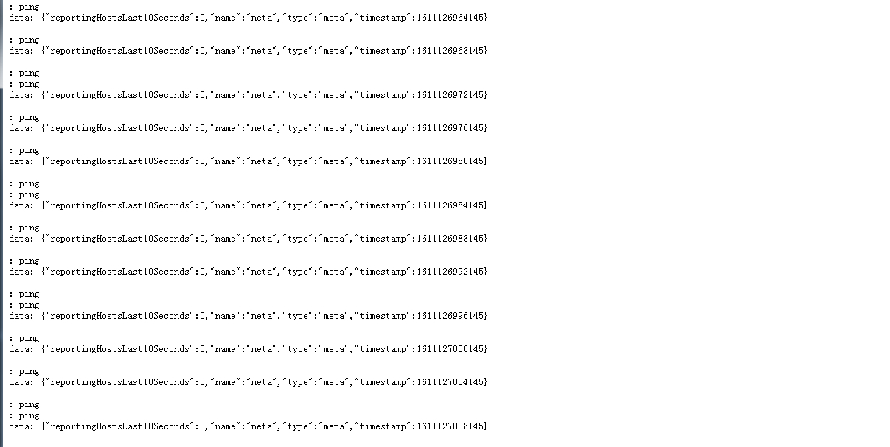
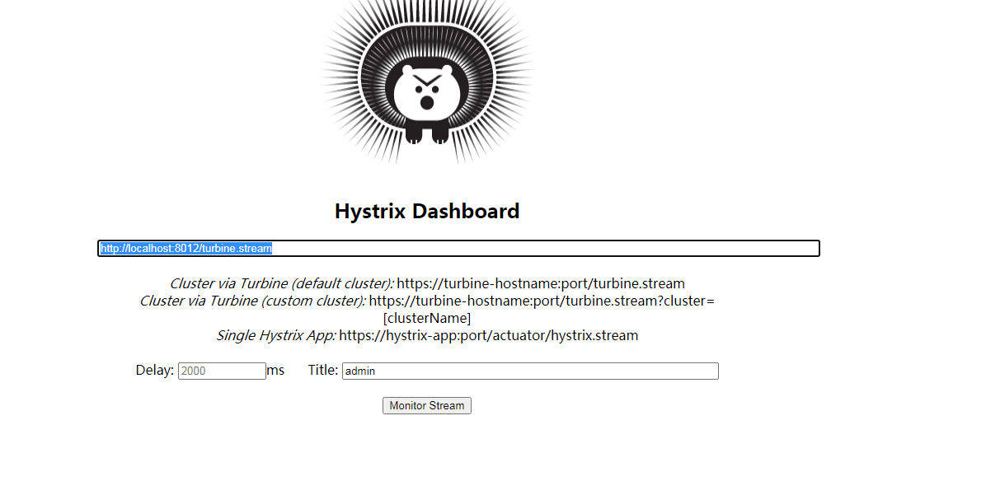

# 第十一篇： Turbine（Hoxton版本）

> 原创 最新推荐文章于 2024-04-04 09:43:08 发布 · 公开 · 263 阅读 · 0 · 0 · 本内容遵循CC 4.0 BY-SA版权协议 版权声明：本文为博主原创文章，遵循 CC 4.0 BY-SA 版权协议，转载请附上原文出处链接和本声明。 · 编辑
> 文章链接：https://blog.csdn.net/tanhongwei1994/article/details/112906983

新建一个service-turbine

pom

```xml
<?xml version="1.0" encoding="UTF-8"?>
<project xmlns="http://maven.apache.org/POM/4.0.0" xmlns:xsi="http://www.w3.org/2001/XMLSchema-instance"
         xsi:schemaLocation="http://maven.apache.org/POM/4.0.0 https://maven.apache.org/xsd/maven-4.0.0.xsd">
    <modelVersion>4.0.0</modelVersion>
    <parent>
        <groupId>com.xiaobu</groupId>
        <artifactId>springcloud-demo</artifactId>
        <version>0.0.1-SNAPSHOT</version>
    </parent>
    <artifactId>service-turbine</artifactId>
    <version>0.0.1-SNAPSHOT</version>
    <name>service-turbine</name>
    <description>service-turbine project for Spring Boot</description>
    <properties>
        <java.version>1.8</java.version>
    </properties>
    <dependencies>
        <dependency>
            <groupId>org.springframework.boot</groupId>
            <artifactId>spring-boot-starter</artifactId>
        </dependency>


        <dependency>
            <groupId>org.springframework.cloud</groupId>
            <artifactId>spring-cloud-starter-netflix-eureka-client</artifactId>
        </dependency>

        <dependency>
            <groupId>org.springframework.boot</groupId>
            <artifactId>spring-boot-starter-actuator</artifactId>
        </dependency>
        <dependency>
            <groupId>org.springframework.cloud</groupId>
            <artifactId>spring-cloud-starter-netflix-hystrix</artifactId>
        </dependency>
        <dependency>
            <groupId>org.springframework.cloud</groupId>
            <artifactId>spring-cloud-starter-netflix-hystrix-dashboard</artifactId>
        </dependency>
        <dependency>
            <groupId>org.springframework.cloud</groupId>
            <artifactId>spring-cloud-starter-netflix-turbine</artifactId>
        </dependency>
    </dependencies>


    <dependencyManagement>
        <dependencies>
            <dependency>
                <groupId>org.springframework.cloud</groupId>
                <artifactId>spring-cloud-dependencies</artifactId>
                <version>${spring-cloud.version}</version>
                <type>pom</type>
                <scope>import</scope>
            </dependency>
        </dependencies>
    </dependencyManagement>

    <build>
        <plugins>
            <plugin>
                <groupId>org.springframework.boot</groupId>
                <artifactId>spring-boot-maven-plugin</artifactId>
            </plugin>
        </plugins>
    </build>

</project>

```

application.properties

```properties
server.port=8012
spring.application.name=service-turbine
eureka.client.serviceUrl.defaultZone=http://localhost:8001/eureka/
management.endpoints.web.exposure.include=*
management.endpoints.web.cors.allowed-origins=*
management.endpoints.web.cors.allowed-methods=*
turbine.app-config=hystrix-dashboard-service-hi,hystrix-dashboard-service-hi2
turbine.aggregator.clusterConfig=default
turbine.clusterNameExpression=new String("default")
turbine.combine-host=true
turbine.instanceUrlSuffix.default=actuator/hystrix.stream

```

ServiceTurbineApplication.java

```java
package com.xiaobu;

import lombok.extern.slf4j.Slf4j;
import org.springframework.beans.factory.annotation.Value;
import org.springframework.boot.CommandLineRunner;
import org.springframework.boot.SpringApplication;
import org.springframework.boot.autoconfigure.SpringBootApplication;
import org.springframework.cloud.client.circuitbreaker.EnableCircuitBreaker;
import org.springframework.cloud.client.discovery.EnableDiscoveryClient;
import org.springframework.cloud.netflix.eureka.EnableEurekaClient;
import org.springframework.cloud.netflix.hystrix.EnableHystrix;
import org.springframework.cloud.netflix.hystrix.dashboard.EnableHystrixDashboard;
import org.springframework.cloud.netflix.turbine.EnableTurbine;
import org.springframework.web.bind.annotation.RestController;

@SpringBootApplication
@EnableEurekaClient
@EnableDiscoveryClient
@RestController
@EnableHystrix
@EnableHystrixDashboard
@EnableCircuitBreaker
@EnableTurbine
@Slf4j
public class ServiceTurbineApplication  implements CommandLineRunner {

    public static void main(String[] args) {
        SpringApplication.run(ServiceTurbineApplication.class, args);
    }

    @Value("${server.port}")
    private String port;
    @Override
    public void run(String... args) throws Exception {
        log.info("service-turbine在端口:{},启动成功....",port);
    }
}

```

依次启动eureka-server、hystrix-dashboard-service-hi（在不同的端口启动两个实例）、service-turbine

访问 http://localhost:8012/turbine.stream

 

请求 http://localhost:8010/hi?name=admin http://localhost:8011/hi?name=admin任意一个

访问 http://localhost:8010/hystrix 监控 http://localhost:8012/turbine.stream

鼠标悬浮数据上面可以看属性说明

 

[项目代码](https://github.com/xiaobu1994/springcloud-demo) 

参考:

[Spring Cloud中Hystrix仪表盘与Turbine集群监控](https://segmentfault.com/a/1190000011478978) 