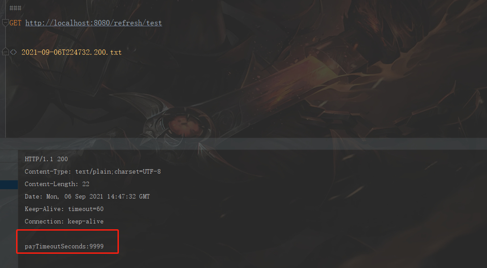
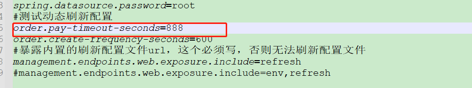
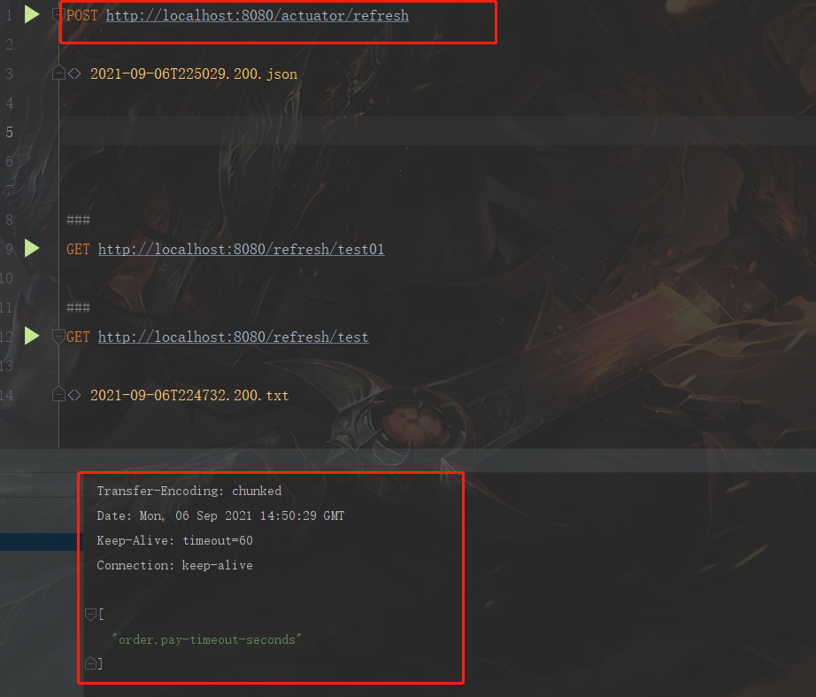
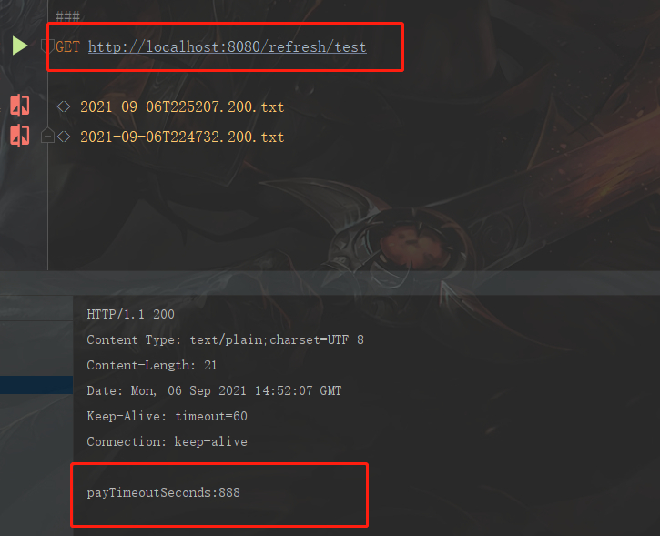
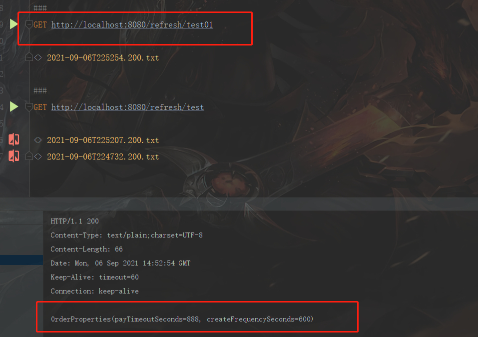
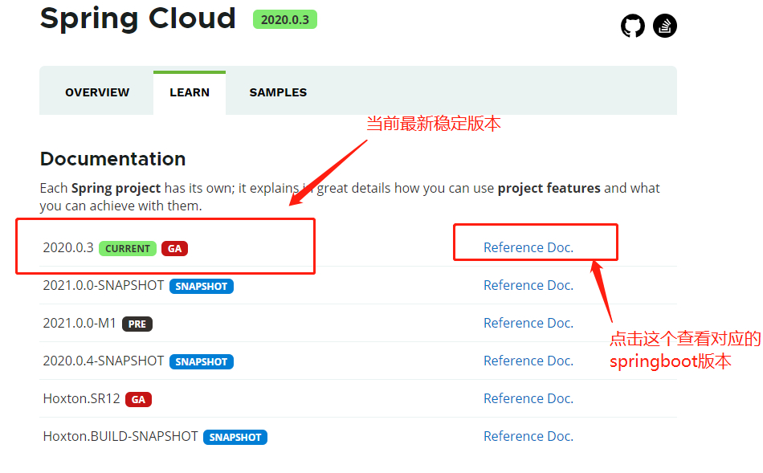
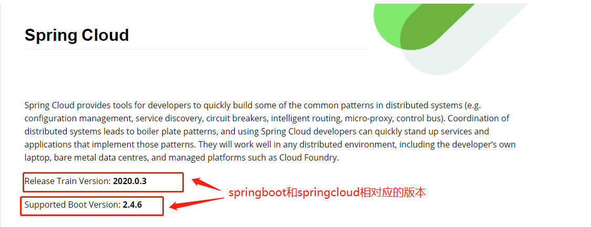

# Springboot 使用@RefreshScope 注解，实现配置文件的动态加载

> 原创 最新推荐文章于 2026-03-03 05:29:09 发布 · 公开 · 7.1k 阅读 · 1 · 21 · 本内容遵循CC 4.0 BY-SA版权协议 版权声明：本文为博主原创文章，遵循 CC 4.0 BY-SA 版权协议，转载请附上原文出处链接和本声明。 · 编辑
> 文章链接：https://blog.csdn.net/tanhongwei1994/article/details/120147010

> spring-boot-starter-actuator提供服务健康检查和暴露内置的url接口。

> spring-cloud-starter-config提供动态刷新的一些支持和注解。

#### pom.xml

```xml
<?xml version="1.0" encoding="UTF-8"?>
<project xmlns:xsi="http://www.w3.org/2001/XMLSchema-instance" xmlns="http://maven.apache.org/POM/4.0.0"
         xsi:schemaLocation="http://maven.apache.org/POM/4.0.0 https://maven.apache.org/xsd/maven-4.0.0.xsd">
    <modelVersion>4.0.0</modelVersion>
    <parent>
        <groupId>org.springframework.boot</groupId>
        <artifactId>spring-boot-starter-parent</artifactId>
        <version>2.4.6</version>
        <relativePath/> <!-- lookup parent from repository -->
    </parent>
    <groupId>com.xiaobu</groupId>
    <artifactId>demo-for-mybatis-plus</artifactId>
    <version>0.0.1-SNAPSHOT</version>
    <name>demo-for-mybatis-plus</name>
    <description>demo-for-mybatis-plus</description>
    <properties>
        <java.version>1.8</java.version>
        <spring-cloud.version>2020.0.3</spring-cloud.version>
    </properties>
    <dependencies>
        <!--spring boot-->
        <dependency>
            <groupId>org.springframework.boot</groupId>
            <artifactId>spring-boot-starter-web</artifactId>
        </dependency>
        <dependency>
            <groupId>org.springframework.boot</groupId>
            <artifactId>spring-boot-starter-test</artifactId>
            <scope>test</scope>
            <exclusions>
                <exclusion>
                    <artifactId>asm</artifactId>
                    <groupId>org.ow2.asm</groupId>
                </exclusion>
            </exclusions>
        </dependency>
        <dependency>
            <groupId>com.baomidou</groupId>
            <artifactId>mybatis-plus-boot-starter</artifactId>
            <version>3.4.2</version>
        </dependency>
        <!-- lomback -->
        <dependency>
            <groupId>org.projectlombok</groupId>
            <artifactId>lombok</artifactId>
            <version>1.16.10</version>
        </dependency>
        <dependency>
            <groupId>cn.hutool</groupId>
            <artifactId>hutool-all</artifactId>
            <version>5.3.2</version>
        </dependency>
        <!-- 引入Swagger2依赖 -->
        <dependency>
            <groupId>io.springfox</groupId>
            <artifactId>springfox-swagger2</artifactId>
            <version>2.9.2</version>
            <exclusions>
                <exclusion>
                    <artifactId>guava</artifactId>
                    <groupId>com.google.guava</groupId>
                </exclusion>
            </exclusions>
        </dependency>
        <dependency>
            <groupId>io.springfox</groupId>
            <artifactId>springfox-swagger-ui</artifactId>
            <version>2.9.2</version>
        </dependency>
        <!-- https://mvnrepository.com/artifact/com.google.guava/guava -->
        <dependency>
            <groupId>com.google.guava</groupId>
            <artifactId>guava</artifactId>
            <version>29.0-jre</version>
        </dependency>
        <dependency>
            <groupId>com.alibaba</groupId>
            <artifactId>easyexcel</artifactId>
            <version>2.0.2</version>
        </dependency>
        <dependency>
            <groupId>junit</groupId>
            <artifactId>junit</artifactId>
        </dependency>

        <dependency>
            <groupId>com.xuxueli</groupId>
            <artifactId>xxl-job-core</artifactId>
            <version>2.3.0</version>
        </dependency>
        <dependency>
            <groupId>mysql</groupId>
            <artifactId>mysql-connector-java</artifactId>
        </dependency>
        <!--   spring-cloud config-->
        <dependency>
            <groupId>org.springframework.cloud</groupId>
            <artifactId>spring-cloud-starter-config</artifactId>
        </dependency>
        <dependency>
            <groupId>org.springframework.boot</groupId>
            <artifactId>spring-boot-starter-actuator</artifactId>
        </dependency>
        <!--        springcloud 高版本需要引入 spring-cloud-starter-bootstrap 否则刷新不起效-->
        <dependency>
            <groupId>org.springframework.cloud</groupId>
            <artifactId>spring-cloud-starter-bootstrap</artifactId>
        </dependency>
    </dependencies>

    <dependencyManagement>
        <dependencies>
            <dependency>
                <groupId>org.springframework.cloud</groupId>
                <artifactId>spring-cloud-dependencies</artifactId>
                <version>${spring-cloud.version}</version>
                <type>pom</type>
                <scope>import</scope>
            </dependency>
        </dependencies>
    </dependencyManagement>


    <build>
        <resources>
            <resource>
                <directory>src/main/resources</directory>
            </resource>
            <resource>
                <directory>src/main/java</directory>
                <includes>
                    <include>**/*.xml</include>
                </includes>
                <filtering>true</filtering>
            </resource>
        </resources>
        <finalName>App</finalName>
        <plugins>
            <plugin>
                <groupId>org.springframework.boot</groupId>
                <artifactId>spring-boot-maven-plugin</artifactId>
                <version>2.4.5</version>
            </plugin>
        </plugins>
    </build>

</project>

```

#### properties

```properties
########## Mybatis 自身配置 ##########
logging.level.com.xiaobu=debug
mybatis-plus.type-aliases-package=com.xiaobu.entity
mybatis-plus.mapper-locations=classpath:com/xiaobu/mapper/xml/*.xml
# 控制台打印sql 带参数 无法写入文件
#mybatis-plus.configuration.log-impl=org.apache.ibatis.logging.stdout.StdOutImpl
# 将sql 写入文件 带参数
mybatis-plus.configuration.log-impl=org.apache.ibatis.logging.slf4j.Slf4jImpl
#集成mysql数据库的配置
spring.datasource.driverClassName=com.mysql.cj.jdbc.Driver
spring.datasource.url=jdbc:mysql://localhost:3306/master0?useSSL=false&useUnicode=true&characterEncoding=utf-8&autoReconnect=true&serverTimezone=Asia/Shanghai
spring.datasource.username=root
spring.datasource.password=root
#测试动态刷新配置
order.pay-timeout-seconds=9999
order.create-frequency-seconds=600
#暴露内置的刷新配置文件url，这个必须写，否则无法刷新配置文件
management.endpoints.web.exposure.include=refresh
#management.endpoints.web.exposure.include=env,refresh#management.endpoints.web.exposure.include=env,refresh
```

#### 启动类

```java
package com.xiaobu;

import org.springframework.boot.SpringApplication;
import org.springframework.boot.autoconfigure.SpringBootApplication;
import org.springframework.boot.context.properties.ConfigurationPropertiesScan;

/**
 * @author 小布
 */
@SpringBootApplication
@ConfigurationPropertiesScan
public class DemoForMybatisPlusApplication {

    public static void main(String[] args) {
        SpringApplication.run(DemoForMybatisPlusApplication.class, args);
    }

}

```

#### 配置类

```java
package com.xiaobu.config;

import lombok.Data;
import org.springframework.boot.context.properties.ConfigurationProperties;
import org.springframework.cloud.context.config.annotation.RefreshScope;
import org.springframework.stereotype.Component;

/**
 * @author 小布
 */
@Component
@ConfigurationProperties(prefix = "order")
@RefreshScope
@Data
public class OrderProperties {
    /**
     * 订单支付超时时长，单位：秒。
     */
    private Integer payTimeoutSeconds;

    /**
     * 订单创建频率，单位：秒
     */
    private Integer createFrequencySeconds;

}

```

#### controller

```java
package com.xiaobu.controller;

import com.xiaobu.config.OrderProperties;
import org.springframework.beans.factory.annotation.Autowired;
import org.springframework.beans.factory.annotation.Value;
import org.springframework.cloud.context.config.annotation.RefreshScope;
import org.springframework.web.bind.annotation.GetMapping;
import org.springframework.web.bind.annotation.RequestMapping;
import org.springframework.web.bind.annotation.RestController;

/**
 * The type Refresh controller.
 *
 * @author 小布
 * @version 1.0.0
 * @className RefreshController.java
 * @createTime 2021年09月06日 15:38:00
 */
@RestController
@RequestMapping("refresh")
@RefreshScope
public class RefreshController {

    @Autowired
    private OrderProperties orderProperties;

    @Value(value = "${order.pay-timeout-seconds}")
    private Integer payTimeoutSeconds;

    /**
     * Test string.
     *
     * @return the string
     */
    @GetMapping("test")
    public String test() {
        return "payTimeoutSeconds:" + payTimeoutSeconds;
    }

    @GetMapping("test01")
    public String test01() {
        return orderProperties.toString();
    }
}

```

#### 打包

执行

```mvn
mvn clean package -Dmaven.test.skip=true
```

cmd启动jar 并指定外部配置文件

```cmd
java -jar App.jar  --spring.config.location=D:/application.properties
```

访问：http://localhost:8080/refresh/test

 

修改配置文件内容:

 

执行 POST http://localhost:8080/actuator/refresh

 

再次访问：http://localhost:8080/refresh/test

 

访问：http://localhost:8080/refresh/test01

 

#### springcloud对应的springboot版本

 

 

#### 参考:

[springcloud对应的springboot版本](https://spring.io/projects/spring-cloud#learn) 

[Springboot 使用@RefreshScope 注解，实现配置文件的动态加载](https://www.jianshu.com/p/1a98e37ef03b) 

[Spring boot 应用实现动态刷新配置](https://blog.csdn.net/lblblblblzdx/article/details/81784237) 

[Spring Boot 指定外部启动配置文件](https://blog.csdn.net/ccor2002/article/details/103739766) 