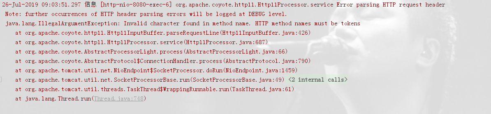

# Tomcat | Invalid character found in method name. HTTP method names must be tokens

> 原创 于 2019-07-26 09:50:59 发布 · 公开 · 460 阅读 · 0 · 0 · 本内容遵循CC 4.0 BY-SA版权协议 版权声明：本文为博主原创文章，遵循 CC 4.0 BY-SA 版权协议，转载请附上原文出处链接和本声明。 · 编辑
> 文章链接：https://blog.csdn.net/tanhongwei1994/article/details/97369579

> 当您尝试从未启用https的端点上的客户端执行https请求时，可能会发生此异常。当服务器期望原始数据时，客户端将加密请求数据。

> 输入https://localhost:8080/ 出现以下错误信息。 测试环境没有搭建证书，应该访问http://localhost:8080/

 

