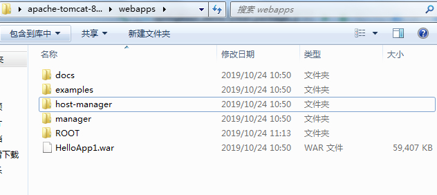
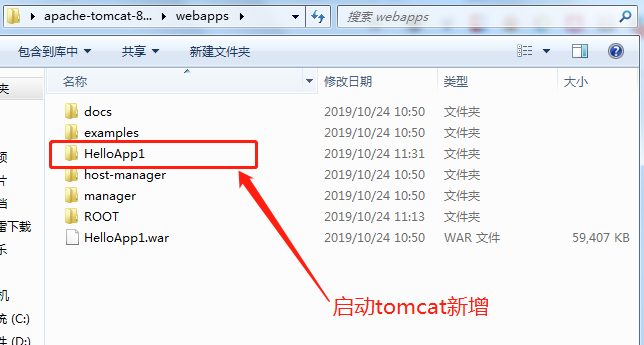
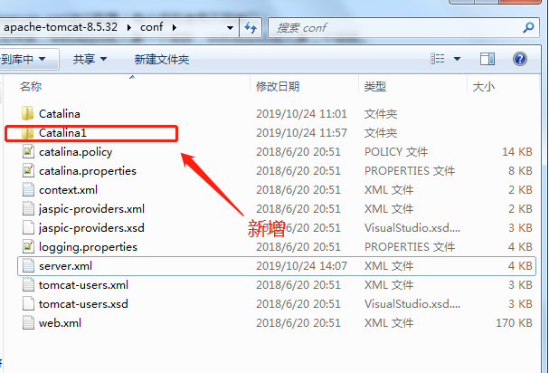
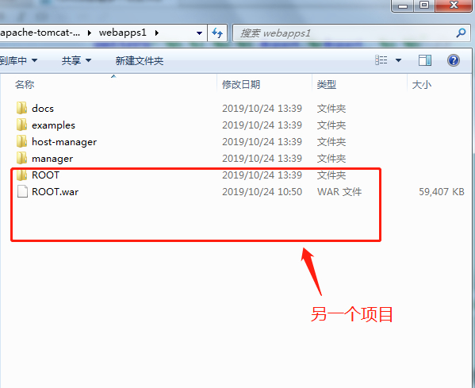
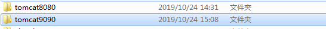
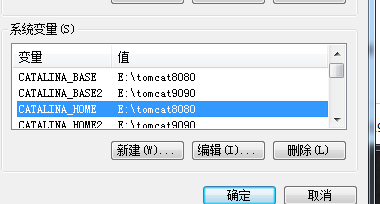

# Tomcat多种方式部署多个项目

> 原创 于 2019-10-24 16:29:10 发布 · 公开 · 743 阅读 · 0 · 2 · 本内容遵循CC 4.0 BY-SA版权协议 版权声明：本文为博主原创文章，遵循 CC 4.0 BY-SA 版权协议，转载请附上原文出处链接和本声明。 · 编辑
> 文章链接：https://blog.csdn.net/tanhongwei1994/article/details/102726245

### 同一个Tomcat同一个端口 部署多个项目

把打好的war包放在webapps下面如:HelloApp1.war。若下图所示：

 

启动tomcat，发现在webapps下面多了一个HelloApp1的文件夹

 

HelloApp1.war是用SpringBoot项目打包而成的,执行方法是http://localhost:9001/emp/demo但实际上应该走http://localhost:8080/HelloApp1/emp/demo

### 同一个Tomcat 多个端口 部署多个项目

常用的几个参数的意义:

<Connectorport=“8080” protocol=“HTTP/1.1” connectionTimeout=“60000”

redirectPort=“8443” disableUploadTimeout=“false”

executor=“tomcatThreadPool” URIEncoding=“UTF-8”/>

其中8080为HTTP端口，8443为HTTPS端口。

8005为远程停服务端口

8009为AJP端口，APACHE能过AJP协议访问TOMCAT的8009端口。

1. 修改conf下面的server.xml文件:
   复制一个service,修改相对应的参数,注释 这段代码。如果不注释掉会报地址已占用。

```xml
<?xml version="1.0" encoding="UTF-8"?>
<!--
  Licensed to the Apache Software Foundation (ASF) under one or more
  contributor license agreements.  See the NOTICE file distributed with
  this work for additional information regarding copyright ownership.
  The ASF licenses this file to You under the Apache License, Version 2.0
  (the "License"); you may not use this file except in compliance with
  the License.  You may obtain a copy of the License at

      http://www.apache.org/licenses/LICENSE-2.0

  Unless required by applicable law or agreed to in writing, software
  distributed under the License is distributed on an "AS IS" BASIS,
  WITHOUT WARRANTIES OR CONDITIONS OF ANY KIND, either express or implied.
  See the License for the specific language governing permissions and
  limitations under the License.
-->
<!-- Note:  A "Server" is not itself a "Container", so you may not
     define subcomponents such as "Valves" at this level.
     Documentation at /docs/config/server.html
 -->
 <!--8005为远程停服务端口 -->
<Server port="8005" shutdown="SHUTDOWN">
  <Listener className="org.apache.catalina.startup.VersionLoggerListener" />
  <!-- Security listener. Documentation at /docs/config/listeners.html
  <Listener className="org.apache.catalina.security.SecurityListener" />
  -->
  <!--APR library loader. Documentation at /docs/apr.html -->
  <Listener className="org.apache.catalina.core.AprLifecycleListener" SSLEngine="on" />
  <!-- Prevent memory leaks due to use of particular java/javax APIs-->
  <Listener className="org.apache.catalina.core.JreMemoryLeakPreventionListener" />
  <Listener className="org.apache.catalina.mbeans.GlobalResourcesLifecycleListener" />
  <Listener className="org.apache.catalina.core.ThreadLocalLeakPreventionListener" />

  <!-- Global JNDI resources
       Documentation at /docs/jndi-resources-howto.html
  -->
  <GlobalNamingResources>
    <!-- Editable user database that can also be used by
         UserDatabaseRealm to authenticate users
    -->
    <Resource name="UserDatabase" auth="Container"
              type="org.apache.catalina.UserDatabase"
              description="User database that can be updated and saved"
              factory="org.apache.catalina.users.MemoryUserDatabaseFactory"
              pathname="conf/tomcat-users.xml" />
  </GlobalNamingResources>

  <!--第一个服务服务名为Catalina -->
  <Service name="Catalina">
  <!--8080为Http端口 8443为Https端口 -->
    <Connector port="8080" protocol="HTTP/1.1"
               connectionTimeout="20000"
               redirectPort="8443" />


    <Engine name="Catalina" defaultHost="localhost">
      <Realm className="org.apache.catalina.realm.LockOutRealm">

        <Realm className="org.apache.catalina.realm.UserDatabaseRealm"
               resourceName="UserDatabase"/>
      </Realm>

      <Host name="localhost"  appBase="webapps"
            unpackWARs="true" autoDeploy="true">

        <Valve className="org.apache.catalina.valves.AccessLogValve" directory="logs"
               prefix="localhost_access_log" suffix=".txt"
               pattern="%h %l %u %t &quot;%r&quot; %s %b" />

      </Host>
    </Engine>
  </Service>
   <!--第二个服务服务名为Catalina1 -->
  <Service name="Catalina1">

    <Connector port="8888" protocol="HTTP/1.1"
               connectionTimeout="20000"
               redirectPort="8443" />
 
 

    <Engine name="Catalina1" defaultHost="localhost">

      <Realm className="org.apache.catalina.realm.LockOutRealm">

        <Realm className="org.apache.catalina.realm.UserDatabaseRealm"
               resourceName="UserDatabase"/>
      </Realm>

      <Host name="localhost"  appBase="webapps1"
            unpackWARs="true" autoDeploy="true">


        <Valve className="org.apache.catalina.valves.AccessLogValve" directory="logs"
               prefix="localhost_access_log" suffix=".txt"
               pattern="%h %l %u %t &quot;%r&quot; %s %b" />

      </Host>
    </Engine>
  </Service>
</Server>

```

1. 在conf文件下复制Catalina更名为Catalina1(要与新的service节点的配置相一致)。

 

1. 在tomcat目录下复制webapps文件夹，更名为webapps1。然后将对应的.war放入webapps1目录下(要与新的service节点的配置相一致)。

 

依次访问http://localhost:8888/emp/demo，http://localhost:8080/都是OK的。

### 一台电脑配置多个tomcat服务。

第一台的配置都不用做修改,然后我们复制第一个tomcat文件夹，文件夹命名如下:

 

分别为两个tomcat配置环境变量：

 

1. 然后在path添加%CATALINA_HOME%\bin;%CATALINA_HOME2%\bin; 前后以逗号隔开。

2. 然后将tomcat9090的bin目录下的startup.bat ，shutdown.bat ，service.bat， catalina.bat这四个文件的所有CATALINA_HOME改成CATALINA_HOME2，CATALINA_BASE改成CATALINA_BASE2。

3. 然后修改conf文件夹下的server.xml。
   ,port改为8006，不冲突即可

   将8080改为9090，不冲突即可
   ，portt改为8019、8029、8039，不冲突即可

4. 分别进入tomcat8080，tomcat9090文件夹下的bin目录,执行安装命令
   service.bat install Tomcat8080
   service.bat install Tomcat9090

卸载命令
service.bat remove Tomcat9090或sc delete Tomcat9090

刷新服务列表即可看到对应的服务了。

参考:

[tomcat环境变量配置](https://jingyan.baidu.com/article/a3761b2bf2ee681577f9aa42.html) 

[一个tomcat下部署多个项目或一个服务器部署多个tomcat](https://www.cnblogs.com/jpfss/p/9208316.html) 