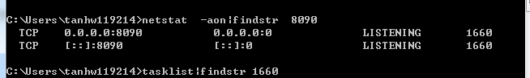
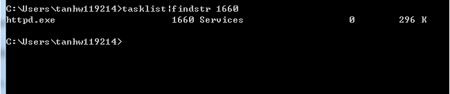

# windows下解决端口占用的情况

> 原创 于 2019-01-17 14:56:34 发布 · 公开 · 328 阅读 · 0 · 0 · 本内容遵循CC 4.0 BY-SA版权协议 版权声明：本文为博主原创文章，遵循 CC 4.0 BY-SA 版权协议，转载请附上原文出处链接和本声明。 · 编辑
> 文章链接：https://blog.csdn.net/tanhongwei1994/article/details/86524339

一、查看端口是否被占用（用apache服务器坐验证 端口8090）

```java
netstat  -aon|findstr  8090
```

 

二、那个进程使用了这个pid

```java
tasklist|findstr 1660
```


 

三、关闭这个pid进程

```java
taskkill /pid 1660  -t  -f
```


 

四、关闭nginx进程。

```java
taskkill /IM  nginx.exe  /F 
```