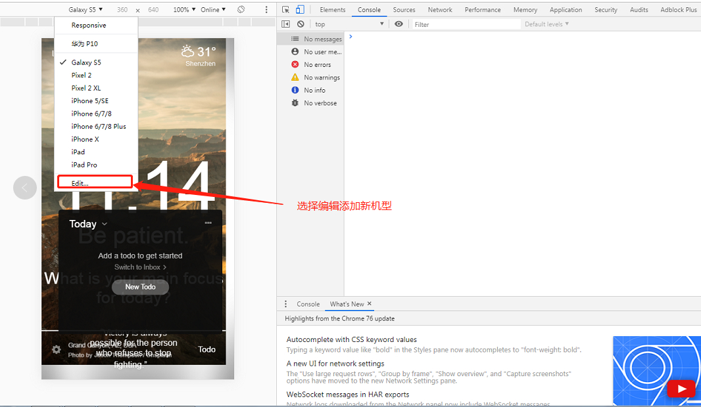
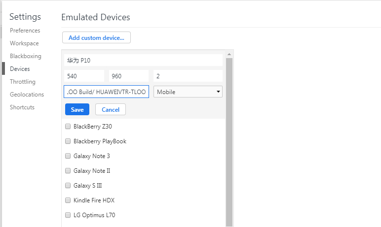

# Chrome添加调试机型

> 原创 于 2019-09-06 11:35:01 发布 · 公开 · 8.9k 阅读 · 1 · 4 · 本内容遵循CC 4.0 BY-SA版权协议 版权声明：本文为博主原创文章，遵循 CC 4.0 BY-SA 版权协议，转载请附上原文出处链接和本声明。 · 编辑
> 文章链接：https://blog.csdn.net/tanhongwei1994/article/details/100576369


1. 打开chrome,按F12。选择toggle device toolbar。切换到手机模拟器模式，手机类型下拉列表，选择Edit

 

1. device name 输入设备名称 如 HuaWei P10

2. device pixel ratio（设备像素比），一般是输入2

3. 输入手机分辨率的width、height(如果像素比是2,1920 *1080分辨率的手机，在这里width* height就要输入540*960 )

4. 输入user agent string。用js去获取 如:alert(navigator.userAgent);
   获取到的字符串为：

```properties
MoZilla/5.0(Linux; U; Android
8.0.0: Zh-cn; VTR-TLOO Build/
HUAWEIVTR-TLOO) AppleWebkit/
537.36(KHTML, like Gecko)
Version/4.0 Chrome/
57.0.2987.132 MQQBrowser/8.8
Mobile safari/537.36
```

将 **MoZilla/5.0(Linux; U; Android
8.0.0: Zh-cn; VTR-TLOO Build/
HUAWEIVTR-TLOO) AppleWebkit/
537.36(KHTML, like Gecko)
Version/4.0Chrome/
57.0.2987.132 MQQBrowser/8.8
Mobilesafari/537.36
** 填入 user agentstring
 

