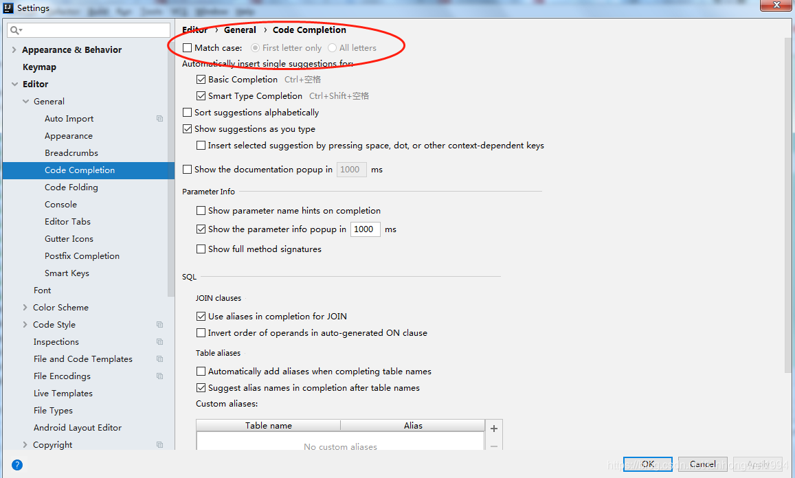
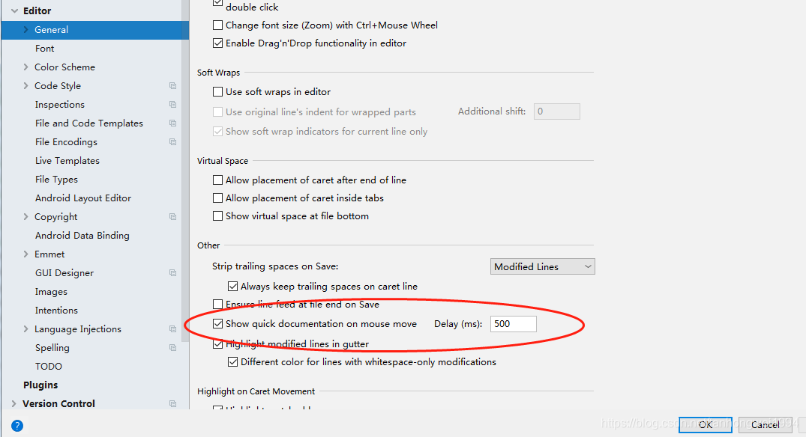
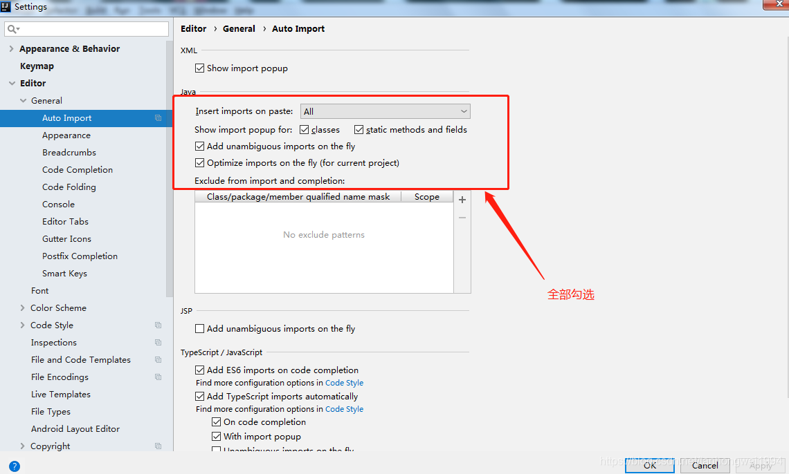
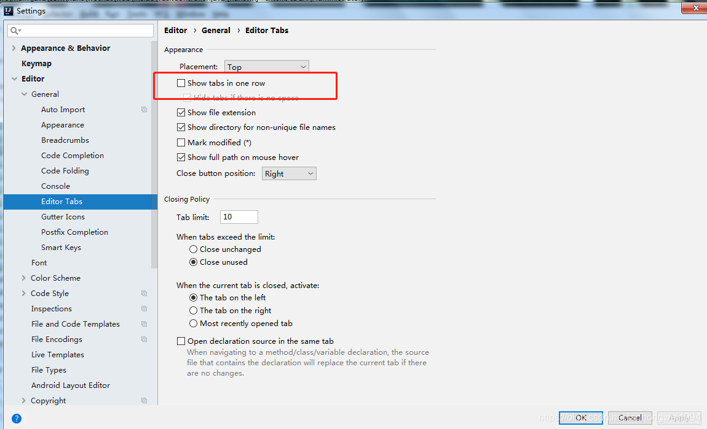
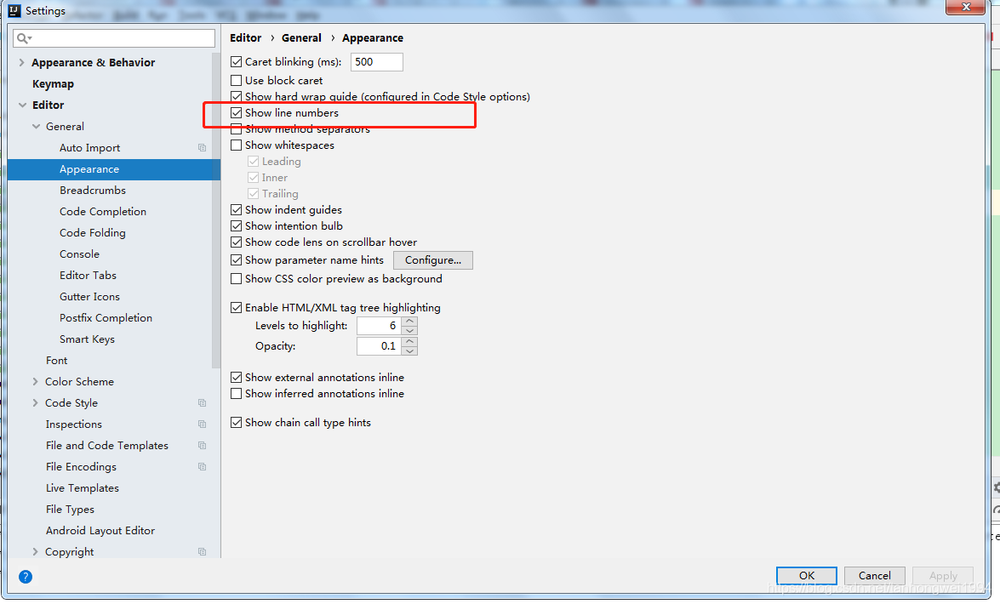
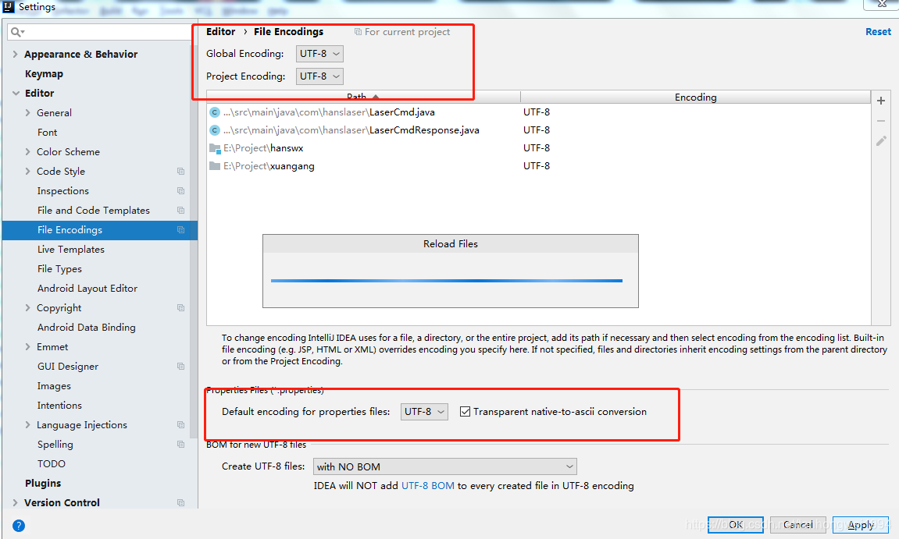

# 2018 IntelliJ IDEA 常用设置

> 原创 于 2018-12-06 19:57:23 发布 · 公开 · 1.5k 阅读 · 0 · 5 · 本内容遵循CC 4.0 BY-SA版权协议 版权声明：本文为博主原创文章，遵循 CC 4.0 BY-SA 版权协议，转载请附上原文出处链接和本声明。 · 编辑
> 文章链接：https://blog.csdn.net/tanhongwei1994/article/details/84863993

一、开启大小写匹配

 

二、悬浮窗提示

 

三、智能导包

 

四、取消单行显示

 

五、设置行号显示

 

六、设置项目编码

 

