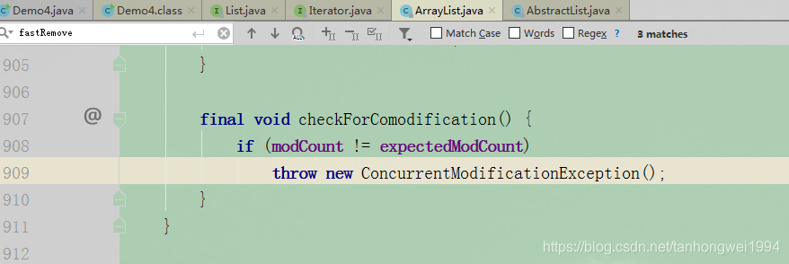
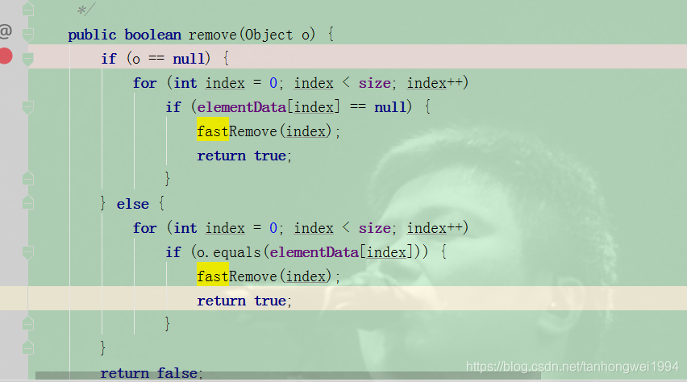
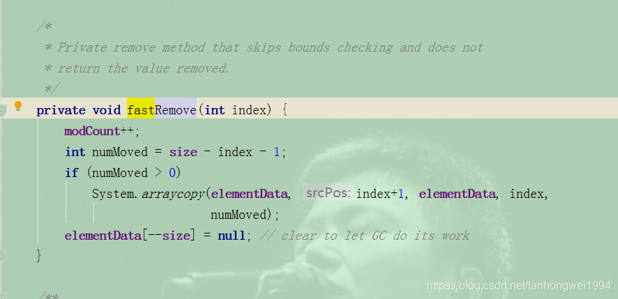
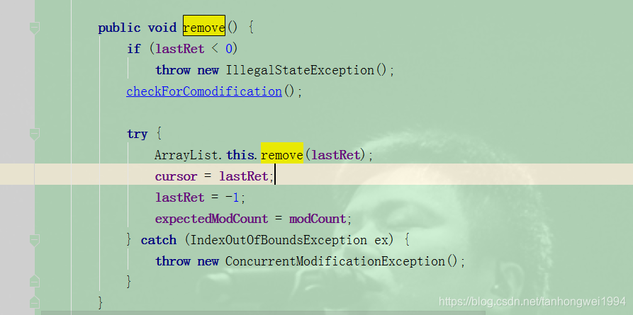

# 为什么阿里巴巴禁止在 foreach 循环里进行元素的 remove/add 操作

> 原创 已于 2023-02-20 14:05:06 修改 · 公开 · 400 阅读 · 0 · 0 · 本内容遵循CC 4.0 BY-SA版权协议 版权声明：本文为博主原创文章，遵循 CC 4.0 BY-SA 版权协议，转载请附上原文出处链接和本声明。 · 编辑
> 文章链接：https://blog.csdn.net/tanhongwei1994/article/details/88293506

一、代码编辑

```java
package com.xiaobu.test.List;
 
import java.util.ArrayList;
import java.util.Iterator;
import java.util.List;
 
/**
 * @author xiaobu
 * @version JDK1.8.0_171
 * @date on  2019/3/4 17:32
 * @description V1.0  fail-fast机制
 */
public class Demo4 {
 
    private static List<String> userNames = new ArrayList<String>() {
        private static final long serialVersionUID = 3061248232613564555L;
 
        {
            add("Xiaobu");
            add("Xiaobus");
            add("xiaobu");
            add("X");
        }
    };
 
    public static void main(String[] args) {
        removeIterator();
        //removeIf();
        //removeByFor();
        //removeByForeach();
        //removeByIterator();
    }
 
 
    /**
     * @author xiaobu
     * @date 2019/3/7 10:23
     * @descprition 结果  [xiaobu, X]
     * @version 1.0 推荐用这个  猜测最终实现是通过执行ArrayList的内部类 Itr的remove方法
     *
     */
 
    public static void removeIf() {
        userNames.removeIf(s -> s.contains("Xiaobu"));
        System.out.println(userNames);
    }
 
 
    /**
     * @author xiaobu
     * @date 2019/3/7 10:25
     * @descprition 结果 [xiaobu, Xiaobus, X]
     * @version 1.0 因为list集合长度会缩短导致,导致元素前移 有可能造成数据的不准确性
     */
    public static void removeByFor() {
        int n = 0;
        for (int i = 0; i < userNames.size(); i++) {
            n++;
            System.out.println("u = " + userNames.get(i));
            if (userNames.get(i).contains("Xiaobu")) {
                userNames.remove(i);
            }
        }
        System.out.println("n = " + n);
        System.out.println(userNames);
    }
 
 
    /**
     * @author xiaobu
     * @date 2019/3/7 11:46
     * @descprition  直接调用的ArrayList的内部类 Itr的remove方法
     * @version 1.0
     */
    public static void removeIterator() {
        Iterator iterator = userNames.iterator();
        while (iterator.hasNext()) {
            String userName = (String) iterator.next();
            if (userName.contains("Xiaobu")) {
                iterator.remove();
            }
        }
        System.out.println(userNames);
    }
 
    /***
     * @author xiaobu
     * @date 2019/3/7 10:28
     * @descprition   iterator remove方法
     * @version 1.0
     */
 
    // TODO: 2019/3/7 Exception in thread "main" java.util.ConcurrentModificationException
    public static void removeByIterator() {
        Iterator iterator = userNames.iterator();
        while (iterator.hasNext()) {
            String userName = (String) iterator.next();
            if (userName.contains("Xiaobu")) {
                userNames.remove(userName);
            }
        }
        System.out.println(userNames);
    }
 
 
    /**
     * @author xiaobu
     * @date 2019/3/7 10:28
     * @descprition foreach最终也是通过迭代器进行删除的 原理跟方法removeByIterator删除一致
     * @version 1.0
     */
 
    // TODO: 2019/3/4  报错 Exception in thread "main" java.util.ConcurrentModificationException
    public static void removeByForeach() {
        for (String userName : userNames) {
            if (userName.contains("Xiaobu")) {
                //该方法调用的是ArrayList的remove方法
                userNames.remove(userName);
                //只是删除一个
               // break;
            }
        }
        System.out.println(userNames);
    }
 
 //普通 for 循环倒序删除（可靠）
 
    public void removeByReverse() {
        for (int i = userNames.size() - 1; i > 0; i--) {
            String str = list.get(i);
            if (str.contains("Xiaobu")) {
                list.remove(i);
            }
        }
        System.out.println(userNames);
    }
}
```


二、错误定位

 

modCount是ArrayList中的一个成员变量。它表示该集合实际被修改的次数。

expectedModCount 是 ArrayList中的一个内部类——Itr中的成员变量。expectedModCount表示这个迭代器期望该集合被修改的次数。其值是在ArrayList.iterator方法被调用的时候初始化的。只有通过迭代器对集合进行操作，该值才会改变。

Itr是一个Iterator的实现，使用ArrayList.iterator方法可以获取到的迭代器就是Itr类的实例。


removeByIterator和removeByForeach调用的是ArrayList的remove方法


 

 

这系列的remove操作只有modCount变化了expectedModCount没有发生改变导致两者不等，抛出ConcurrentModificationException 异常。


---

```
ArrayList的内部类 Itr的remove方法，有看到有修改到expectedModCount的值。modCount，expectedModCount两者是相等的。所以不会抛出异常。
```

 

